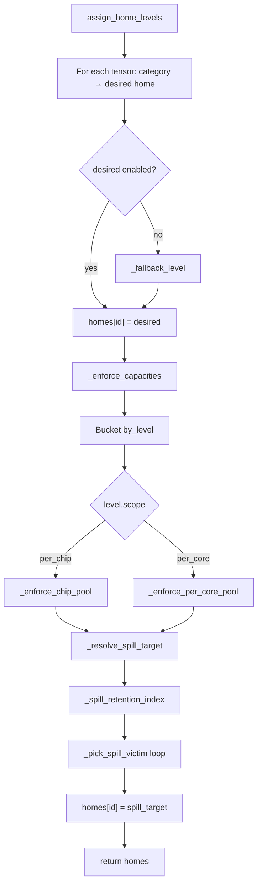

# Line-by-line walkthrough: `placement.py`

Complete annotation of `[src/dmsim/policies/placement.py](../src/dmsim/policies/placement.py)` (211 lines). This module assigns each trace tensor a **home memory level** (e.g. `ltram`, `stram`, `hbm`) once at simulation start. It does **not** move tensors during event replay — the simulator uses `homes` as the persistent “where this tensor belongs” map.

**Called from:** `[src/dmsim/sim/engine.py](../src/dmsim/sim/engine.py)` `run_simulation` (lines 64–68).

**Related types:**

- `[PolicyConfig](../src/dmsim/config/models.py)` — category → home, spill fallbacks, victim order
- `[ResolvedHierarchy](../src/dmsim/config/models.py)` — enabled levels, capacities, `scope` (`per_core` vs `per_chip`)
- `[TensorRecord](../src/dmsim/trace/schema.py)` — `id`, `bytes`, `category`, optional `core_id`
- `[Trace](../src/dmsim/trace/schema.py)` — optional; used for residency-aware spill ranking

**External symbols:** Anything not defined inside `placement.py` (types, methods, replay helpers, comparison behavior) is documented in [External definitions (not in `placement.py`)](#external-definitions-not-in-placementpy) at the end of this file.

**Trace replay** (how `build_retention_by_residency_replay` and `run_simulation` update residency): [TRACE_REPLAY_WALKTHROUGH.md](TRACE_REPLAY_WALKTHROUGH.md).

**Example policy** (`[configs/policies/decode_tiered.yaml](../configs/policies/decode_tiered.yaml)`):

```yaml
home_level_by_category:
  weight: ltram
  kv_cache: stram
  hidden: stram
  activation: stram
  other: hbm
default_access_target: sbuf
fallback_by_level:
  psum: sbuf
  sbuf: hbm
  stram: hbm
  ltram: hbm
spill_victim_order: best_case
```

---

## Lines 1–9 — Module docstring

```1:9:src/dmsim/policies/placement.py
"""Static tensor placement: map trace categories to hierarchy home levels.

Placement runs once at simulation start. It does not move tensors during the
trace — only adjusts homes when a tier is disabled or over capacity.

Policy YAML supplies category → desired level, spill/fallback targets, and
``spill_victim_order`` (best_case vs worst_case). Spill ranking requires a
trace: residency-aware retention from ``build_retention_by_residency_replay``.
"""
```


| Line | Meaning                                                                                                                          |
| ---- | -------------------------------------------------------------------------------------------------------------------------------- |
| 1    | One-line summary: **static placement** = category → memory tier.                                                                 |
| 3    | **Once at start** — unlike runtime eviction in the simulator, this file only sets initial `homes` (plus capacity spill at init). |
| 4    | Homes change here only if (a) desired tier is disabled, or (b) a pool is over capacity.                                          |
| 6–7  | Policy YAML drives desired homes and spill chains (`fallback_by_level`).                                                         |
| 7–8  | `spill_victim_order` picks *which* tensor to spill when over capacity; ranking uses trace replay when `trace=` is passed.        |


---

## Lines 11–16 — Imports

```11:16:src/dmsim/policies/placement.py
from __future__ import annotations

from collections import defaultdict

from dmsim.config.models import PolicyConfig, ResolvedHierarchy
from dmsim.trace.schema import TensorRecord, Trace
```


| Line | Meaning                                                                                            |
| ---- | -------------------------------------------------------------------------------------------------- |
| 11   | Postponed annotation evaluation (forward refs, cleaner type hints).                                |
| 13   | `defaultdict` — used in `_enforce_per_core_pool` to bucket tensors by `core_id`.                   |
| 15   | `PolicyConfig` — homes/fallbacks/spill order; `ResolvedHierarchy` — capacities and level metadata. |
| 16   | `TensorRecord` — one tensor in the trace; `Trace` — optional input for spill ranking.              |


---

## Lines 19–40 — `assign_home_levels` (public API)

```19:40:src/dmsim/policies/placement.py
def assign_home_levels(
    tensors: list[TensorRecord],
    hierarchy: ResolvedHierarchy,
    policy: PolicyConfig,
    *,
    trace: Trace | None = None,
) -> dict[str, str]:
    """Assign each tensor a persistent home memory level for the simulation."""
    enabled_ids = {level.id for level in hierarchy.enabled_levels}
    homes: dict[str, str] = {}

    for tensor in tensors:
        category_key = tensor.category.value
        desired = policy.home_level_by_category.get(category_key, "hbm")

        if desired not in enabled_ids:
            desired = _fallback_level(desired, policy, enabled_ids)

        homes[tensor.id] = desired

    _enforce_capacities(tensors, homes, hierarchy, policy, trace=trace)
    return homes
```

### Line 19–25 — Signature


| Line  | Detail                                                                                                 |
| ----- | ------------------------------------------------------------------------------------------------------ |
| 19    | Entry point exported from `[policies/__init__.py](../src/dmsim/policies/__init__.py)`.                 |
| 20    | All tensors to place (from `trace.tensors` in the engine).                                             |
| 21    | Resolved hierarchy: which levels exist, capacities, `per_core` vs `per_chip`.                          |
| 22    | Placement policy YAML, loaded as `PolicyConfig`.                                                       |
| 23–24 | Keyword-only `trace`. If `None`, spill victims are ranked only by tie-break keys (weight 0 retention). |
| 25    | **Return type:** `tensor_id → level_id` (e.g. `{"w1": "ltram", "kv": "stram"}`).                       |


**Example inputs:**

```python
tensors = [
    TensorRecord(id="w1", name="layer0.wq", bytes=250_000, category=TensorCategory.WEIGHT),
    TensorRecord(id="kv", name="layer0.kv", bytes=8_388_608, category=TensorCategory.KV_CACHE, core_id=0),
]
# policy.home_level_by_category["weight"] == "ltram"
# policy.home_level_by_category["kv_cache"] == "stram"
```

### Line 26–27 — Docstring and `enabled_ids`


| Line | Detail                                                                                                                                                                                 |
| ---- | -------------------------------------------------------------------------------------------------------------------------------------------------------------------------------------- |
| 26   | Documents return value semantics.                                                                                                                                                      |
| 27   | Set of level IDs that are **enabled** in this hierarchy candidate (e.g. `{"sbuf", "stram", "ltram", "hbm"}`). Disabled levels (e.g. `stram` in baseline-only HBM config) are excluded. |


### Line 28 — `homes` accumulator

```python
homes: dict[str, str] = {}  # filled per tensor, then mutated by _enforce_capacities
```

### Lines 30–36 — Per-tensor desired home


| Line  | Detail                                                                                                                                                                                                     |
| ----- | ---------------------------------------------------------------------------------------------------------------------------------------------------------------------------------------------------------- |
| 30    | Loop every tensor in the trace catalog.                                                                                                                                                                    |
| 31    | `category_key` is a string: `"weight"`, `"kv_cache"`, `"activation"`, `"other"`, etc. (`TensorCategory.value`).                                                                                            |
| 32    | Look up policy desired home; **default `"hbm"`** if category not listed.                                                                                                                                   |
| 34–35 | If policy wants `stram` but hierarchy disabled it, rewrite `desired` via spill/fallback chain (see `test_disabled_level_uses_policy_fallback` in `[tests/test_placement.py](../tests/test_placement.py)`). |
| 36    | Record provisional home: `homes[tensor.id] = desired`.                                                                                                                                                     |


**Example after this loop (decode_tiered, all levels enabled):**

```python
homes == {
    "w1": "ltram",   # weight → ltram
    "kv": "stram",   # kv_cache → stram
}
```

### Lines 38–40 — Capacity enforcement and return


| Line | Detail                                                                                                           |
| ---- | ---------------------------------------------------------------------------------------------------------------- |
| 38   | **In-place** spill: may change some `homes[...]` from e.g. `ltram` → `hbm` if LtRAM total bytes exceed capacity. |
| 39   | Return final map to `run_simulation`, which seeds `TensorResidency(home_level=home, ...)`.                       |
| 40   | End of `assign_home_levels`.                                                                                     |


---

## Lines 43–54 — `_fallback_level`

```43:54:src/dmsim/policies/placement.py
def _fallback_level(
    desired: str,
    policy: PolicyConfig,
    enabled_ids: set[str],
) -> str:
    """Pick an enabled home when policy desired level is disabled."""
    if desired in enabled_ids:
        return desired
    target = _resolve_spill_target(desired, policy, enabled_ids)
    if target is not None:
        return target
    return "hbm" if "hbm" in enabled_ids else next(iter(enabled_ids))
```


| Line  | Detail                                                                                                                    |
| ----- | ------------------------------------------------------------------------------------------------------------------------- |
| 43–47 | Helper when **policy target tier is disabled** in the hierarchy under test (not overflow — that's `_enforce_capacities`). |
| 48    | If desired level is enabled, return unchanged.                                                                            |
| 49    | Fast path: nothing to fix.                                                                                                |
| 51–53 | Walk `policy.fallback_by_level` starting at `desired` (e.g. `stram` → `hbm`).                                             |
| 52–53 | Use first **enabled** level found that isn't the starting disabled id.                                                    |
| 54    | Last resort: `hbm` if enabled, else **any** enabled level (`next(iter(enabled_ids))`).                                    |


**Example** (`[test_placement.py](../tests/test_placement.py)` `test_disabled_level_uses_policy_fallback`):

- Policy: `kv_cache → stram`
- Hierarchy: baseline (no `stram`)
- `desired = "stram"` ∉ `enabled_ids` → `_resolve_spill_target("stram")` → `"hbm"` (from `fallback_by_level`)
- `homes["kv"] == "hbm"`

---

## Lines 57–71 — `_resolve_spill_target`

```57:71:src/dmsim/policies/placement.py
def _resolve_spill_target(
    level_id: str,
    policy: PolicyConfig,
    enabled_ids: set[str],
) -> str | None:
    """Follow ``policy.fallback_by_level`` until an enabled level != ``level_id``."""
    visited: set[str] = {level_id}
    current = policy.fallback_for(level_id)
    while True:
        if current in visited:
            return None
        visited.add(current)
        if current in enabled_ids and current != level_id:
            return current
        current = policy.fallback_for(current)
```


| Line  | Detail                                                                                                                                               |
| ----- | ---------------------------------------------------------------------------------------------------------------------------------------------------- |
| 57–61 | Resolve **where to spill** when a pool is full or level disabled. Returns `None` on cycle / no valid target.                                         |
| 63    | `visited` prevents infinite loops in malformed fallback graphs.                                                                                      |
| 64    | First hop: `policy.fallback_for(level_id)` — uses YAML map, default `"hbm"` (`[PolicyConfig.fallback_for](../src/dmsim/config/models.py)` L119–120). |
| 65    | `while True` — walk the chain.                                                                                                                       |
| 66–67 | Cycle detected → give up (`None` → caller skips spill or uses last resort).                                                                          |
| 68    | Mark `current` visited.                                                                                                                              |
| 69–70 | Success: `current` is enabled **and** different from starting `level_id` (spill must move tensor elsewhere).                                         |
| 71    | Not valid yet → follow next fallback link.                                                                                                           |


**Example chain (decode_tiered):**

```
ltram → hbm     (fallback_for("ltram") == "hbm")
stram → hbm
sbuf  → hbm
```

Spilling from full `ltram`: start `level_id="ltram"`, `current="hbm"`, `hbm` enabled → return `"hbm"`.

**Example: LtRAM overflow does not spill to StRAM** (`[test_spill_uses_policy_fallback_not_yaml_order](../tests/test_placement.py)`) — only policy chain matters, not YAML level list order.

---

## Lines 74–85 — `_spill_victim_key`

```74:85:src/dmsim/policies/placement.py
def _spill_victim_key(
    tensor: TensorRecord,
    retention: dict[str, float],
    home_hop_bytes: dict[str, int],
    policy: PolicyConfig,
) -> tuple:
    """Sort key for picking spill victims (lower = evicted first in best_case)."""
    value = retention.get(tensor.id, 0)
    weight = home_hop_bytes.get(tensor.id, 0)
    if policy.spill_victim_order == "worst_case":
        return (-value, -weight, tensor.id)
    return (value, weight, tensor.id)
```


| Line  | Detail                                                                                                                                                                                          |
| ----- | ----------------------------------------------------------------------------------------------------------------------------------------------------------------------------------------------- |
| 74–79 | Build a **sort key** for `min(...)` victim selection.                                                                                                                                           |
| 81    | `retention[tensor.id]` — estimated **benefit (ns)** of keeping tensor in the full pool vs already spilled to target; from trace replay (see `_spill_retention_index`). Default `0` if no trace. |
| 82    | `home_hop_bytes[tensor.id]` — total bytes read on hops **from** home pool level; tie-breaker when latency deltas are flat.                                                                      |
| 83–84 | `**worst_case`:** negate value/weight so `min()` picks **highest** retention (evict hot tensors first).                                                                                         |
| 85    | `**best_case` (default):** `min()` picks **lowest** retention (keep hot tensors, spill cold).                                                                                                   |


**Example** (`[test_spill_ranks_by_residency_replay](../tests/test_placement.py)`):


| Tensor         | bytes | trace reads | retention (conceptual) | victim?            |
| -------------- | ----- | ----------- | ---------------------- | ------------------ |
| `w_many_small` | 20k   | 80 × 4KB    | lower                  | **yes** → `hbm`    |
| `w_few_large`  | 370k  | 8 × 64KB    | higher                 | no → stays `ltram` |


Sort key `(value, weight, id)` — lower `value` evicted first under `best_case`.

---

## Lines 88–99 — `_pick_spill_victim`

```88:99:src/dmsim/policies/placement.py
def _pick_spill_victim(
    pool: list[TensorRecord],
    retention: dict[str, float],
    home_hop_bytes: dict[str, int],
    policy: PolicyConfig,
) -> TensorRecord:
    return min(
        pool,
        key=lambda tensor: _spill_victim_key(
            tensor, retention, home_hop_bytes, policy
        ),
    )
```


| Line  | Detail                                                                                                                                                                                                    |
| ----- | --------------------------------------------------------------------------------------------------------------------------------------------------------------------------------------------------------- |
| 88–93 | Choose one tensor to spill out of `pool` (tensors currently homed in an over-capacity level).                                                                                                             |
| 94–98 | Python `min` with custom key — **does not compare `TensorRecord` objects directly** (see [External definitions](#external-definitions-not-in-placementpy) § “How `_pick_spill_victim` chooses a winner”). |
| 99    | Returns the `TensorRecord` to re-home to `spill_target`.                                                                                                                                                  |


**Data structure example:**

```python
pool = [TensorRecord(id="w1", bytes=250_000, ...), TensorRecord(id="w2", bytes=250_000, ...)]
retention = {"w1": 1_200_000.0, "w2": 50_000.0}  # ns benefit of staying in ltram
# best_case → pick w2 (lower retention)
```

---

## Lines 102–116 — `_spill_retention_index`

```102:116:src/dmsim/policies/placement.py
def _spill_retention_index(
    trace: Trace | None,
    hierarchy: ResolvedHierarchy,
    policy: PolicyConfig,
    homes: dict[str, str],
    pool_level: str,
    spill_target: str,
) -> tuple[dict[str, float], dict[str, int]]:
    if trace is None:
        return {}, {}
    from dmsim.sim.placement_replay import build_retention_by_residency_replay

    return build_retention_by_residency_replay(
        trace, hierarchy, policy, homes, pool_level, spill_target
    )
```


| Line    | Detail                                                                                                                                                                                                |
| ------- | ----------------------------------------------------------------------------------------------------------------------------------------------------------------------------------------------------- |
| 102–109 | Bridge to residency replay for spill ranking.                                                                                                                                                         |
| 110–111 | **No trace** → empty dicts; spill order falls back to `(0, 0, tensor.id)` keys (byte-agnostic except tie-break id).                                                                                   |
| 112     | Lazy import avoids circular imports with simulator.                                                                                                                                                   |
| 114–116 | Delegates to `[build_retention_by_residency_replay](../src/dmsim/sim/placement_replay.py)` — replays trace reads, accumulates per-tensor `retention` and `home_hop_bytes` for hops from `pool_level`. |


**Return tuple:**

```python
(
    {"w1": 1.2e6, "w2": 5e4},      # retention: ns saved by homing in pool vs spill_target
    {"w1": 2_621_440, "w2": 32768},  # home_hop_bytes: sum of read bytes from pool home
)
```

---

## Lines 119–148 — `_enforce_capacities`

```119:148:src/dmsim/policies/placement.py
def _enforce_capacities(
    tensors: list[TensorRecord],
    homes: dict[str, str],
    hierarchy: ResolvedHierarchy,
    policy: PolicyConfig,
    *,
    trace: Trace | None = None,
) -> None:
    """Spill oversized tensors via policy fallbacks; updates ``homes`` in place."""
    enabled_ids = {level.id for level in hierarchy.enabled_levels}
    by_level: dict[str, list[TensorRecord]] = {
        level.id: [] for level in hierarchy.enabled_levels
    }

    for tensor in tensors:
        by_level[homes[tensor.id]].append(tensor)

    for level in hierarchy.enabled_levels:
        pool_tensors = by_level[level.id]
        if not pool_tensors:
            continue

        if level.scope == "per_core":
            _enforce_per_core_pool(
                pool_tensors, level, hierarchy, homes, policy, enabled_ids, trace=trace
            )
        else:
            _enforce_chip_pool(
                pool_tensors, level, hierarchy, homes, policy, enabled_ids, trace=trace
            )
```


| Line    | Detail                                                                    |
| ------- | ------------------------------------------------------------------------- |
| 119–126 | Capacity pass — **mutates `homes`**, no return value.                     |
| 127     | Docstring: spill via policy fallbacks.                                    |
| 128     | Recompute enabled set (same as in `assign_home_levels`).                  |
| 129–131 | `by_level`: bucket tensors by **current** home after category assignment. |
| 133–134 | Every tensor appended to list for its home level.                         |


**Example `by_level` after categorization:**

```python
by_level == {
    "ltram": [w1, w2, w3],           # all weights
    "stram": [kv_hot, kv_cold],
    "hbm":   [hbm_traffic_weight, ...],
    "sbuf":  [],
}
```


| Line    | Detail                                                                                            |
| ------- | ------------------------------------------------------------------------------------------------- |
| 136–139 | Process each **enabled** hierarchy level that has at least one tensor.                            |
| 141–144 | `**per_core`** scope (SBUF, StRAM on Trainium) — capacity enforced **per NeuronCore** separately. |
| 145–148 | `**per_chip`** / global scope (LtRAM, HBM) — one shared pool per chip.                            |


`ResolvedLevel.scope` comes from hierarchy YAML `LevelConfig.scope` (`[models.py](../src/dmsim/config/models.py)` L56).

---

## Lines 151–176 — `_enforce_chip_pool`

```151:176:src/dmsim/policies/placement.py
def _enforce_chip_pool(
    pool_tensors: list[TensorRecord],
    level,
    hierarchy: ResolvedHierarchy,
    homes: dict[str, str],
    policy: PolicyConfig,
    enabled_ids: set[str],
    *,
    trace: Trace | None,
) -> None:
    """Enforce one chip-wide capacity pool (LtRAM or HBM)."""
    total = sum(tensor.bytes for tensor in pool_tensors)
    if total <= level.capacity_bytes:
        return
    spill_target = _resolve_spill_target(level.id, policy, enabled_ids)
    if spill_target is None:
        return
    pool = list(pool_tensors)
    retention, home_hop_bytes = _spill_retention_index(
        trace, hierarchy, policy, homes, level.id, spill_target
    )
    while total > level.capacity_bytes and pool:
        victim = _pick_spill_victim(pool, retention, home_hop_bytes, policy)
        pool.remove(victim)
        homes[victim.id] = spill_target
        total -= victim.bytes
```


| Line    | Detail                                                                                                                            |
| ------- | --------------------------------------------------------------------------------------------------------------------------------- |
| 151–160 | Chip-wide pool: **LtRAM**, **HBM** (anything with `scope != "per_core"`).                                                         |
| 161     | Docstring example levels.                                                                                                         |
| 162     | Sum static `tensor.bytes` for all tensors homed in this level.                                                                    |
| 163–164 | Under capacity → **no spill** (early return).                                                                                     |
| 165     | Where evicted tensors go (e.g. `ltram` → `hbm`).                                                                                  |
| 166–167 | No valid spill target → **silent no-op** (homes stay over capacity; simulator may behave inconsistently — rare if `hbm` enabled). |
| 168     | Mutable copy of tensor list for iterative eviction.                                                                               |
| 169–171 | Build retention index once per pool spill episode (uses current `homes` snapshot).                                                |
| 172     | Greedy loop until fits or pool empty.                                                                                             |
| 173     | Pick coldest (best_case) or hottest (worst_case) victim.                                                                          |
| 174     | Remove from local pool list.                                                                                                      |
| 175     | **Re-home** victim: `homes[victim.id] = spill_target`.                                                                            |
| 176     | Decrement running total by victim size.                                                                                           |


**Example (two weights, LtRAM cap 500KB, each 250KB, both want ltram):**

```
total = 500_000 ≤ capacity → return (fits exactly)

total = 520_000 > capacity → spill one 250KB tensor to hbm
total = 270_000 → stop
```

Note: `**tensor.bytes` is static catalog size**, not sum of DMA access bytes.

---

## Lines 179–210 — `_enforce_per_core_pool`

```179:210:src/dmsim/policies/placement.py
def _enforce_per_core_pool(
    pool_tensors: list[TensorRecord],
    level,
    hierarchy: ResolvedHierarchy,
    homes: dict[str, str],
    policy: PolicyConfig,
    enabled_ids: set[str],
    *,
    trace: Trace | None,
) -> None:
    """Enforce per-NeuronCore capacity (SBUF, StRAM)."""
    spill_target = _resolve_spill_target(level.id, policy, enabled_ids)
    if spill_target is None:
        return

    by_core: dict[int, list[TensorRecord]] = defaultdict(list)
    for tensor in pool_tensors:
        by_core[tensor.core_id if tensor.core_id is not None else 0].append(tensor)

    for core_tensors in by_core.values():
        total = sum(tensor.bytes for tensor in core_tensors)
        if total <= level.capacity_bytes:
            continue
        pool = list(core_tensors)
        retention, home_hop_bytes = _spill_retention_index(
            trace, hierarchy, policy, homes, level.id, spill_target
        )
        while total > level.capacity_bytes and pool:
            victim = _pick_spill_victim(pool, retention, home_hop_bytes, policy)
            pool.remove(victim)
            homes[victim.id] = spill_target
            total -= victim.bytes
```


| Line    | Detail                                                                      |
| ------- | --------------------------------------------------------------------------- |
| 179–188 | Per-core pools: **StRAM**, **SBUF** (Trainium `scope: per_core`).           |
| 189     | Docstring.                                                                  |
| 190–192 | Resolve spill target **once** for this level (same target for all cores).   |
| 194–196 | Partition `pool_tensors` by `tensor.core_id`; missing `core_id` → core `0`. |


**Example `by_core` (4-core trace, kv on stram):**

```python
by_core == {
    0: [TensorRecord(id="kv0", bytes=4_194_304, core_id=0)],
    1: [TensorRecord(id="kv1", bytes=4_194_304, core_id=1)],
    # cores 2,3 empty — skipped in loop
}
```


| Line    | Detail                                                                              |
| ------- | ----------------------------------------------------------------------------------- |
| 198     | Each core's tensors enforced independently against **same** `level.capacity_bytes`. |
| 199–201 | Per-core total vs capacity; skip if fits.                                           |
| 202–210 | Identical greedy spill loop as chip pool, but scoped to one core's list.            |


**Example** (`[test_tiered_stram_spills_to_hbm_per_policy](../tests/test_placement.py)`):

- StRAM capacity = `C`; two KV tensors each `C//2 + 1` on core 0
- Total on core 0 > `C` → spill one to `hbm` (via `stram → hbm` fallback)
- Hotter tensor (`kv_hot`, more reads in trace) stays on `stram`

---

## End-to-end flow (all 211 lines)




**Concrete walkthrough** (`decode_ltram_only`, two weights, trace from tests):

1. **L30–36:** Both `weight` → `ltram`; `homes = {w1: ltram, w2: ltram}`.
2. **L133–134:** `by_level["ltram"] = [w1, w2]`.
3. **L146–147:** LtRAM is `per_chip` → `_enforce_chip_pool`.
4. **L162:** `total = 500_000`; capacity might be e.g. `400_000` → spill.
5. **L165:** `spill_target = "hbm"`.
6. **L169–171:** Replay trace → `w1` high retention, `w2` low.
7. **L173–175:** Victim `w2` → `homes["w2"] = "hbm"`.
8. **L39:** Return `{w1: ltram, w2: hbm}`.

---

## What this file does *not* do


| Concern                                  | Where it lives                                                            |
| ---------------------------------------- | ------------------------------------------------------------------------- |
| Runtime DMA / hop charging during trace  | `[sim/engine.py](../src/dmsim/sim/engine.py)`                             |
| Kernel-boundary SBUF wipe                | `engine._handle_kernel_boundary`                                          |
| Tensor **category** assignment from NEFF | `[trace/tensor_name_mapper.py](../src/dmsim/trace/tensor_name_mapper.py)` |
| Dynamic re-placement mid-simulation      | Not implemented — homes fixed after `assign_home_levels`                  |


---

## Quick reference: line → responsibility


| Lines   | Symbol                   | Role                                  |
| ------- | ------------------------ | ------------------------------------- |
| 1–9     | module doc               | Purpose and dependencies              |
| 11–16   | imports                  | stdlib + config + trace types         |
| 19–40   | `assign_home_levels`     | Public API: category homes + capacity |
| 43–54   | `_fallback_level`        | Disabled tier → enabled fallback      |
| 57–71   | `_resolve_spill_target`  | Walk `fallback_by_level` graph        |
| 74–85   | `_spill_victim_key`      | Sort key for eviction priority        |
| 88–99   | `_pick_spill_victim`     | `min` over pool by key                |
| 102–116 | `_spill_retention_index` | Optional trace replay metrics         |
| 119–148 | `_enforce_capacities`    | Bucket + dispatch per scope           |
| 151–176 | `_enforce_chip_pool`     | LtRAM/HBM capacity                    |
| 179–210 | `_enforce_per_core_pool` | StRAM/SBUF capacity per core          |


---

## External definitions (not in `placement.py`)

Every symbol below is **used** by `placement.py` but **defined elsewhere**. When the walkthrough mentions one of these, this section is the follow-up.

### Trace schema — `[src/dmsim/trace/schema.py](../src/dmsim/trace/schema.py)`

#### `TensorCategory` (enum)

String enum: `weight`, `kv_cache`, `hidden`, `activation`, `other`.  
In placement, only `.value` is used (`tensor.category.value`) as a key into `policy.home_level_by_category`.

#### `TensorRecord` (Pydantic `BaseModel`)

```python
class TensorRecord(BaseModel):
    id: str
    name: str = ""
    bytes: int
    category: TensorCategory = TensorCategory.OTHER
    core_id: int | None = None
```


| Field      | Used in placement for                                                |
| ---------- | -------------------------------------------------------------------- |
| `id`       | Key in `homes` dict; tie-break in spill ranking (`tensor.id` string) |
| `bytes`    | Capacity sums and spill loop (`total -= victim.bytes`)               |
| `category` | Initial home lookup                                                  |
| `core_id`  | Per-core pooling (`None` → core `0`)                                 |
| `name`     | **Not** used in `placement.py`                                       |


**How are `TensorRecord` instances compared?**

They are **not** compared to each other directly. `TensorRecord` has **no** custom `__lt__`, `__eq__` override, or ordering — it is a plain Pydantic model.

The only “comparison” path is in `_pick_spill_victim`:

```python
min(pool, key=lambda tensor: _spill_victim_key(tensor, ...))
```

Python compares the **return value of `key=`**, not the `TensorRecord`:


| `spill_victim_order` | Key tuple                                  | `min()` picks                                 |
| -------------------- | ------------------------------------------ | --------------------------------------------- |
| `best_case`          | `(retention, home_hop_bytes, tensor.id)`   | **Smallest** retention first (coldest tensor) |
| `worst_case`         | `(-retention, -home_hop_bytes, tensor.id)` | **Largest** retention first (hottest tensor)  |


Tuple comparison is **lexicographic** (left to right):

1. Compare first element (retention, or negated retention).
2. If equal, compare `home_hop_bytes`.
3. If still equal, compare `tensor.id` **as strings** (`"w2" < "w_many_small"` lexically — not semantic).

**Example:**

```python
_spill_victim_key(w1, {"w1": 1.2e6, "w2": 5e4}, {...}, best_case_policy)
# → (1_200_000.0, 2621440, "w1")

_spill_victim_key(w2, {"w1": 1.2e6, "w2": 5e4}, {...}, best_case_policy)
# → (50_000.0, 32768, "w2")

min(...)  # picks w2 because 50_000 < 1_200_000
```

Identity in `pool` lists uses **object reference** (`pool.remove(victim)` removes the exact instance returned by `min`).

#### `Trace` (Pydantic `BaseModel`)

```python
class Trace(BaseModel):
    version: int = 1
    metadata: TraceMetadata
    tensors: list[TensorRecord]
    events: list[dict]
```


| Method            | Defined in         | Used by placement?                                                  |
| ----------------- | ------------------ | ------------------------------------------------------------------- |
| `parsed_events()` | `schema.py` L75–85 | **No** directly — used inside `build_retention_by_residency_replay` |
| `tensor_map()`    | `schema.py` L87–88 | **No** directly — same                                              |


Placement only passes `trace` through to `_spill_retention_index` → `build_retention_by_residency_replay`.

---

### Config models — `[src/dmsim/config/models.py](../src/dmsim/config/models.py)`

#### `PolicyConfig`

Loaded from policy YAML (`[config/loader.py](../src/dmsim/config/loader.py)` `load_policy`).


| Member                   | Type                           | Role in placement                               |
| ------------------------ | ------------------------------ | ----------------------------------------------- |
| `home_level_by_category` | `dict[str, str]`               | Category string → desired level id              |
| `fallback_by_level`      | `dict[str, str]`               | Spill chain (e.g. `ltram: hbm`)                 |
| `spill_victim_order`     | `"best_case"` | `"worst_case"` | Spill ranking mode                              |
| `default_access_target`  | `str`                          | **Not** read in `placement.py` (used in replay) |
| `fallback_for(level_id)` | method L119–120                | `fallback_by_level.get(level_id, "hbm")`        |


#### `ResolvedHierarchy`

Loaded from hierarchy YAML (`load_hierarchy`).


| Member            | Type                  | Role in placement                                   |
| ----------------- | --------------------- | --------------------------------------------------- |
| `enabled_levels`  | **property** L155–157 | `[level for level in self.levels if level.enabled]` |
| `level_by_id(id)` | method L159–163       | **Not** called in `placement.py` (used in replay)   |
| `levels`          | `list[ResolvedLevel]` | Full list including disabled                        |


#### `ResolvedLevel` (each item in `hierarchy.enabled_levels`)


| Field                        | Used in placement                                       |
| ---------------------------- | ------------------------------------------------------- |
| `id`                         | Pool key, spill source level                            |
| `scope`                      | `"per_core"` → `_enforce_per_core_pool`; else chip pool |
| `capacity_bytes`             | Overflow threshold                                      |
| `enabled`                    | Filter via `enabled_levels` property                    |
| `tech`, `interconnect`, etc. | **Not** used in `placement.py`                          |


---

### Simulator replay — `[src/dmsim/sim/placement_replay.py](../src/dmsim/sim/placement_replay.py)`

#### `build_retention_by_residency_replay(...) -> tuple[dict[str, float], dict[str, int]]`

Called lazily from `_spill_retention_index` when `trace is not None`.

**Inputs:** full `Trace`, `ResolvedHierarchy`, current `homes`, `pool_level`, `spill_target`.

**Algorithm (summary):**

1. Build `TensorResidency` per tensor from `homes`.
2. Replay trace `read` access events in time order (same residency update rules as the main simulator).
3. For each read whose **source** is `pool_level` and matches home-level hop charging, accumulate:
  - `retention[tensor_id] += latency(spill→target) - latency(pool→target)` (nanoseconds)
  - `home_hop_bytes[tensor_id] += event.bytes`

**Returns:**

```python
(
    {"w1": 1200000.0, "w2": 50000.0},   # per-tensor retention score
    {"w1": 2621440, "w2": 32768},        # per-tensor byte tie-break
)
```

If `trace is None`, placement uses `({}, {})` — all retention/weight zero → spill order is **only** `tensor.id` string order.

**Related types in replay (not in placement.py):**


| Symbol            | File                                                | Role                                         |
| ----------------- | --------------------------------------------------- | -------------------------------------------- |
| `TensorResidency` | `[sim/residency.py](../src/dmsim/sim/residency.py)` | `home_level`, `resident_level` during replay |
| `FastBufferState` | same                                                | SBUF/PSUM occupants during replay            |
| `LevelPoolState`  | same                                                | Chip pool occupancy during replay            |
| `latency_ns`      | `[sim/transfer.py](../src/dmsim/sim/transfer.py)`   | Hop latency for retention delta              |


---

### Standard library

#### `defaultdict(list)` — `[collections](https://docs.python.org/3/library/collections.html#collections.defaultdict)`

Used in `_enforce_per_core_pool` L194–196:

```python
by_core: dict[int, list[TensorRecord]] = defaultdict(list)
by_core[tensor.core_id or 0].append(tensor)
```

Missing keys auto-create an empty `list`. Equivalent to:

```python
if core_id not in by_core:
    by_core[core_id] = []
by_core[core_id].append(tensor)
```

#### `min(iterable, key=...)` — built-in

See **TensorRecord comparison** above. Returns the **original element** from `pool` whose key is smallest.

#### `next(iter(enabled_ids))` — built-in

In `_fallback_level` L54: if `hbm` is disabled, pick **some** enabled level. Set iteration order is arbitrary in Python 3.7+ (insertion order for set built from list — here order follows `hierarchy.enabled_levels`).

---

### What placement passes to the simulator — `[sim/engine.py](../src/dmsim/sim/engine.py)`

After `assign_home_levels` returns, the engine does **not** call placement again:

```python
homes = assign_home_levels(trace.tensors, hierarchy, policy, trace=trace)
residency = {
    tensor_id: TensorResidency(home_level=home, resident_level=home)
    for tensor_id, home in homes.items()
}
```


| Symbol            | File              | Relation to placement                                                   |
| ----------------- | ----------------- | ----------------------------------------------------------------------- |
| `TensorResidency` | `residency.py`    | `home_level` = placement output; `resident_level` updated during replay |
| `run_simulation`  | `engine.py` L58+  | Calls `assign_home_levels` once at L64–68                               |
| `_handle_access`  | `engine.py` L362+ | Moves **resident_level**, not **home_level**                            |


See [PLACEMENT_AND_EVICTION.md](PLACEMENT_AND_EVICTION.md) for home vs resident during replay.

---

### Cross-reference: external symbol → first use in `placement.py`


| Symbol                                            | First line in `placement.py` | Defined in                  |
| ------------------------------------------------- | ---------------------------- | --------------------------- |
| `PolicyConfig`                                    | L15 import                   | `config/models.py`          |
| `ResolvedHierarchy`                               | L15 import                   | `config/models.py`          |
| `TensorRecord`                                    | L16 import                   | `trace/schema.py`           |
| `Trace`                                           | L16 import                   | `trace/schema.py`           |
| `TensorCategory.value`                            | L31                          | `trace/schema.py`           |
| `hierarchy.enabled_levels`                        | L27                          | `config/models.py` property |
| `policy.home_level_by_category`                   | L32                          | `PolicyConfig` field        |
| `policy.fallback_for`                             | L64                          | `PolicyConfig` method       |
| `policy.spill_victim_order`                       | L83                          | `PolicyConfig` field        |
| `level.id`, `level.scope`, `level.capacity_bytes` | L136–141                     | `ResolvedLevel`             |
| `defaultdict`                                     | L194                         | stdlib `collections`        |
| `build_retention_by_residency_replay`             | L114                         | `sim/placement_replay.py`   |
| `min(..., key=...)`                               | L94                          | Python built-in             |


