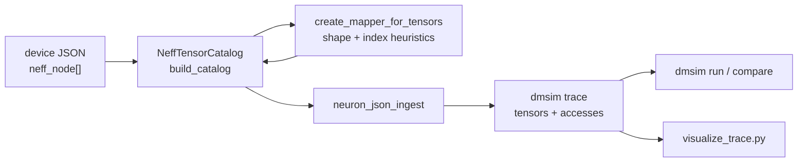
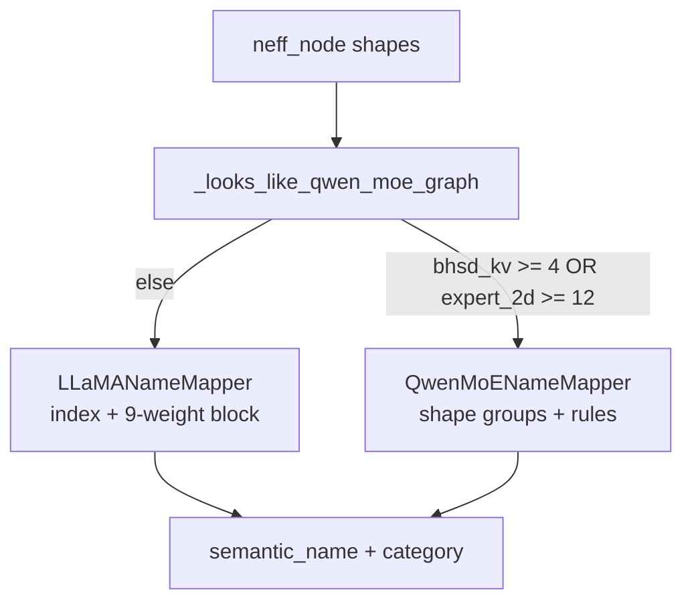

# Tensor Mapper Audit — Llama-3.2-1B-Instruct & Qwen1.5-MoE-A2.7B

Audit of [`src/dmsim/trace/tensor_name_mapper.py`](../src/dmsim/trace/tensor_name_mapper.py) against **compiled NEFF slot shapes** (not raw HuggingFace shapes). Conducted June 2026. Findings come from code review, HF/NxD layout recipes, in-repo model constants, and inline mapper tests.

**Related:** [WORKFLOW.md](WORKFLOW.md), [profiler/LLAMA32_PROFILING_AND_DMSIM.md](../profiler/LLAMA32_PROFILING_AND_DMSIM.md), [profiler/NEURON_PROFILE.md](../profiler/NEURON_PROFILE.md), [docs/TODOS.md](TODOS.md).

**Key idea:** `neff_node[]` shapes are the mapper's ground truth. HF / PyTorch graphs are useful for architecture constants and for *deriving* expected NEFF shapes after TP, fusion, and layout transforms — see §2 and §3.

---

## 1. How to get model graphs (tensor dims + kernels)

Use a tiered approach. **Tier C is what dmsim actually ingests.**

### Tier A — HuggingFace weight catalog (logical / uncompiled)

Install `transformers`, then enumerate parameters:

```bash
pip install transformers torch
python3 -c "
from transformers import AutoConfig, AutoModelForCausalLM
for mid in ['meta-llama/Llama-3.2-1B-Instruct', 'Qwen/Qwen1.5-MoE-A2.7B']:
    cfg = AutoConfig.from_pretrained(mid)
    model = AutoModelForCausalLM.from_pretrained(mid, torch_dtype='auto', device_map='cpu')
    print('===', mid, '===')
    for name, p in model.named_parameters():
        print(name, tuple(p.shape))
"
```

This gives **semantic HF names → full (unsharded) shapes**. Do **not** compare these directly to `neff_node[]`; apply TP sharding, fusion, and layout rules in §2 first.

**Qwen HF config** (from `Qwen/Qwen1.5-MoE-A2.7B/config.json`): 24 layers, H=2048, 16 heads, 16 KV heads, head_dim=128, 60 experts, `moe_intermediate_size`=1408, `shared_expert_intermediate_size`=5632, vocab=151936.

**Llama constants** (from [`profiler/llama/config.py`](../profiler/llama/config.py)): 16 layers, H=2048, 32 heads, 8 KV heads, head_dim=64, intermediate=8192, vocab=128256.

### Tier B — PyTorch forward graph with shapes (pre-compile)

| Tool | Install | Use |
|------|---------|-----|
| **torchinfo** | `pip install torchinfo` | Tabular summary: `summary(model, input_size=(1, 1))` |
| **torch.fx + ShapeProp** | built-in | `ShapeProp(symbolic_trace(model)).propagate(sample_input)` |
| **torchview** | `pip install torchview` | Graphviz DAG with `show_shapes=True` |

Use a **decode-step** wrapper (batch=1, seq_len=1). Shapes here reflect the **traced PyTorch** graph before `neuronx-cc` / NxD compilation; they will diverge from NEFF after TP, fusion, and cache layout changes.

### Tier C — Compiled NEFF slot shapes (authoritative for the mapper)

**What they are:** Each entry in `neff_node[]` is a static graph I/O slot — `input0`, `input1`, … — with a shape string, byte `size`, and `type` (`IN`, `OUT`, `WEIGHT`). These are the **whole-slot** geometries at the NEFF boundary, after tensor-parallel sharding and compiler layout choices. They are **not** kernel-internal tile sizes and **not** per-DMA chunk sizes.

| Model | Decode `model-key` | Capture script |
|-------|-------------------|----------------|
| Llama 3.2 1B | `446048307616134` | `profiler/capture_and_export.sh` |
| Qwen 1.5 MoE A2.7B | `307929685239809` | `profiler/capture_and_export_qwen.sh` |

#### How to view NEFF slot shapes

| Method | What you get |
|--------|----------------|
| **Neuron Explorer UI** | Tensor Viewer on the capture directory: `neuron-explorer view -d "$PROFILE" -p 8081` (SSH tunnel if remote). Best for browsing aggregates; same underlying NEFF metadata as JSON export. |
| **Exported device JSON** | `neff_node[]` inside per-core files, e.g. `i-*_nc_0_model_446048307616134.json`. Produced by `capture_and_export.sh` / `capture_and_export_qwen.sh` via `neuron-explorer view --output-format json`. |
| **Raw JSON (no mapper)** | `jq '.neff_node[] \| {variable_name, shape, size, type}' device.json` — raw slot table. |
| **`NeffTensorCatalog` (mapped)** | Runs the heuristic mapper on each node; prints semantic names. Snippet below. |
| **Ingested dmsim trace** | `dmsim ingest` writes `tensors[]` with `name` (semantic), `bytes` (from `neff_node.size`), `category` (from mapper). |
| **`visualize_trace.py`** | Bar charts of tensor **counts/bytes by category** from ingested trace — indirect view of catalog + mapper quality. |

**Kernels (separate from slot shapes):** `layer_summary[]` — per-kernel `name`, `start`, `end`, FLOPs. Timing boundaries only; does not list input/output tensor shapes per kernel.

**Inspect raw + mapped slots:**

```python
import re, json
from pathlib import Path
from dmsim.trace.neuron_json_ingest import discover_profile_dir, resolve_device_json
from dmsim.trace.tensor_name_mapper import NeffTensorCatalog

PROFILE = Path("/dev/shm/traced_model/.../profile")
dev = json.load(open(resolve_device_json(discover_profile_dir(PROFILE), 0, "446048307616134")))

# Raw NEFF slots
for node in dev.get("neff_node") or []:
    print(node.get("variable_name"), node.get("shape"), node.get("size"), node.get("type"))

# After heuristic mapper
cat = NeffTensorCatalog(dev)

def idx(e):
    m = re.search(r"\d+", e.variable_name)
    return int(m.group()) if m else 0

for e in sorted(cat.entries(), key=idx):
    print(f"{e.variable_name:12} {e.shape:20} {e.bytes:10} -> {e.semantic_name:40} {e.category.value}")
```

Copy profile JSON from the Trainium host when access is restored, then validate against §4.

#### Where NEFF slot shapes are already used in this repo



| Stage | File | How `neff_node` is used |
|-------|------|-------------------------|
| Catalog build | [`tensor_name_mapper.py`](../src/dmsim/trace/tensor_name_mapper.py) | `NeffTensorCatalog` reads all nodes; `map_tensor(variable, shape, type)` → semantic name + category; indexes `by_variable` and `by_size`. |
| Trace seeding | [`neuron_json_ingest.py`](../src/dmsim/trace/neuron_json_ingest.py) | `_seed_catalog_tensors` — each catalog entry becomes a `TensorRecord` (`name`, `bytes`, `category`) in the ingested trace. |
| Named DMA | same | `resolve_dma` — if `dma.variable` matches `inputN` or unique byte size, attach access to catalog entry. |
| Unattributed DMA | same | `_ProportionalCategoryAssigner.from_catalog` — when decode DMA is `variable=unknown`, split bytes across synthetic `hbm_traffic_{category}` tensors **in proportion to NEFF catalog byte totals per category**. |
| Simulation | `dmsim.cli run` | Placement / eviction use trace tensor `bytes` and `category` (derived from mapper + catalog sizes). |
| Visualization | [`visualize_trace.py`](../profiler/visualize_trace.py) | Charts static `tensor.bytes` (from catalog) vs access traffic. |

**What NEFF shapes are *not* used for:** binding dynamic DMA rows to individual layers (decode ~99% `unknown`); kernel-internal matmul tiling; sub-tensor DMA chunk geometry (`transfer_size` is often 256 B on dynamic queues, unrelated to full slot shape).

---

## 2. Shape equivalence caveats (HF vs NEFF vs tiling)

Do not expect `neff_node[]` shapes to match `model.named_parameters()` one-to-one.

| Transform | Effect on shapes | Example |
|-----------|------------------|---------|
| **Tensor parallelism (TP=4)** | Vocab, heads, intermediate dims divided across ranks | vocab `128256→32064`; attn proj `2048→512` |
| **Weight fusion** | Multiple HF matrices → one NEFF slot | Qwen expert `gate_proj` + `up_proj` → `[60 2048 2816]` |
| **Transpose / layout** | Same elements, different axis order | Expert fusion uses `.T` in [`convert_qwen_moe_to_neuron_state_dict`](../profiler/qwen_moe/neuron_modeling_qwen_moe.py) |
| **KV cache layout** | `bshd` in PyTorch source vs `bhsd` on decode NEFF | Llama `[1 2 256 64]` not `[1 128 2 64]` |
| **GQA head repeat (Llama)** | KV heads repeated before TP shard | `wk`/`wv` become `[128 2048]` not raw HF `[512 2048]` |
| **Kernel / DMA tiling** | **Below** NEFF slot granularity | `layer_summary` kernels tile matmuls; DMA `transfer_size` is chunk bytes — neither appears in `neff_node.shape` |

**Valid comparisons:**

| From | To | Valid? |
|------|-----|--------|
| HF `named_parameters()` | `neff_node[]` directly | No |
| HF + NxD layout recipe (§4 tables) | `neff_node[]` | Yes — expected NEFF shapes |
| Mapper rules | `neff_node[]` on same capture | Yes — the real functional test |
| PyTorch `torchinfo` | `neff_node[]` | Only after documenting compile transforms |

**NxD layout recipes in-repo:** [`profiler/llama/model.py`](../profiler/llama/model.py) (Llama TP + KV), [`profiler/qwen_moe/neuron_modeling_qwen_moe.py`](../profiler/qwen_moe/neuron_modeling_qwen_moe.py) (MoE fusion). The §4 tables are derived from these plus captured decode conventions in [LLAMA32_PROFILING_AND_DMSIM.md](../profiler/LLAMA32_PROFILING_AND_DMSIM.md).

---

## 3. PyTorch graph tooling quick reference

See §1 Tier A/B. For compiled graphs, Tier C (`neff_node` + `layer_summary`) is authoritative for dmsim.

```bash
pip install torchinfo
python3 -c "from torchinfo import summary; ..."
```

---

## 4. Expected NEFF shape catalogs (TP=4, decode)

These are **expected compiled NEFF slot shapes** (HF + TP=4 + NxD fusion/layout), not raw HF parameter shapes. Trace config: TP=4, batch=1, seq=256 (see [`profiler/run_llama32_1b_trn2.py`](../profiler/run_llama32_1b_trn2.py), [`profiler/run_qwen_moe_trn2.py`](../profiler/run_qwen_moe_trn2.py)). Confirm against real `neff_node[]` from Tier C when profile JSON is available.

### Llama-3.2-1B-Instruct

| Semantic name | NEFF shape | Notes |
|---------------|------------|-------|
| `tokens` | `[1 1]` | decode step |
| `position` | `[1]` | |
| `attention_mask` | `[1 1]` | |
| `layer_L.cache_k` / `cache_v` | `[1 2 256 64]` | **bhsd**: 8 KV heads / TP4 = 2; seq=256 |
| `embedding.weight` | `[32064 2048]` | vocab/TP |
| `layer_L.attention.wq.weight` | `[2048 512]` | H × (n_heads·head_dim/TP) |
| `layer_L.attention.wk.weight` | `[128 2048]` | (n_kv·head_dim/TP) × H — transposed vs HF |
| `layer_L.attention.wv.weight` | `[128 2048]` | same |
| `layer_L.attention.wo.weight` | `[512 2048]` | |
| `layer_L.attention_norm.weight` | `[2048]` | |
| `layer_L.mlp.gate_proj.weight` | `[2048 2048]` | intermediate/TP = 8192/4 |
| `layer_L.mlp.up_proj.weight` | `[2048 2048]` | |
| `layer_L.mlp.down_proj.weight` | `[2048 2048]` | |
| `layer_L.mlp_norm.weight` | `[2048]` | |
| `output.weight` | `[32064 2048]` | lm_head TP shard |
| `final_norm.weight` | `[2048]` | |

KV layout in [`profiler/llama/model.py`](../profiler/llama/model.py) registers caches as **bshd** `(batch, seq, n_kv_heads, head_dim)`, but decode NEFF uses **bhsd** `[1 2 256 64]` per [LLAMA32_PROFILING_AND_DMSIM.md](../profiler/LLAMA32_PROFILING_AND_DMSIM.md).

### Qwen1.5-MoE-A2.7B

| Semantic name | NEFF shape | Notes |
|---------------|------------|-------|
| `layer_L.cache_k` / `cache_v` | `[1 4 256 128]` | bhsd; 16 KV heads/TP4 |
| `layer_L.moe.router.gate.weight` | `[60 2048]` | |
| `layer_L.moe.expert.gate_up.weight` | `[60 2048 2816]` | Neuron fused **(E, H, 2·I)** per [`convert_qwen_moe_to_neuron_state_dict`](../profiler/qwen_moe/neuron_modeling_qwen_moe.py) |
| `layer_L.moe.expert.down_proj.weight` | `[60 1408 2048]` | Neuron fused **(E, I, H)** |
| `layer_L.attention.wq/wk/wv.weight` | `[2048 512]` | MHA (16·128/4) |
| `layer_L.attention.wo.weight` | `[512 2048]` | |
| `layer_L.mlp.shared.gate_proj.weight` | `[2048 1408]` | shared expert |
| `layer_L.mlp.shared.up_proj.weight` | `[2048 1408]` | |
| `layer_L.mlp.shared.down_proj.weight` | `[1408 2048]` | |
| `layer_L.input_layernorm.weight` | `[1 2048]` | mapper expects `(1, H)` |
| `layer_L.post_attention_layernorm.weight` | `[2048]` | mapped as `norm.weight` |
| `layer_L.attention.bias` | `[512]` | QKV bias shard (o_proj bias injected as zeros in Neuron model) |
| `embedding.weight` | `[37984 2048]` | 151936/4 |
| `output.weight` | `[151936 512]` | full vocab × hidden/TP |

---

## 5. Mapper audit results

Tests run: `pytest tests/test_tensor_name_mapper.py tests/test_qwen_moe_tensor_mapper.py` (4 passed). Additional synthetic NEFF tensors were fed through `create_mapper_for_tensors` inline (not saved as a script).

### 5.1 Critical — Llama decode selects `QwenMoENameMapper`

`_looks_like_qwen_moe_graph()` returns true when **≥4 bhsd KV tensors** OR ≥12 expert-like 2D/3D tensors.

Llama decode KV shape `[1 2 256 64]` is classified as **bhsd** by `classify_kv_shape`. With 16 layers × 2 (K+V) = **32 bhsd tensors**, the full decode NEFF triggers Qwen mapper selection.

**Measured:** synthetic full Llama decode NEFF → `QwenMoENameMapper` → **146/182 tensors misnamed** (all attention/MLP weights mapped to MoE/shared rules or `unknown`).

| Expected | Got (example) |
|----------|---------------|
| `layer_0.attention.wq.weight` `[2048 512]` | `layer_0.mlp.shared.gate_proj.weight` |
| `layer_0.attention.wk.weight` `[128 2048]` | `layer_0.moe.router.gate.weight` |
| `layer_0.mlp.gate_proj.weight` `[2048 2048]` | `input41` (unknown) |

KV tensors **do** get correct layer names under Qwen mapper (`layer_L.cache_k/v`), but every weight is wrong.

**Fix direction:** Require expert-like 2D/3D tensors for Qwen detection, not bhsd KV alone; or exclude graphs with Llama-dense weight signatures (e.g. `[128 2048]` wk shapes, no `[60 …]` experts).

### 5.2 Critical — Llama KV loses layer index under `LLaMANameMapper`

Even when `LLaMANameMapper` is used, decode KV `[1 2 256 64]` maps to generic `input3_kv_cache` (layer_index=-1), not `layer_0.cache_k`.

**Cause:** Early return in `_map_input_tensor` (lines 307–317) fires on any KV-shaped input **before** index-based layer assignment (lines 319–339). Confirmed by unit test expecting `input3_kv_cache` in [`tests/test_tensor_name_mapper.py`](../tests/test_tensor_name_mapper.py).

For isolated `LLaMANameMapper` with decode KV `[1 2 256 64]`:
- `input3` → `input3_kv_cache`, `layer_index=-1` (not `layer_0.cache_k`)

Prefill-style bshd `[1 128 2 64]` hits the same early-return path under `LLaMANameMapper`; layer assignment via input index only runs if the early KV heuristic is skipped.

**Fix direction:** Assign layer from input index (or ordered KV slot list, as Qwen does) before returning generic KV name; or only use early heuristic when index is outside the KV range.

### 5.3 Critical — Qwen expert 3D shapes swapped

Neuron fusion ([`neuron_modeling_qwen_moe.py`](../profiler/qwen_moe/neuron_modeling_qwen_moe.py)):

| Tensor | Actual shape |
|--------|--------------|
| `gate_up_proj.weight` | `(E, H, 2·I)` = `[60 2048 2816]` |
| `down_proj.weight` | `(E, I, H)` = `[60 1408 2048]` |

Mapper `_map_moe_weight_shape` rules:

| Rule | Condition | Intended name |
|------|-----------|---------------|
| gate_up | `shape[2] == hidden_size` | `expert.gate_up` |
| down | `shape[1] == hidden_size` | `expert.down_proj` |

**Measured on Neuron shapes:**

| Shape | Expected | Got |
|-------|----------|-----|
| `[60 2048 2816]` | `gate_up` | `expert.down_proj` ❌ |
| `[60 1408 2048]` | `down_proj` | `expert.gate_up` ❌ |

TP-sharded shapes `[60 352 2048]` / `[60 2048 352]` map correctly to the (wrong) rules — still swapped semantically if Neuron uses unsharded `(E,H,2I)` layout.

**Fix direction:** Match `(E, H, 2·I)` → gate_up and `(E, I, H)` → down_proj.

### 5.4 High — Qwen wq/wk/wv not distinguished; layer index fails

All three projections share shape `[2048 512]`. With 24 layers, the shape group has **72 tensors**. `_layer_index_in_group` only handles group sizes `n_layers`, `2·n_layers`, or `n_layers·2` with pos `< n_layers`; **72 returns -1**.

**Measured:** `wq`, `wk`, `wv` all → `input171` (unknown).

**Fix direction:** Use input-index ordering within shape groups (like KV slots), or separate rules for wk/wv (e.g. HF transposed layouts if they differ on NEFF).

### 5.5 High — Qwen shared `gate_proj` / `up_proj` ambiguous

`sgate` and `sup` share `[2048 1408]` → 48 tensors in one group. Layer index works (`pos // 2`), but **both map to the same rule** (`shared.gate_proj`); `up_proj` has no rule.

**Measured:** `sgate` → `input267` (unknown), `sup` → `input267` (unknown). Likely autodetect / group-order interaction; both shapes need distinct mapping (index offset within the 9-weight block or separate shape signatures).

### 5.6 Medium — Other gaps

| Issue | Detail |
|-------|--------|
| `shared_expert_gate.weight` | Not in mapper; Neuron adds per [`neuron_modeling_qwen_moe.py`](../profiler/qwen_moe/neuron_modeling_qwen_moe.py) |
| Hierarchical router `linear_group.weight` | `[n_group, H]` when `--router-kernel hierarchical`; not mapped |
| Llama MLP `[2048 2048]` | No Qwen rule; stays `unknown` when Qwen mapper wrongly selected |
| `classify_kv_shape` | Decode Llama KV tagged bhsd (Qwen layout); conflates two conventions |
| TP-exact equality | Rules use full `moe_intermediate_size=1408`; fail if experts shard I dim |

### 5.7 What works today

| Case | Result |
|------|--------|
| Qwen KV `[1 4 256 128]` | `layer_0.cache_k` / `layer_0.cache_v` ✓ |
| Qwen router `[60 2048]` | `layer_0.moe.router.gate.weight` ✓ |
| Qwen `wo` `[512 2048]` | `layer_0.attention.wo.weight` ✓ |
| Qwen `input_layernorm` `[1 2048]` | `layer_0.input_layernorm.weight` ✓ |
| Qwen `post norm` `[2048]` | `layer_0.norm.weight` ✓ |
| Qwen attention bias `[512]` | `layer_0.attention.bias` ✓ |
| Qwen embedding / lm_head | Large 2D vocab rules ✓ (unit tests) |

---

## 6. Architecture flow



**Llama decode failure mode:** 32 bhsd KV tensors → Qwen path → dense weights misclassified.

---

## 7. Recommended fix priority

| P | Issue | Suggested change |
|---|-------|------------------|
| P0 | Llama → Qwen misroute | Tighten `_looks_like_qwen_moe_graph`; require expert tensors |
| P0 | Qwen expert 3D swap | Fix gate_up/down shape conditions to `(E,H,2I)` / `(E,I,H)` |
| P0 | Llama KV no layer | Layer assignment before generic `inputN_kv_cache` fallback |
| P1 | Qwen wq/wk/wv group of 72 | Index-ordered slots within shape group |
| P1 | Qwen shared up_proj | Add rule or index offset vs gate_proj |
| P2 | KV layout taxonomy | Separate decode bhsd-for-Llama from Qwen in `classify_kv_shape` |
| P2 | TP-tolerant matching | Compare ratios, not exact intermediate dims |

---

## 8. Re-audit when profile JSON is available

1. Copy decode device JSON from Trainium (`model-key` in §1 Tier C).
2. Print raw `neff_node[]`, then run the `NeffTensorCatalog` snippet in §1.
3. Compare each `inputN` shape against §4 tables (not raw HF).
4. Re-ingest and check `visualize_trace.py` category breakdown for unexpected `other` share.

Expected outcome if P0 bugs are present on real captures:
- **Llama decode:** many weights labeled `moe_*` or `mlp.shared.*` or `other`
- **Qwen decode:** expert weights with swapped names; wq/wk/wv as `other`
