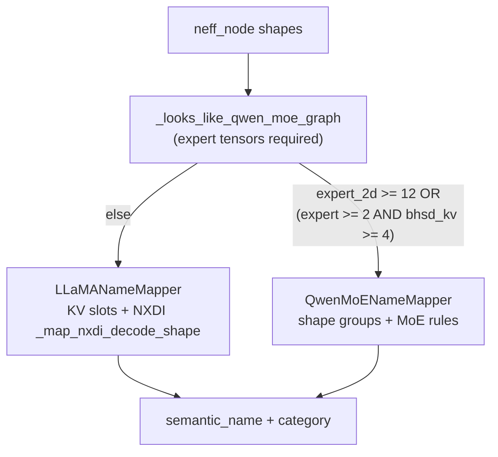
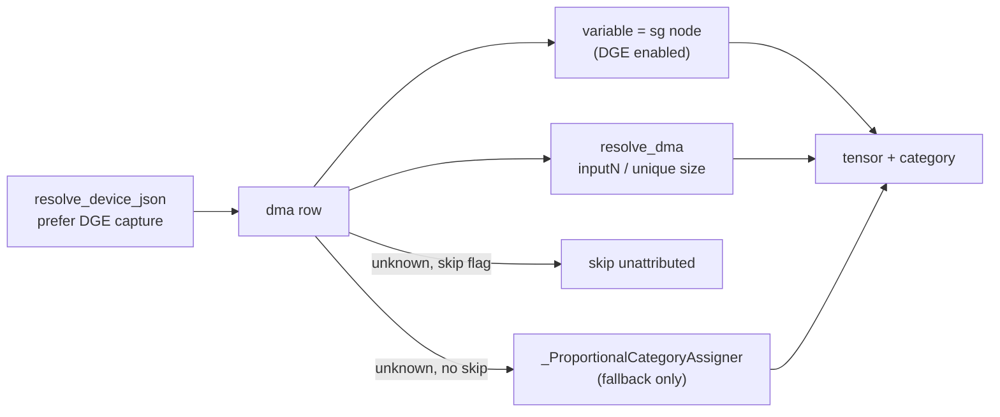

# Tensor Mapper Audit — Llama-3.2-1B-Instruct & Qwen1.5-MoE-A2.7B

Audit of [`src/dmsim/trace/tensor_name_mapper.py`](../src/dmsim/trace/tensor_name_mapper.py) against **compiled NEFF slot shapes** (not raw HuggingFace shapes).

| Audit | Date | Scope |
|-------|------|-------|
| Initial | June 2026 | Code review + synthetic NEFF; P0 bugs documented |
| Re-audit | 19 June 2026 | Live decode NEFF JSON on trn2.3xlarge + ingested 4-core traces |
| **Independent audit (this doc)** | **20 June 2026** | Full re-run: live catalogs (4 cores), fresh 4-core ingest, pytest, DMA/DGE checks |

**Related:** [WORKFLOW.md](dev/WORKFLOW.md), [profiler/LLAMA32_PROFILING_AND_DMSIM.md](../profiler/LLAMA32_PROFILING_AND_DMSIM.md), [profiler/NEURON_PROFILE.md](../profiler/NEURON_PROFILE.md).

**Key idea:** `neff_node[]` shapes are the mapper's ground truth. HF / PyTorch graphs are useful for architecture constants and for *deriving* expected NEFF shapes after TP, fusion, and layout transforms — see §2.

**Verdict (20 June 2026):** Mapper and ingest path are **healthy**. Zero fallback `inputN_norm` names, zero duplicate catalog `tensor_id`s, zero Qwen `other` static tensors. Llama mixed-profile dirs auto-select DGE capture. No open P0–P3 bugs.

**Capture note:** Llama uses **NXDI** tiled decode NEFFs (`912553378486640`). Dense HF-style shapes (e.g. `[2048 512]` wq) do **not** appear on the live Llama decode graph — see §4.1.

---

## 1. How to get model graphs (tensor dims + kernels)

Use a tiered approach. **Tier C is what dmsim actually ingests.**

### Tier A — HuggingFace weight catalog (logical / uncompiled)

```bash
pip install transformers torch
python3 -c "
from transformers import AutoConfig, AutoModelForCausalLM
for mid in ['meta-llama/Llama-3.2-1B-Instruct', 'Qwen/Qwen1.5-MoE-A2.7B']:
    cfg = AutoConfig.from_pretrained(mid)
    model = AutoModelForCausalLM.from_pretrained(mid, torch_dtype='auto', device_map='cpu')
    print('===', mid, '===')
    for name, p in model.named_parameters():
        print(name, tuple(p.shape))
"
```

**Qwen HF config:** 24 layers, H=2048, 16 heads, 16 KV heads, head_dim=128, 60 experts, `moe_intermediate_size`=1408, vocab=151936.

**Llama constants** ([`profiler/llama/config.py`](../profiler/llama/config.py)): 16 layers, H=2048, 32 heads, 8 KV heads, head_dim=64, intermediate=8192, vocab=128256.

### Tier B — PyTorch forward graph with shapes (pre-compile)

Decode-step wrapper (batch=1, seq_len=1). Shapes reflect traced PyTorch before `neuronx-cc` / NxD compilation.

### Tier C — Compiled NEFF slot shapes (authoritative for the mapper)

| Model | Decode `model-key` | Profile path (this host) |
|-------|-------------------|--------------------------|
| Llama 3.2 1B NXDI | **`912553378486640`** | `/dev/shm/traced_model/Llama-3.2-1B-Instruct-nxdi-lnc1-tp4-b1-ctx128-seq256/profile` |
| Qwen 1.5 MoE A2.7B | **`902259225960644`** | `/dev/shm/traced_model/Qwen1.5-MoE-A2.7B-lnc1-tp4-b1-p128-s256-rtopk_softmax/profile` |

Older captures used different NEFF hashes (`446048307616134` Llama, `307929685239809` Qwen). Always pass the `model-key` from the exported JSON filename.

#### Inspect raw + mapped slots

```python
import re, json
from pathlib import Path
from dmsim.trace.neuron_json_ingest import discover_profile_dir, resolve_device_json
from dmsim.trace.tensor_name_mapper import NeffTensorCatalog, create_mapper_for_tensors

PROFILE = Path("/dev/shm/traced_model/.../profile")
MODEL_KEY = "912553378486640"
dev = json.load(open(resolve_device_json(discover_profile_dir(PROFILE), 0, MODEL_KEY)))

mapper = create_mapper_for_tensors(dev["neff_node"])
print(type(mapper).__name__, "n_layers=", getattr(mapper, "n_layers", None))

cat = NeffTensorCatalog(dev)
for e in sorted(cat.entries(), key=lambda x: int(re.search(r"\d+", x.variable_name).group())):
    print(f"{e.variable_name:12} {e.shape:22} {e.bytes:10} -> {e.semantic_name:45} {e.category.value}")
```

#### Where NEFF shapes flow in dmsim

| Stage | File | Role |
|-------|------|------|
| Catalog build | `tensor_name_mapper.py` | `NeffTensorCatalog` → semantic name + category |
| Trace seeding | `neuron_json_ingest.py` | Each catalog entry → `TensorRecord` |
| Capture selection | `neuron_json_ingest.py` | `resolve_device_json` picks lowest-unknown-DMA `pid_*` |
| Named DMA | same | `NeffTensorCatalog.resolve_dma` |
| Unattributed DMA | same | skipped when `--skip-unattributed-dma`; else `_ProportionalCategoryAssigner` |
| Viz | `visualize_trace.py` | Category bar charts from ingested trace |

**DGE:** `ENABLE_DGE_NOTIFS=1` attributes dynamic DMA to graph nodes. Without DGE, Llama decode DMA is ~100% `variable=unknown` (see §5.2).

**Semantic vs simulator category:** RMSNorm slots (`attention_norm`, `input_layernorm`, etc.) map to mapper `norm_weight` but dmsim `TensorCategory.WEIGHT` — intentional; norms are static weight tensors in the simulator.

---

## 2. Shape equivalence caveats (HF vs NEFF vs tiling)

| Transform | Effect | Example |
|-----------|--------|---------|
| **Tensor parallelism (TP=4)** | Dims divided across ranks | vocab `128256→32064`; attn `2048→512` |
| **Weight fusion** | Multiple HF matrices → one slot | Qwen gate+up → `[60 2048 704]`; QKV → `qkv_proj` / `qkv_tile` |
| **NXDI tiling (Llama decode)** | Dense weights become 6D tile slots | qkv `[4 64 2 4 4 128]`, wo `[2 128 16 4 2 32]` |
| **KV layout** | bshd in source vs bhsd on NEFF | Llama persistent KV `[1 2 256 64]` |
| **KV staging (Llama NXDI)** | 5D workspace, not persistent cache | `[8 128 16 2 128]` → `kv_cache` for traffic accounting |
| **Kernel / DMA tiling** | Below NEFF slot granularity | DMA `transfer_size` often 256 B |

**Valid comparisons:** HF + layout recipe → expected NEFF; mapper rules → live `neff_node[]`; ingest category breakdown → mapper quality.

---

## 3. PyTorch graph tooling quick reference

See §1 Tier A/B. For compiled graphs, Tier C is authoritative.

---

## 4. Observed NEFF shape catalogs (TP=4, decode, live captures)

Tables from **independent audit 20 June 2026** — nc0 device JSON selected by `resolve_device_json` (DGE-preferred).

### 4.1 Llama-3.2-1B-Instruct NXDI (`912553378486640`)

234 `neff_node` entries per core (nc0–nc3 identical). Mapper: **`LLaMANameMapper`**, `n_layers=16`.

| Semantic name (mapped) | NEFF shape | Count | Static (nc0) | Notes |
|------------------------|------------|-------|--------------|-------|
| `tokens`, `position`, `attention_mask` | `[1 1]`, `[1 256]`, `[1 1]` | 1+2×dup | &lt;1 KiB | runtime → activation |
| `layer_L.cache_k` / `cache_v` | `[1 2 256 64]` | 32 IN + 32 OUT | 4 MiB | bhsd persistent KV |
| `layer_L.attention.kv_staging_{0,1,2}` | `[8 128 16 2 128]` | 48 | 384 MiB | NXDI staging → **kv_cache** |
| `layer_L.cache_k_tile` / `cache_v_tile` | `[128 16 2 64]`, `[128 16 2 2 32]` | 16 + 16 | 16 MiB | tiled KV views |
| `layer_L.attention.qkv_tile.weight` | `[4 64 2 4 4 128]` | 16 | 32 MiB | fused Q/K/V tile (no separate wk/wv slots) |
| `layer_L.attention.wo.weight` | `[2 128 16 4 2 32]` | 16 | 32 MiB | NXDI output proj tile |
| `layer_L.attention_norm` / `mlp_norm` | `[128 16]` | 32 + 1 final | 0.1 MiB | group 33 = 2·16 + 1 |
| `final_norm.weight` | `[128 16]` | 1 (in group above) | — | trailing slot in norm group |
| `embedding.weight` | `[128256 512]` | 1 | 125 MiB | full-vocab NEFF view |
| `output.weight` | `[32064 2048]` | 1 | 125 MiB | lm_head TP shard |
| `logits` | `[128256]` | 1 | 0.5 MiB | decode output |
| Compiler constants | `[32 128 1 1]`, `[128 128 1 1]`, etc. | 19 WEIGHT | 0.3 MiB | → **activation** |

**Not present:** dense `[2048 512]` wq, `[128 2048]` wk/wv, `[2048 2048]` MLP — NXDI uses tiled 6D slots.

**Chip static (4 cores):** kv_cache 56.2% · weight 43.8% · activation &lt;0.1% (~2878 MiB total).

### 4.2 Qwen1.5-MoE-A2.7B (`902259225960644`)

561 `neff_node` entries per core. Mapper: **`QwenMoENameMapper`**, `n_layers=24`, `moe_intermediate_size=1408`.

| Semantic name (mapped) | NEFF shape | Count | Static (nc0) | Notes |
|------------------------|------------|-------|--------------|-------|
| `layer_L.cache_k` / `cache_v` | `[1 4 256 128]` | 48 IN + 48 OUT | 24 MiB | bhsd KV |
| `layer_L.moe.router.gate.weight` | `[60 2048]` | 24 | 5.6 MiB | ✓ |
| `layer_L.moe.expert.gate_up.weight` | `[60 2048 704]` | 24 | 3960 MiB | TP `(E,H,2I/TP)` ✓ |
| `layer_L.moe.expert.down_proj.weight` | `[60 352 2048]` | 24 | 1980 MiB | TP `(E,I/TP,H)` ✓ |
| `layer_L.attention.qkv_proj.weight` | `[2048 512]` | 24 | 48 MiB | one fused slot per layer ✓ |
| `layer_L.attention.wo.weight.tpN` | `[512 2048]` | 72 | 144 MiB | 3 TP shards/layer, unique names |
| `layer_L.attention.bias.tpN` | `[512]` | 72 | 0.1 MiB | 3 TP shards/layer, unique names |
| `layer_L.mlp.shared.gate/up/down` | `[2048 1408]`, `[1408 2048]` | 24 + 48 | 396 MiB | ✓ |
| `layer_L.input_layernorm.weight` | `[1 2048]` | 24 | 0.1 MiB | ✓ |
| `layer_L.norm.weight` (+ `final_norm`) | `[2048]` | 73 | 0.3 MiB | group 73 = 3·24 + 1 |
| `embedding.weight` / `output.weight` | `[37984 2048]`, `[151936 512]` | 1 each | 148 MiB each | ✓ |
| `logits` | `[151936]` | 1 | 0.6 MiB | decode output |
| Compiler `bp_mask_*` | `[64 128 1 1]` | 48 | 1.5 MiB | → **activation** (not other) |

**Not present:** unsharded expert `[60 2048 2816]` (TP uses 704-wide dim). No Llama-style NXDI KV staging shapes.

**Chip static (4 cores):** weight 99.6% · kv_cache 0.4% · activation &lt;0.1% (~27.4 GiB total).

---

## 5. Independent audit results (20 June 2026)

### Method

1. `resolve_device_json` on mixed Llama profile (2 pids) and Qwen profile.
2. `NeffTensorCatalog` + `create_mapper_for_tensors` on nc0–nc3.
3. Fresh 4-core ingest: `--min-transfer-bytes 1 --no-aggregate-dma --skip-unattributed-dma --max-access-events 0`.
4. `pytest tests/test_tensor_name_mapper.py tests/test_qwen_moe_tensor_mapper.py tests/test_neuron_ingest.py` — **18 passed**, 4 skipped (no bundled example profile).

### 5.1 Regression checklist

| Check | Llama | Qwen |
|-------|-------|------|
| Mapper class | `LLaMANameMapper` ✓ | `QwenMoENameMapper` ✓ |
| `n_layers` | 16 ✓ | 24 ✓ |
| `moe_intermediate_size` | — | 1408 ✓ |
| Fallback `inputN_norm` | **0** ✓ | **0** ✓ |
| Duplicate catalog `tensor_id` | **0** ✓ | **0** ✓ |
| Static `other` tensors | **0** ✓ | **0** ✓ |
| Mis-rotated wq/wk/wv on `[2048 512]` | N/A (no dense q) | **0** (all `qkv_proj`) ✓ |
| nc0–nc3 catalog identical | ✓ | ✓ |

### 5.2 DGE capture selection

Mixed Llama profile contains two nc0 captures for the same NEFF:

| pid | unknown DMA | total DMA | unknown % |
|-----|-------------|-----------|-----------|
| `17801` | 151,316 | 151,351 | **99.98%** |
| `30400` | 1,598 | 152,330 | **1.0%** |

`resolve_device_json(..., prefer_dge_capture=True)` selects **`pid_30400`** automatically. Qwen capture (`pid_13149`) has 0.6% unknown DMA (2403 / 379,023).

`Coalesced_memloc_split_*` DMA variables (588 rows on Llama nc0) resolve to **activation** via `resolve_dma`.

### 5.3 Llama — catalog + ingest

**Catalog (nc0, `pid_30400`):**

| Category | Tensors | Static bytes | Share |
|----------|---------|--------------|-------|
| kv_cache | 144 | 404 MiB | 56.2% |
| weight | 68 | 315 MiB | 43.8% |
| activation | 22 | 0.3 MiB | &lt;0.1% |
| other | 0 | 0 | — |

**Ingest (fresh 4-core, mixed profile dir, 600,672 access events, 4.63 GiB):**

| Category | Access bytes | Share |
|----------|--------------|-------|
| **kv_cache** | **3.14 GiB** | **67.9%** |
| weight | 1.48 GiB | 32.0% |
| activation | 6 MiB | 0.1% |
| other | 0 | 0.0% |

KV-dominated decode traffic — matches expectation with DGE + NXDI staging attribution.

### 5.4 Qwen — catalog + ingest

**Catalog (nc0, `pid_13149`):**

| Category | Tensors | Static bytes | Share |
|----------|---------|--------------|-------|
| weight | 412 | 6831 MiB | 99.6% |
| kv_cache | 96 | 24 MiB | 0.4% |
| activation | 53 | 1.5 MiB | &lt;0.1% |
| other | 0 | 0 | — |

**Ingest (fresh 4-core, 1,503,901 access events, 9.02 GiB):**

| Category | Access bytes | Share |
|----------|--------------|-------|
| weight | 8.89 GiB | 98.6% |
| kv_cache | 94 MiB | 1.0% |
| activation | 27 MiB | 0.3% |
| other | 0 | 0.0% |

Weight-dominated — expected for 60 experts × 24 layers. Low KV % is architectural, not a mapper defect.

### 5.5 Fix history (all resolved)

| Issue | Status | Evidence (20 Jun) |
|-------|--------|-------------------|
| Llama selects Qwen mapper | Fixed | `LLaMANameMapper` on live NEFF |
| Llama KV layer index | Fixed | `[1 2 256 64]` → `layer_L.cache_k/v` |
| Qwen expert gate_up/down swap | Fixed | `[60 2048 704]` / `[60 352 2048]` |
| Qwen `moe_intermediate_size`=512 | Fixed | detects 1408 |
| Llama `[128 16]` norm group=33 | Fixed | `attention_norm` / `mlp_norm` + `final_norm` |
| Qwen `[2048]` norm group=73 | Fixed | `layer_L.norm.weight` ×3/layer + `final_norm` |
| Qwen fused QKV `[2048 512]` | Fixed | `attention.qkv_proj.weight` |
| Qwen wo/bias TP triplication | Fixed | `.tpN` suffix; 72 unique semantic + tensor IDs |
| NXDI qkv tile naming | Fixed | `attention.qkv_tile.weight` |
| Compiler WEIGHT slots | Fixed | 19 Llama + 48 Qwen `bp_mask` → activation |
| Mixed DGE profile | Fixed | auto-select `pid_30400` |
| `Coalesced_memloc*` DMA | Fixed | → activation |
| KV layout taxonomy | Fixed | `classify_kv_shape` docstring |

### 5.6 Residual notes (not bugs)

| Model | Note |
|-------|------|
| Llama | wk/wv not separate NEFF slots — fused in `qkv_tile` |
| Llama | Embedding appears as `[128256 512]` (full vocab) not TP shard `[32064 2048]` — same semantic name |
| Qwen | `layer_L.norm.weight` repeats 3× per layer (73 = 3·24 + 1) — correct for grouped shape |
| Qwen | KV access ~1% vs Llama ~68% — MoE vs dense/NXDI staging, expected |
| Both | `logits` output tensors present but not architecturally significant for weight/KV accounting |

---

## 6. Architecture flow



**Ingest path for decode DMA:**



---

## 7. Status — no open issues

All P0–P3 items from prior audits are **resolved** as of 20 June 2026. No new issues found in this independent audit.

---

## 8. Reproduce this audit

### Checklist

1. Confirm `model-key` matches exported JSON filename.
2. Run catalog snippet (§1); verify mapper class and `n_layers`.
3. Count fallback `inputN_norm` — expect **0**.
4. Verify `resolve_device_json` picks DGE capture on mixed Llama profile.
5. Ingest 4-core with DGE; expect **kv_cache &gt; weight** (Llama) and **weight ≫ kv_cache** (Qwen).
6. Run pytest (see §5).

### Ingest commands (validated 20 June 2026)

**Llama** (mixed profile dir — DGE auto-selected):

```bash
PYTHONPATH=src python3 -m dmsim.cli ingest \
  --profile-dir /dev/shm/traced_model/Llama-3.2-1B-Instruct-nxdi-lnc1-tp4-b1-ctx128-seq256/profile \
  --model-key 912553378486640 \
  --min-transfer-bytes 1 --no-aggregate-dma --skip-unattributed-dma \
  --max-access-events 0 \
  --output data/traces/llama32_1b_decode_4core_dge_kv.json

python profiler/visualize_trace.py \
  data/traces/llama32_1b_decode_4core_dge_kv.json \
  -o profiler/out/llama32_1b_decode_4core_dge_kv_viz
```

**Qwen:**

```bash
PYTHONPATH=src python3 -m dmsim.cli ingest \
  --profile-dir /dev/shm/traced_model/Qwen1.5-MoE-A2.7B-lnc1-tp4-b1-p128-s256-rtopk_softmax/profile \
  --model-key 902259225960644 \
  --min-transfer-bytes 1 --no-aggregate-dma --skip-unattributed-dma \
  --max-access-events 0 \
  --output data/traces/qwen1_5_moe_decode_4core_dge_v2.json

python profiler/visualize_trace.py \
  data/traces/qwen1_5_moe_decode_4core_dge_v2.json \
  -o profiler/out/qwen1_5_moe_decode_4core_dge_v2_viz
```

### Expected vs broken signals

| Signal | Healthy | Broken |
|--------|---------|--------|
| Llama mapper class | `LLaMANameMapper` | `QwenMoENameMapper` |
| Llama weight names | `qkv_tile`, `wo`, norms | `moe.*`, `inputN_norm` |
| Llama access (DGE) | kv_cache ~60–70% | weight 100% or other &gt;5% |
| Llama device JSON | `pid_30400` (auto) | `pid_17801` default |
| Qwen `moe_intermediate_size` | 1408 | 512 |
| Qwen QKV on `[2048 512]` | `qkv_proj` | rotating wq/wk/wv |
| Qwen catalog `other` | 0 | &gt;0 or hundreds misclassified |
| Fallback `inputN_norm` | 0 | &gt;0 |

---

## Appendix — initial audit bug summaries (historical)

The June 2026 initial audit (synthetic / pre-fix) documented P0 bugs in the first version of this file. All P0 items are **resolved**. Keep this appendix for regression context only.
