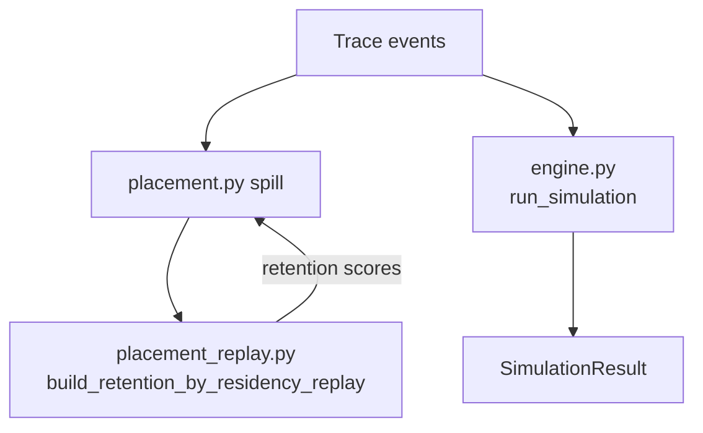

# Line-by-line walkthrough: trace replay (placement + main simulator)

Complete annotation of:

- `[src/dmsim/sim/placement_replay.py](../src/dmsim/sim/placement_replay.py)` (279 lines) — **placement spill ranking** replay
- `[src/dmsim/sim/engine.py](../src/dmsim/sim/engine.py)` (518 lines) — **main trace replay** (latency, energy, HBM traffic)

**Related:** [PLACEMENT_CODE_WALKTHROUGH.md](PLACEMENT_CODE_WALKTHROUGH.md), [PLACEMENT_AND_EVICTION.md](PLACEMENT_AND_EVICTION.md), `[sim/README.md](../src/dmsim/sim/README.md)`.

**External symbols:** See [External definitions](#external-definitions-not-in-the-replay-files) at the end.

---

## Two replays, one residency model

Both files replay the **same trace events** using the **same rules** for “where does this read come from?” — but they **charge different things**:


|                             | Placement replay                              | Main replay (`engine.py`)                       |
| --------------------------- | --------------------------------------------- | ----------------------------------------------- |
| **Called from**             | `placement.py` `_spill_retention_index`       | `run_simulation`                                |
| **When**                    | Once per over-capacity pool, before sim       | Full simulation                                 |
| **Updates**                 | `retention`, `home_hop_bytes` dicts only      | `SimulationResult` (time, energy, HBM bytes, …) |
| **Residency state**         | Temporary; discarded after spill ranking      | Persistent through full trace                   |
| **Charges latency/energy?** | Computes `latency_ns` deltas only for scoring | Full `_charge_path` + refresh                   |





**Important:** `placement_replay.py` duplicates several helpers from `engine.py` (`_source_level_for_access`, `_handle_kernel_boundary`, …) so spill victim ranking sees the **same** `source`/`resident_level` evolution as the main sim. They are **not** shared imports — keep them in sync manually.

---

# Part A — `placement_replay.py`

## Lines 1–10 — Module header and imports

**Summary:** Lightweight replay module for placement spill ranking — imports config, residency state, and `latency_ns` only (no energy accounting).

```1:10:src/dmsim/sim/placement_replay.py
"""Residency-aware replay for placement spill (matches simulator hop charging)."""

from __future__ import annotations

from collections import defaultdict

from dmsim.config.models import PolicyConfig, ResolvedHierarchy
from dmsim.sim.residency import FastBufferState, LevelPoolState, TensorResidency
from dmsim.sim.transfer import latency_ns
from dmsim.trace.schema import AccessEvent, KernelBoundaryEvent, Trace
```


| Line | Meaning                                                                         |
| ---- | ------------------------------------------------------------------------------- |
| 1    | Purpose: score tensors for placement spill using a **lightweight** replay.      |
| 3    | Postponed annotations.                                                          |
| 5    | `defaultdict(float/int)` for accumulating per-tensor scores.                    |
| 7–9  | Config, residency dataclasses, **only** `latency_ns` from transfer (no energy). |
| 10   | Trace event types; no full `Trace` import needed beyond the parameter.          |


---

## Lines 13–96 — `build_retention_by_residency_replay` (public API)

**Summary:** Replays the trace with current `homes` and accumulates per-tensor **retention** (ns saved by homing in `pool_level` vs `spill_target`) plus **home_hop_bytes** for tie-breaks. Called once per over-capacity pool during placement spill; does not charge energy or update `SimulationResult`.

Full function (reference for all subsections below):

```13:96:src/dmsim/sim/placement_replay.py
def build_retention_by_residency_replay(
    trace: Trace,
    hierarchy: ResolvedHierarchy,
    policy: PolicyConfig,
    homes: dict[str, str],
    pool_level: str,
    spill_target: str,
) -> tuple[dict[str, float], dict[str, int]]:
    """
    Per-tensor benefit (ns) of homing in ``pool_level`` vs ``spill_target``.

    Counts ``latency_ns(spill→target) - latency_ns(pool→target)`` only on trace
    reads that actually incur an interconnect hop **from** ``pool_level`` (the
    tensor's home), matching when the simulator charges a home-level DMA.

    Also returns ``home_hop_bytes`` (Σ event bytes on those hops) for tie-breaks
    when per-hop latency delta is constant across transfer sizes.
    """
    tensor_map = trace.tensor_map()
    residency: dict[str, TensorResidency] = {
        tensor_id: TensorResidency(home_level=home, resident_level=home)
        for tensor_id, home in homes.items()
    }
    pools: dict[str, LevelPoolState] = {
        level.id: LevelPoolState(capacity_bytes=level.capacity_bytes)
        for level in hierarchy.enabled_levels
        if level.scope != "per_core"
    }
    fast_buffers: dict[int, dict[str, FastBufferState]] = {}
    retention: dict[str, float] = defaultdict(float)
    home_hop_bytes: dict[str, int] = defaultdict(int)

    pool_resolved = hierarchy.level_by_id(pool_level)
    spill_resolved = hierarchy.level_by_id(spill_target)
    target_id = policy.default_access_target
    to_level = hierarchy.level_by_id(target_id)

    _bootstrap_near_memory_homes(
        tensor_map, homes, hierarchy, residency, fast_buffers, pools
    )

    for event in trace.parsed_events():
        if isinstance(event, KernelBoundaryEvent):
            _handle_kernel_boundary(
                event, hierarchy, fast_buffers, residency, tensor_map
            )
            continue
        if not isinstance(event, AccessEvent):
            continue
        if event.op != "read":
            continue

        tensor = tensor_map.get(event.tensor_id)
        if tensor is None:
            continue

        state = residency[event.tensor_id]
        target = event.target_level or policy.default_access_target
        source = _source_level_for_access(event, state, policy, hierarchy)

        if _is_direct_stram_read(event, state, policy):
            continue

        if source != target and source == state.home_level == pool_level:
            lat_pool = latency_ns(
                hierarchy,
                event.bytes,
                from_level=pool_resolved,
                to_level=to_level,
            )
            lat_spill = latency_ns(
                hierarchy,
                event.bytes,
                from_level=spill_resolved,
                to_level=to_level,
            )
            retention[event.tensor_id] += int(lat_spill - lat_pool)
            home_hop_bytes[event.tensor_id] += event.bytes

        _advance_access_residency(
            event, hierarchy, policy, residency, fast_buffers
        )

    return dict(retention), dict(home_hop_bytes)
```

### Lines 13–30 — Signature and docstring

```13:30:src/dmsim/sim/placement_replay.py
def build_retention_by_residency_replay(
    trace: Trace,
    hierarchy: ResolvedHierarchy,
    policy: PolicyConfig,
    homes: dict[str, str],
    pool_level: str,
    spill_target: str,
) -> tuple[dict[str, float], dict[str, int]]:
    """
    Per-tensor benefit (ns) of homing in ``pool_level`` vs ``spill_target``.

    Counts ``latency_ns(spill→target) - latency_ns(pool→target)`` only on trace
    reads that actually incur an interconnect hop **from** ``pool_level`` (the
    tensor's home), matching when the simulator charges a home-level DMA.

    Also returns ``home_hop_bytes`` (Σ event bytes on those hops) for tie-breaks
    when per-hop latency delta is constant across transfer sizes.
    """
```


| Line  | Detail                                                                                                                                                                                                                      |
| ----- | --------------------------------------------------------------------------------------------------------------------------------------------------------------------------------------------------------------------------- |
| 13–20 | **Inputs:** full trace; hierarchy; policy; current `homes` map; the **full** pool being spilled (`pool_level`, e.g. `"ltram"`) and where victims would go (`spill_target`, e.g. `"hbm"`).                                   |
| 20    | **Returns:** `(retention, home_hop_bytes)` per tensor id.                                                                                                                                                                   |
| 21–29 | **Retention** = cumulative ns **saved** by homing in `pool_level` vs `spill_target` on reads that would DMA from home. Higher retention → tensor benefits more from staying in the pool → **keep** under `best_case` spill. |


**Example question answered:** “If we spill `w1` from LtRAM to HBM, how much extra latency would its trace reads pay?” — sum of `(lat_hbm→sbuf - lat_ltram→sbuf)` per qualifying read.

### Lines 31–48 — Initialize state (mirror of engine startup)

```31:48:src/dmsim/sim/placement_replay.py
    tensor_map = trace.tensor_map()
    residency: dict[str, TensorResidency] = {
        tensor_id: TensorResidency(home_level=home, resident_level=home)
        for tensor_id, home in homes.items()
    }
    pools: dict[str, LevelPoolState] = {
        level.id: LevelPoolState(capacity_bytes=level.capacity_bytes)
        for level in hierarchy.enabled_levels
        if level.scope != "per_core"
    }
    fast_buffers: dict[int, dict[str, FastBufferState]] = {}
    retention: dict[str, float] = defaultdict(float)
    home_hop_bytes: dict[str, int] = defaultdict(int)

    pool_resolved = hierarchy.level_by_id(pool_level)
    spill_resolved = hierarchy.level_by_id(spill_target)
    target_id = policy.default_access_target
    to_level = hierarchy.level_by_id(target_id)
```


| Line  | Code                                                                         | Meaning                                                                                                                      |
| ----- | ---------------------------------------------------------------------------- | ---------------------------------------------------------------------------------------------------------------------------- |
| 31    | `tensor_map = trace.tensor_map()`                                            | `dict[id → TensorRecord]` — see [External definitions](#trace-map-and-parsed-events).                                        |
| 32–35 | Build `residency` from `homes`                                               | Each tensor starts `resident_level = home_level`.                                                                            |
| 36–40 | `pools`                                                                      | Chip-wide pools (`ltram`, `hbm`) — `LevelPoolState` per non-`per_core` level.                                                |
| 41    | `fast_buffers = {}`                                                          | Per-core SBUF/StRAM occupants.                                                                                               |
| 42–43 | `retention`, `home_hop_bytes`                                                | Accumulators (default 0).                                                                                                    |
| 45–48 | Resolve `ResolvedLevel` objects + `default_access_target` (usually `"sbuf"`) | Used in `latency_ns(..., to_level=to_level)`. See [L45–48 in depth](#l4548-in-depth--resolving-levels-for-latency_ns) below. |


**Example `homes` + `residency` after L32–35:**

```python
homes = {"w1": "ltram", "w2": "ltram"}
residency = {
    "w1": TensorResidency(home_level="ltram", resident_level="ltram"),
    "w2": TensorResidency(home_level="ltram", resident_level="ltram"),
}
```

#### L45–48 in depth — resolving levels for `latency_ns`

Placement passes **string level IDs** (`pool_level="ltram"`, `spill_target="hbm"`). The simulator needs `**ResolvedLevel`** objects from `[ResolvedHierarchy.level_by_id](../src/dmsim/config/models.py)` — each carries tech-spec latencies, interconnect domain (`on_chip` / `off_chip`), capacity, and scope. Lines 45–48 look up four IDs **once** before the event loop so every scored read reuses the same objects.


| Variable         | Typical value                                                                       | Role in retention scoring                                          |
| ---------------- | ----------------------------------------------------------------------------------- | ------------------------------------------------------------------ |
| `pool_resolved`  | LtRAM `ResolvedLevel`                                                               | **From** level if the tensor stays homed in the pool being spilled |
| `spill_resolved` | HBM `ResolvedLevel`                                                                 | **From** level if the tensor were evicted to the spill target      |
| `target_id`      | `"sbuf"` from `[PolicyConfig.default_access_target](../src/dmsim/config/models.py)` | Where trace reads usually land (NeuronCore scratchpad)             |
| `to_level`       | SBUF `ResolvedLevel`                                                                | **To** level for the hop — the destination of the DMA              |


`default_access_target` is set in policy YAML (e.g. `[decode_tiered.yaml](../configs/policies/decode_tiered.yaml)`: `default_access_target: sbuf`). Trace `AccessEvent`s that omit `target_level` are treated as loads into SBUF.

**How they feed the scoring block (L76–88):** when a read would DMA from home in the pool → target, the replay computes two hop latencies and takes the difference:

```python
lat_pool  = latency_ns(hierarchy, nbytes, from_level=pool_resolved,  to_level=to_level)
lat_spill = latency_ns(hierarchy, nbytes, from_level=spill_resolved, to_level=to_level)
retention[tensor_id] += int(lat_spill - lat_pool)
```

With `to_level` set, `[latency_ns](../src/dmsim/sim/transfer.py)` models a full interconnect hop:

```40:47:src/dmsim/sim/transfer.py
    if to_level is not None:
        bw_GBs = hierarchy.link_bandwidth_GBs(from_level.id, to_level.id)
        hop_transfer = nbytes / bw_GBs if bw_GBs > 0 else 0.0
        return (
            from_level.tech.access.read_latency_ns
            + hop_transfer
            + to_level.tech.access.write_latency_ns
        )
```

So each scored read pays: **read latency at source** + **nbytes / link bandwidth** + **write latency at destination**. Link bandwidth is DMA (368 GB/s per core on Trainium2 baseline) when either endpoint is off-chip; on-chip hops use `on_chip_bandwidth_GBs`.

**Numeric example** — one 64 KiB read → SBUF, pool LtRAM vs spill HBM (Trainium2 baseline interconnect):


| Term                | LtRAM → SBUF (`lat_pool`)    | HBM → SBUF (`lat_spill`)                 |
| ------------------- | ---------------------------- | ---------------------------------------- |
| Read at source      | ~10 ns (RRAM tech spec)      | ~122 ns (HBM tech spec)                  |
| Transfer            | 65536 / 368e9 × 1e9 ≈ 178 ns | same ≈ 178 ns                            |
| Write at SBUF       | ~0.8 ns                      | ~0.8 ns                                  |
| **Total**           | ~189 ns                      | ~301 ns                                  |
| **Retention delta** |                              | **~112 ns** added to that tensor’s score |


Retention therefore answers: *“For every trace read that pulls this tensor from its home level into SBUF, how much **extra** time would we pay if home were HBM instead of LtRAM?”* Higher retention → keep the tensor in the pool; spill someone else first under `best_case`.

**Relation to the per-event `target` (L70):** inside the loop, `target = event.target_level or policy.default_access_target` can differ per event. The pre-resolved `to_level` is the SBUF object for the common case. Scored reads are almost always SBUF-targeted weight/KV loads; if a trace event explicitly targeted another level, the loop’s `target` would differ but the scoring block still uses `to_level` from L48.

### Lines 50–52 — Bootstrap

```50:52:src/dmsim/sim/placement_replay.py
    _bootstrap_near_memory_homes(
        tensor_map, homes, hierarchy, residency, fast_buffers, pools
    )
```


| Line  | Detail                              |
| ----- | ----------------------------------- |
| 50–52 | `_bootstrap_near_memory_homes(...)` |


#### Bootstrap in depth — what `_bootstrap_near_memory_homes` does

After placement, each tensor has a **home** in `homes` (e.g. `w1 → ltram`). Lines 32–35 already set logical residency:

```python
TensorResidency(home_level="ltram", resident_level="ltram")
```

That says “this tensor lives in LtRAM,” but **chip pools and fast buffers start empty**. Bootstrap adds the **occupancy bookkeeping** the simulator uses during replay — modeling that decode has **already programmed** weights into LtRAM and KV into StRAM before the profiled trace region begins.

Implementation ([L111–141](../src/dmsim/sim/placement_replay.py)):

```111:141:src/dmsim/sim/placement_replay.py
def _bootstrap_near_memory_homes(
    tensor_map: dict,
    homes: dict[str, str],
    hierarchy: ResolvedHierarchy,
    residency: dict[str, TensorResidency],
    fast_buffers: dict[int, dict[str, FastBufferState]],
    pools: dict[str, LevelPoolState],
) -> None:
    deepest = hierarchy.enabled_levels[-1].id
    wipe_ids = set(hierarchy.kernel.wipe_levels_on_boundary)
    for tensor_id, home_level in homes.items():
        if home_level == deepest or home_level in wipe_ids:
            continue
        tensor = tensor_map[tensor_id]
        level = hierarchy.level_by_id(home_level)
        if level.scope == "per_core":
            core_id = tensor.core_id if tensor.core_id is not None else 0
            _install_in_fast_buffer(
                hierarchy,
                fast_buffers,
                residency,
                core_id,
                home_level,
                tensor_id,
                tensor.bytes,
            )
        else:
            pool = pools.get(home_level)
            if pool is not None:
                pool.install(tensor_id, tensor.bytes)
        residency[tensor_id].resident_level = home_level
```

**Who gets bootstrapped vs skipped:**


| Home level                      | Bootstrap?                        | Why                                                                   |
| ------------------------------- | --------------------------------- | --------------------------------------------------------------------- |
| **LtRAM** (`per_chip`)          | Yes — `pool.install`              | Chip-wide pool tracks occupancy (used by refresh in main sim)         |
| **StRAM** (`per_core`)          | Yes — `_install_in_fast_buffer`   | Per-core StRAM buffer tracks occupancy                                |
| **HBM** (deepest enabled level) | No — skipped here                 | Deepest tier seeded separately in engine via `_seed_home_allocations` |
| **SBUF / PSUM**                 | No — in `wipe_levels_on_boundary` | Scratch tiers cleared every kernel; not long-term homes               |


**State before vs after bootstrap** (policy: `w1 → ltram`, `kv1 → stram` on core 0):

After L32–35 only:

```python
residency["w1"]  = TensorResidency(home_level="ltram", resident_level="ltram")
residency["kv1"] = TensorResidency(home_level="stram", resident_level="stram")
pools["ltram"].used_bytes = 0                    # pool empty despite logical home
fast_buffers[0]["stram"]  = FastBufferState()    # buffer empty
```

After bootstrap:

```python
pools["ltram"].occupants = {"w1": <tensor.bytes>}
fast_buffers[0]["stram"].occupants = {"kv1": <tensor.bytes>}
# resident_level unchanged — still at home
```

**Why bootstrap matters for spill ranking:**

1. **First read `source` is often correct without bootstrap** — `resident_level` is already set to `home_level` at init, so `_source_level_for_access` may return the right level anyway.
2. **Occupancy diverges without bootstrap** — chip pools and fast buffers stay at zero while the sim treats tensors as resident at home. SBUF overflow eviction, post-kernel-wipe state, and pool `used_bytes` (refresh in engine) would not match the main simulator.
3. **After `kernel_end`** — SBUF is wiped and affected tensors’ `resident_level` resets to `home_level`. Bootstrap ensures LtRAM/StRAM pools still reflect that the tensor occupies its home tier; the next read again DMAs from home.
4. **Placement replay must mirror `engine.py`** — both call the same bootstrap before the event loop so retention scores see the **same** residency evolution as the full simulation.

**Minimal replay timeline** (weight `w1` homed in LtRAM):


| Step  | Event                   | Retention / residency                                                       |
| ----- | ----------------------- | --------------------------------------------------------------------------- |
| t=0   | Bootstrap               | LtRAM pool holds `w1`; `resident_level = ltram`                             |
| t=100 | Read `w1` 64 KiB → SBUF | Scores `lat(hbm→sbuf) - lat(ltram→sbuf)`; then `resident_level = sbuf`      |
| t=500 | `kernel_end`            | SBUF cleared; `w1`’s `resident_level → ltram`; LtRAM pool still tracks `w1` |
| t=600 | Read `w1` again         | Same retention delta — another home-level DMA                               |


### Lines 54–94 — Event loop

```54:94:src/dmsim/sim/placement_replay.py
    for event in trace.parsed_events():
        if isinstance(event, KernelBoundaryEvent):
            _handle_kernel_boundary(
                event, hierarchy, fast_buffers, residency, tensor_map
            )
            continue
        if not isinstance(event, AccessEvent):
            continue
        if event.op != "read":
            continue

        tensor = tensor_map.get(event.tensor_id)
        if tensor is None:
            continue

        state = residency[event.tensor_id]
        target = event.target_level or policy.default_access_target
        source = _source_level_for_access(event, state, policy, hierarchy)

        if _is_direct_stram_read(event, state, policy):
            continue

        if source != target and source == state.home_level == pool_level:
            lat_pool = latency_ns(
                hierarchy,
                event.bytes,
                from_level=pool_resolved,
                to_level=to_level,
            )
            lat_spill = latency_ns(
                hierarchy,
                event.bytes,
                from_level=spill_resolved,
                to_level=to_level,
            )
            retention[event.tensor_id] += int(lat_spill - lat_pool)
            home_hop_bytes[event.tensor_id] += event.bytes

        _advance_access_residency(
            event, hierarchy, policy, residency, fast_buffers
        )
```


| Line  | Detail                                                           |
| ----- | ---------------------------------------------------------------- |
| 54    | `for event in trace.parsed_events()`                             |
| 55–58 | `KernelBoundaryEvent`                                            |
| 60–61 | Non-access events                                                |
| 62–63 | **Only `read`** accesses                                         |
| 65–67 | Unknown `tensor_id`                                              |
| 69–71 | `state = residency[event.tensor_id]`; compute `target`, `source` |
| 73–74 | Direct StRAM read                                                |
| 76–90 | **Retention accumulation**                                       |
| 92–94 | `_advance_access_residency`                                      |


#### When retention accumulates

Retention and `home_hop_bytes` update **only** when every condition below holds for a trace event. If any gate fails, the event is skipped (or residency is updated without scoring).

**Event gates** (must reach L76 without `continue`):


| #   | Condition                                                                                                   | If false                                                                      |
| --- | ----------------------------------------------------------------------------------------------------------- | ----------------------------------------------------------------------------- |
| 1   | Event is an `AccessEvent`                                                                                   | Kernel boundaries handled separately; other event types ignored               |
| 2   | `event.op == "read"`                                                                                        | Writes never scored and never call `_advance_access_residency` in this replay |
| 3   | `event.tensor_id` in `tensor_map`                                                                           | Unknown tensor skipped silently                                               |
| 4   | `event.tensor_id` in `residency` (from `homes`)                                                             | Would raise `KeyError` — callers pass the current `homes` map from placement  |
| 5   | Not a direct StRAM read (`_is_direct_stram_read` is false — see [L236–249](#_is_direct_stram_read-l236249)) | Local StRAM datapath — no home-level DMA to score                             |


**Scoring conditions** (L76 — all three required):


| #   | Condition                        | Meaning                                                                                  |
| --- | -------------------------------- | ---------------------------------------------------------------------------------------- |
| A   | `source != target`               | Simulator would charge an interconnect hop (not a same-level hit)                        |
| B   | `source == state.home_level`     | Data is fetched from **home**, not from a scratch cache (e.g. SBUF hit after prior load) |
| C   | `state.home_level == pool_level` | That home is the **pool being spilled** (e.g. `"ltram"`), not HBM or another tier        |


Where:

```python
target = event.target_level or policy.default_access_target   # usually "sbuf"
source = _source_level_for_access(event, state, policy, hierarchy)
# for reads: source = state.resident_level or state.home_level
```

**What gets updated** when A + B + C hold:

```python
retention[tensor_id]     += int(latency_ns(..., from_level=spill_resolved, to_level=to_level)
                              - latency_ns(..., from_level=pool_resolved,  to_level=to_level))
home_hop_bytes[tensor_id] += event.bytes
```

**One-line summary:** *Score a read when the main simulator would DMA **from this tensor’s home in the spill pool** to the access target — compare that hop’s latency if home stayed in the pool vs if home were the spill target.*

#### Why these conditions? (not redundant)

**Can `source == state.home_level` or `state.home_level == pool_level` be dropped?**


| Simplified to                                                                 | Problem                                                                                                                                                                                                                                                                                                       |
| ----------------------------------------------------------------------------- | ------------------------------------------------------------------------------------------------------------------------------------------------------------------------------------------------------------------------------------------------------------------------------------------------------------- |
| `source != target` only                                                       | Any read that hops would score — including tensors **homied in HBM** while ranking an LtRAM spill (`source=hbm`, `home≠pool`). Inflates retention for tensors not in the pool.                                                                                                                                |
| `source != target and source == state.home_level` (drop `home == pool`)       | Same issue: a tensor **already spilled to HBM** still has `source == home`; every HBM→SBUF read would count toward LtRAM retention even though it left the pool.                                                                                                                                              |
| `source != target and state.home_level == pool_level` (drop `source == home`) | Usually fine for **SBUF-targeted** reads (the common case): if `home == pool` and `target == sbuf`, a hop implies `source == pool == home`. Fails on exotic `target_level` values — e.g. `home=ltram`, `resident=sbuf`, `target=ltram` would score even though the sim charges **sbuf→ltram**, not home→SBUF. |
| `source != target and source == pool_level`                                   | Nearly equivalent to the full triple for normal traces, but `source == home` is the condition that matches the docstring and `[engine.py](../src/dmsim/sim/engine.py)` home-DMA charging intent.                                                                                                              |


**None of the three parts can be omitted without changing meaning.** In practice, **B** (SBUF cache hits) and **C** (wrong tier) filter most non-qualifying events; **A** is the hop test.

**Why exclude direct StRAM reads instead of folding them into `source == target`?**

Direct StRAM reads **are** analogous to SBUF scratch hits — both are **local** accesses, not interconnect DMA. They are excluded for the same reason SBUF hits are: retention only counts reads where the main sim charges a **home-level hop**.


| Access            | `source` | `target` | Caught by `source == target`? | Engine charges                  |
| ----------------- | -------- | -------- | ----------------------------- | ------------------------------- |
| SBUF hit          | `sbuf`   | `sbuf`   | Yes — fails A                 | `_charge_local_access` at SBUF  |
| Direct StRAM read | `stram`  | `sbuf`   | **No** — `source != target`   | `_charge_local_access` at StRAM |


Without gate 5 (`_is_direct_stram_read`), a KV tensor homed in **StRAM** (`pool_level=stram` during per-core spill) would pass A+B+C and accumulate `lat(spill→sbuf) - lat(stram→sbuf)` — but the engine never charges `stram→sbuf`; it uses local StRAM latency (`[engine.py` L383–387](../src/dmsim/sim/engine.py)). That would **overstate** retention for StRAM-homed tensors.

So gate 5 is the StRAM-specific mirror of the SBUF hit rule: *no hop → no retention delta.*

**Common cases that do not score:**


| Situation                                                      | Why                                                                       |
| -------------------------------------------------------------- | ------------------------------------------------------------------------- |
| Write to HBM/SBUF                                              | Skipped at gate 2 (`op != "read"`)                                        |
| Read after tensor already in SBUF (`resident_level == "sbuf"`) | `source == target` → fails A                                              |
| Tensor homed in HBM while spilling LtRAM pool                  | `home_level != pool_level` → fails C                                      |
| StRAM home, resident at home, read → SBUF                      | Same as SBUF hit — local access, not DMA; gate 5 (not A)                  |
| Read immediately after prior read loaded tensor to SBUF        | `source = "sbuf"`, `target = "sbuf"` → fails A                            |
| After `kernel_end` wipe                                        | `resident_level` reset to `home_level`; next home-level read scores again |


**Example timeline** (`w1` home `ltram`, spilling LtRAM pool, spill target HBM):


| Event                              | `source` | `target` | Scores?                  |
| ---------------------------------- | -------- | -------- | ------------------------ |
| Read 64 KiB → SBUF (cold)          | `ltram`  | `sbuf`   | Yes — A,B,C all true     |
| Read 64 KiB → SBUF (still in SBUF) | `sbuf`   | `sbuf`   | No — fails A             |
| `kernel_end`                       | —        | —        | Residency only; no score |
| Read 64 KiB → SBUF (post-wipe)     | `ltram`  | `sbuf`   | Yes again                |


**Numeric example** (one qualifying read, 64 KiB, LtRAM pool vs HBM spill, target SBUF):

```python
lat_pool  = latency_ns(hierarchy, 65536, from_level=ltram, to_level=sbuf)   # e.g. 500 ns
lat_spill = latency_ns(hierarchy, 65536, from_level=hbm,  to_level=sbuf)   # e.g. 2000 ns
retention["w1"] += int(2000 - 500)   # 1500 ns benefit of staying in ltram
home_hop_bytes["w1"] += 65536
```

### Lines 96 — Return

```96:96:src/dmsim/sim/placement_replay.py
    return dict(retention), dict(home_hop_bytes)
```

Convert `defaultdict` to plain `dict` for placement spill code.

---

## Lines 99–108 — `_fast_buffer`

**Summary:** Lazy getter for a per-core, per-level `FastBufferState` (SBUF/StRAM occupancy). Creates empty nested dict entries on first access.

```99:108:src/dmsim/sim/placement_replay.py
def _fast_buffer(
    fast_buffers: dict[int, dict[str, FastBufferState]],
    core_id: int,
    level_id: str,
) -> FastBufferState:
    if core_id not in fast_buffers:
        fast_buffers[core_id] = {}
    if level_id not in fast_buffers[core_id]:
        fast_buffers[core_id][level_id] = FastBufferState()
    return fast_buffers[core_id][level_id]
```


| Line   | Detail                                                                                                               |
| ------ | -------------------------------------------------------------------------------------------------------------------- |
| 99–108 | Lazy-create nested dict `fast_buffers[core_id][level_id] → FastBufferState()`. Same pattern as `engine.py` L257–266. |


**Data structure:**

```python
fast_buffers = {
    0: {"sbuf": FastBufferState(occupants={"w1": 65536}, used_bytes=65536)},
    1: {},
}
```

---

## Lines 111–141 — `_bootstrap_near_memory_homes`

**Summary:** At t=0, pre-install tensors homed in near-memory tiers (StRAM/LtRAM) into fast buffers or chip pools so occupancy matches “already programmed before profile.” Skips deepest (HBM) and wipe tiers (SBUF/PSUM).

```111:141:src/dmsim/sim/placement_replay.py
def _bootstrap_near_memory_homes(
    tensor_map: dict,
    homes: dict[str, str],
    hierarchy: ResolvedHierarchy,
    residency: dict[str, TensorResidency],
    fast_buffers: dict[int, dict[str, FastBufferState]],
    pools: dict[str, LevelPoolState],
) -> None:
    deepest = hierarchy.enabled_levels[-1].id
    wipe_ids = set(hierarchy.kernel.wipe_levels_on_boundary)
    for tensor_id, home_level in homes.items():
        if home_level == deepest or home_level in wipe_ids:
            continue
        tensor = tensor_map[tensor_id]
        level = hierarchy.level_by_id(home_level)
        if level.scope == "per_core":
            core_id = tensor.core_id if tensor.core_id is not None else 0
            _install_in_fast_buffer(
                hierarchy,
                fast_buffers,
                residency,
                core_id,
                home_level,
                tensor_id,
                tensor.bytes,
            )
        else:
            pool = pools.get(home_level)
            if pool is not None:
                pool.install(tensor_id, tensor.bytes)
        residency[tensor_id].resident_level = home_level
```


| Line    | Detail                                                                                       |
| ------- | -------------------------------------------------------------------------------------------- |
| 119     | `deepest = enabled_levels[-1].id` — typically `"hbm"`.                                       |
| 120     | `wipe_ids` — levels cleared on kernel end (default `psum`, `sbuf`).                          |
| 121–123 | Skip tensors already at deepest home or on wipe tiers.                                       |
| 124–125 | Load tensor metadata and level config.                                                       |
| 126–136 | `**per_core` home (StRAM):** install full `tensor.bytes` into fast buffer for tensor’s core. |
| 137–140 | **Chip pool (LtRAM):** `pool.install(tensor_id, tensor.bytes)`.                              |
| 141     | `**resident_level = home_level`** — tensor considered present at StRAM/LtRAM at start.       |


**Example:** KV homed in `stram` → occupies StRAM fast buffer on `core_id`; weight in `ltram` → counted in LtRAM chip pool.

---

## Lines 144–162 — `_install_in_fast_buffer` (placement variant)

**Summary:** Records a tensor in a **per-core** fast buffer (SBUF/StRAM). Evicts one occupant (FIFO, no writeback) if over capacity. Chip pools (LtRAM) are handled in bootstrap only — this helper returns early for non-`per_core` levels.

```144:162:src/dmsim/sim/placement_replay.py
def _install_in_fast_buffer(
    hierarchy: ResolvedHierarchy,
    fast_buffers: dict[int, dict[str, FastBufferState]],
    residency: dict[str, TensorResidency],
    core_id: int,
    level_id: str,
    tensor_id: str,
    nbytes: int,
) -> None:
    level = hierarchy.level_by_id(level_id)
    if level.scope != "per_core":
        return
    buffer = _fast_buffer(fast_buffers, core_id, level_id)
    if tensor_id not in buffer.occupants and buffer.used_bytes + nbytes > level.capacity_bytes:
        _evict_from_fast_buffer(buffer, residency)
    if tensor_id in buffer.occupants:
        buffer.used_bytes -= buffer.occupants[tensor_id]
    buffer.occupants[tensor_id] = nbytes
    buffer.used_bytes += nbytes
```

**Note:** Signature differs from `engine.py` — no `pools` param; **only** handles `per_core` levels (L154–155 returns early for chip pools).

---

## Lines 165–175 — `_evict_from_fast_buffer`

**Summary:** Drops the first occupant from a full fast buffer without modeling writeback traffic; sets that tensor’s `resident_level` back to `home_level`. Not LRU — uses dict insertion order.

```165:175:src/dmsim/sim/placement_replay.py
def _evict_from_fast_buffer(
    buffer: FastBufferState,
    residency: dict[str, TensorResidency],
) -> None:
    if not buffer.occupants:
        return
    victim_id = next(iter(buffer.occupants))
    buffer.used_bytes -= buffer.occupants.pop(victim_id)
    state = residency.get(victim_id)
    if state is not None:
        state.resident_level = state.home_level
```

---

## Lines 178–214 — Kernel wipe helpers

**Summary:** Helpers for `kernel_end` events — resolve which NeuronCore(s) to wipe and reset scratch residency after SBUF/PSUM are cleared.

### `_tensor_core_id` (L178–182)

**Summary:** Returns a tensor’s `core_id` from the trace map, defaulting to `0` if missing.

```178:182:src/dmsim/sim/placement_replay.py
def _tensor_core_id(tensor_map: dict, tensor_id: str) -> int:
    tensor = tensor_map.get(tensor_id)
    if tensor is None or tensor.core_id is None:
        return 0
    return tensor.core_id
```

### `_kernel_wipe_cores` (L185–192)

**Summary:** Determines which core IDs are affected by a kernel boundary — single core if `event.core_id` is set, otherwise all cores with fast-buffer state (default `[0]`).

```185:192:src/dmsim/sim/placement_replay.py
def _kernel_wipe_cores(
    event: KernelBoundaryEvent,
    fast_buffers: dict[int, dict[str, FastBufferState]],
) -> list[int]:
    if event.core_id is not None:
        return [event.core_id]
    cores = list(fast_buffers.keys())
    return cores if cores else [0]
```


| Line    | Detail                                                          |
| ------- | --------------------------------------------------------------- |
| 189–190 | If event has explicit `core_id`, wipe that core only.           |
| 191–192 | Else wipe all cores that have fast-buffer state; default `[0]`. |


**Difference from engine:** engine’s `_kernel_wipe_cores` also takes `wipe_ids` and returns `[0]` when no buffers but wipe levels exist (L332–333).

### `_handle_kernel_boundary` (L195–214)

**Summary:** On `kernel_end`, clears SBUF/PSUM fast buffers for affected cores and resets `resident_level` to `home_level` for tensors whose resident tier was wiped. Does not increment a wipe counter (engine variant does).

```195:214:src/dmsim/sim/placement_replay.py
def _handle_kernel_boundary(
    event: KernelBoundaryEvent,
    hierarchy: ResolvedHierarchy,
    fast_buffers: dict[int, dict[str, FastBufferState]],
    residency: dict[str, TensorResidency],
    tensor_map: dict,
) -> None:
    if event.type != "kernel_end":
        return
    wipe_ids = set(hierarchy.kernel.wipe_levels_on_boundary)
    core_set = set(_kernel_wipe_cores(event, fast_buffers))
    for core_id in core_set:
        for level_id in wipe_ids:
            if level_id in fast_buffers.get(core_id, {}):
                fast_buffers[core_id][level_id].clear()
    for tensor_id, state in residency.items():
        if _tensor_core_id(tensor_map, tensor_id) not in core_set:
            continue
        if state.resident_level in wipe_ids:
            state.resident_level = state.home_level
```

Same logic as engine L337–358 except **no** `result.kernel_wipes` counter.

---

## Lines 217–249 — Access routing (duplicated from engine)

**Summary:** Decide where a trace access reads from and whether StRAM-homed tensors use a local datapath instead of DMA. Duplicated here so spill retention sees the same routing as the main sim.

### `_source_level_for_access` (L217–233)

**Summary:** Returns the level id data is read **from**: `resident_level` (or `home_level`) for reads; for writes to off-chip targets, models SBUF→memory flush by returning `default_access_target`.

```217:233:src/dmsim/sim/placement_replay.py
def _source_level_for_access(
    event: AccessEvent,
    state: TensorResidency,
    policy: PolicyConfig,
    hierarchy: ResolvedHierarchy,
) -> str:
    resident = state.resident_level or state.home_level
    target = event.target_level or policy.default_access_target
    if event.op != "write":
        return resident
    try:
        target_level = hierarchy.level_by_id(target)
    except KeyError:
        return resident
    if target_level.interconnect == "off_chip":
        return policy.default_access_target
    return resident
```


| Case                       | Returns                                                           |
| -------------------------- | ----------------------------------------------------------------- |
| `read`                     | `resident_level or home_level`                                    |
| `write` to off-chip target | `policy.default_access_target` (`"sbuf"`) — models SBUF→HBM flush |
| `write` to on-chip target  | `resident`                                                        |


### `_is_direct_stram_read` (L236–249)

**Summary:** True when a read targets SBUF, the tensor is homed in StRAM, and it is still resident at home — the engine charges local StRAM latency, not a `stram→sbuf` hop.

```236:249:src/dmsim/sim/placement_replay.py
def _is_direct_stram_read(
    event: AccessEvent,
    state: TensorResidency,
    policy: PolicyConfig,
) -> bool:
    if event.op != "read":
        return False
    target = event.target_level or policy.default_access_target
    if target != policy.default_access_target:
        return False
    if state.home_level != "stram":
        return False
    resident = state.resident_level or state.home_level
    return resident == state.home_level
```

---

## Lines 252–279 — `_advance_access_residency`

**Summary:** Updates `resident_level` (and **per-core** fast-buffer occupancy) after a scored read — no latency/energy. On `source != target`, calls placement `_install_in_fast_buffer`, which only tracks **SBUF/StRAM** with capacity eviction; **chip pools (LtRAM/HBM) are not passed in and are not updated here** — their occupancy stays whatever bootstrap wrote. Skips direct StRAM reads; same-level writes are dead code in this replay (only reads reach this function).

```252:279:src/dmsim/sim/placement_replay.py
def _advance_access_residency(
    event: AccessEvent,
    hierarchy: ResolvedHierarchy,
    policy: PolicyConfig,
    residency: dict[str, TensorResidency],
    fast_buffers: dict[int, dict[str, FastBufferState]],
) -> None:
    state = residency[event.tensor_id]
    target = event.target_level or policy.default_access_target
    source = _source_level_for_access(event, state, policy, hierarchy)

    if _is_direct_stram_read(event, state, policy):
        return

    if source != target:
        _install_in_fast_buffer(
            hierarchy,
            fast_buffers,
            residency,
            event.core_id,
            target,
            event.tensor_id,
            event.bytes,
        )
        state.resident_level = target
    elif event.op == "write":
        return
```


| Line    | Detail                                                                                        |
| ------- | --------------------------------------------------------------------------------------------- |
| 263–264 | StRAM direct read → return without changing state (already at home).                          |
| 266–276 | If `source != target`: `_install_in_fast_buffer` at `target`, then `resident_level = target`. |
| 277–278 | Same-level write → no-op (unreachable from placement replay’s read-only loop).                |


**Does not** call `_charge_path` or update `SimulationResult`.

**Chip pools vs fast buffers:** `_advance_access_residency` has no `pools` argument. Placement `_install_in_fast_buffer` returns immediately for non-`per_core` targets (L154–155), so a hop like `ltram→sbuf` updates **SBUF** occupancy (with FIFO eviction if full) and sets `resident_level = "sbuf"`, but **does not** remove the tensor from the LtRAM pool or enforce LtRAM capacity. Chip-pool `used_bytes` is fixed after `_bootstrap_near_memory_homes` (and is not used for spill decisions during this replay — spill already ran in `placement.py`). Contrast **engine** `_install_in_fast_buffer` (L491–495), which can `pool.install` on LtRAM/HBM when the hop target is a chip pool.

**Why this is still enough for retention:** scoring keys off `source == home_level` and `resident_level` after kernel wipes; SBUF caching affects whether the **next** read is a home-level DMA or an SBUF hit. Exact LtRAM pool pressure during replay is not modeled here.

---

# Part B — `engine.py`

## Lines 1–20 — Module header and imports

**Summary:** Main trace-driven simulator — placement at startup, full latency/energy/HBM accounting, refresh between events, and residency updates through the trace.

```1:20:src/dmsim/sim/engine.py
"""Trace-driven memory hierarchy simulator. See README.md in this package."""

from __future__ import annotations

from dataclasses import dataclass, field

from dmsim.config.models import PolicyConfig, ResolvedHierarchy
from dmsim.policies.placement import assign_home_levels
from dmsim.sim.residency import FastBufferState, LevelPoolState, TensorResidency
from dmsim.sim.transfer import (
    access_energy_pJ,
    hops_between,
    latency_ns,
    transfer_energy_pJ,
)
from dmsim.trace.schema import (
    AccessEvent,
    KernelBoundaryEvent,
    Trace,
)
```


| Import                                   | Role                                   |
| ---------------------------------------- | -------------------------------------- |
| `assign_home_levels`                     | Static placement before replay         |
| `access_energy_pJ`, `transfer_energy_pJ` | Energy accounting                      |
| `hops_between`                           | Single-hop path (source→dest directly) |
| `latency_ns`                             | Hop + local access latency             |


---

## Lines 23–55 — `SimulationResult`

**Summary:** Dataclass holding all simulation outputs — per-core latency, HBM/cross-domain byte counters, refresh energy, hop counts, and per-level latency/energy rollups. `total_time_ns` is set to the slowest core at the end.

```23:55:src/dmsim/sim/engine.py
@dataclass
class SimulationResult:
    hierarchy_name: str
    policy_name: str
    trace_workload: str
    total_time_ns: float
    total_energy_pJ: float
    time_by_core_ns: dict[int, float] = field(default_factory=dict)
    hbm_read_bytes: int = 0
    hbm_write_bytes: int = 0
    cross_domain_read_bytes: int = 0
    cross_domain_write_bytes: int = 0
    kernel_wipes: int = 0
    refresh_energy_pJ: float = 0.0
    refresh_cycles_by_level: dict[str, int] = field(default_factory=dict)
    transfers_by_hop: dict[str, int] = field(default_factory=dict)
    energy_by_level_pJ: dict[str, float] = field(default_factory=dict)
    latency_by_level_ns: dict[str, float] = field(default_factory=dict)

    @property
    def hbm_traffic_bytes(self) -> int:
        return self.hbm_read_bytes + self.hbm_write_bytes

    @property
    def cross_domain_traffic_bytes(self) -> int:
        """Bytes on hops crossing on_chip ↔ off_chip (HBM, LtRAM ↔ SBUF/StRAM/PSUM)."""
        return self.cross_domain_read_bytes + self.cross_domain_write_bytes

    @property
    def worst_core_id(self) -> int | None:
        if not self.time_by_core_ns:
            return None
        return max(self.time_by_core_ns, key=self.time_by_core_ns.get)
```


| Field                                       | Meaning                                                     |
| ------------------------------------------- | ----------------------------------------------------------- |
| `time_by_core_ns`                           | Per-NeuronCore cumulative latency (critical path per core). |
| `hbm_read_bytes` / `hbm_write_bytes`        | Bytes crossing HBM on read/write hops.                      |
| `cross_domain_*`                            | On-chip ↔ off-chip interconnect bytes.                      |
| `kernel_wipes`                              | Count of `kernel_end` events processed.                     |
| `refresh_energy_pJ`                         | Volatile tier refresh between events.                       |
| `transfers_by_hop`                          | e.g. `"ltram->sbuf": 42`                                    |
| `energy_by_level_pJ`, `latency_by_level_ns` | Per-level aggregates.                                       |


| Property                     | Lines | Formula                         |
| ---------------------------- | ----- | ------------------------------- |
| `hbm_traffic_bytes`          | 42–44 | read + write                    |
| `cross_domain_traffic_bytes` | 46–49 | cross read + write              |
| `worst_core_id`              | 51–55 | core with max `time_by_core_ns` |


---

## Lines 58–131 — `run_simulation` (main entry)

**Summary:** Top-level entry point — runs placement, seeds residency, replays sorted trace events (refresh gaps, kernel wipes, access charging), and returns a populated `SimulationResult`.

Full function:

```58:131:src/dmsim/sim/engine.py
def run_simulation(
    trace: Trace,
    hierarchy: ResolvedHierarchy,
    policy: PolicyConfig,
) -> SimulationResult:
    tensor_map = trace.tensor_map()
    homes = assign_home_levels(
        trace.tensors,
        hierarchy,
        policy,
        trace=trace,
    )
    deepest = _deepest_enabled(hierarchy)

    residency: dict[str, TensorResidency] = {
        tensor_id: TensorResidency(home_level=home, resident_level=home)
        for tensor_id, home in homes.items()
    }

    pools: dict[str, LevelPoolState] = {
        level.id: LevelPoolState(capacity_bytes=level.capacity_bytes)
        for level in hierarchy.enabled_levels
        if level.scope != "per_core"
    }

    fast_buffers: dict[int, dict[str, FastBufferState]] = {}
    _seed_home_allocations(
        tensor_map, homes, hierarchy, residency, fast_buffers, pools, deepest
    )
    _bootstrap_near_memory_homes(
        tensor_map, homes, hierarchy, residency, fast_buffers, pools, deepest
    )

    result = SimulationResult(
        hierarchy_name=hierarchy.name,
        policy_name=policy.name,
        trace_workload=trace.metadata.workload,
        total_time_ns=0.0,
        total_energy_pJ=0.0,
    )

    parsed = trace.parsed_events()
    prev_t_ns: float | None = parsed[0].t_ns if parsed else None

    for event in parsed:
        if prev_t_ns is not None and event.t_ns > prev_t_ns:
            _apply_refresh_energy_between(
                hierarchy,
                fast_buffers,
                pools,
                prev_t_ns,
                event.t_ns,
                result,
            )
        prev_t_ns = event.t_ns
        if isinstance(event, KernelBoundaryEvent):
            _handle_kernel_boundary(
                event, hierarchy, fast_buffers, residency, tensor_map, result
            )
            continue
        if isinstance(event, AccessEvent):
            _handle_access(
                event,
                hierarchy,
                policy,
                tensor_map,
                residency,
                pools,
                fast_buffers,
                result,
            )

    result.total_time_ns = max(result.time_by_core_ns.values()) if result.time_by_core_ns else 0.0
    return result
```

### Lines 58–89 — Setup

```63:89:src/dmsim/sim/engine.py
    tensor_map = trace.tensor_map()
    homes = assign_home_levels(
        trace.tensors,
        hierarchy,
        policy,
        trace=trace,
    )
    deepest = _deepest_enabled(hierarchy)

    residency: dict[str, TensorResidency] = {
        tensor_id: TensorResidency(home_level=home, resident_level=home)
        for tensor_id, home in homes.items()
    }

    pools: dict[str, LevelPoolState] = {
        level.id: LevelPoolState(capacity_bytes=level.capacity_bytes)
        for level in hierarchy.enabled_levels
        if level.scope != "per_core"
    }

    fast_buffers: dict[int, dict[str, FastBufferState]] = {}
    _seed_home_allocations(
        tensor_map, homes, hierarchy, residency, fast_buffers, pools, deepest
    )
    _bootstrap_near_memory_homes(
        tensor_map, homes, hierarchy, residency, fast_buffers, pools, deepest
    )
```


| Line  | Detail                                                                                       |
| ----- | -------------------------------------------------------------------------------------------- |
| 63    | `tensor_map` for lookups.                                                                    |
| 64–69 | **Placement** — `assign_home_levels(..., trace=trace)` so spill ranking matches this replay. |
| 70    | `deepest` — last enabled level id (usually `hbm`).                                           |
| 72–75 | Initialize `residency` from `homes`.                                                         |
| 77–81 | Chip pools for non-`per_core` levels.                                                        |
| 84–86 | `_seed_home_allocations` — tensors homed at **deepest** level (HBM) pre-installed in pools.  |
| 87–89 | `_bootstrap_near_memory_homes` — StRAM/LtRAM preload (same as placement replay).             |


**Two seed paths:**


| Function                       | Which tensors                                   | Purpose                         |
| ------------------------------ | ----------------------------------------------- | ------------------------------- |
| `_seed_home_allocations`       | `home_level == deepest` (HBM)                   | Count HBM occupancy for refresh |
| `_bootstrap_near_memory_homes` | Near-memory homes (not deepest, not wipe tiers) | StRAM/LtRAM resident at t=0     |


### Lines 91–128 — Main event loop

```91:128:src/dmsim/sim/engine.py
    result = SimulationResult(
        hierarchy_name=hierarchy.name,
        policy_name=policy.name,
        trace_workload=trace.metadata.workload,
        total_time_ns=0.0,
        total_energy_pJ=0.0,
    )

    parsed = trace.parsed_events()
    prev_t_ns: float | None = parsed[0].t_ns if parsed else None

    for event in parsed:
        if prev_t_ns is not None and event.t_ns > prev_t_ns:
            _apply_refresh_energy_between(
                hierarchy,
                fast_buffers,
                pools,
                prev_t_ns,
                event.t_ns,
                result,
            )
        prev_t_ns = event.t_ns
        if isinstance(event, KernelBoundaryEvent):
            _handle_kernel_boundary(
                event, hierarchy, fast_buffers, residency, tensor_map, result
            )
            continue
        if isinstance(event, AccessEvent):
            _handle_access(
                event,
                hierarchy,
                policy,
                tensor_map,
                residency,
                pools,
                fast_buffers,
                result,
            )
```


| Line    | Detail                                                              |
| ------- | ------------------------------------------------------------------- |
| 91–97   | Empty `SimulationResult`.                                           |
| 99      | Parse and sort events by `t_ns`.                                    |
| 100     | `prev_t_ns` for refresh intervals between events.                   |
| 102–111 | Between events: `_apply_refresh_energy_between` for volatile tiers. |
| 113–116 | `kernel_end` → wipe + increment `kernel_wipes`.                     |
| 118–128 | `AccessEvent` → `_handle_access` (charge + update residency).       |


### Lines 130–131 — Finish

```130:131:src/dmsim/sim/engine.py
    result.total_time_ns = max(result.time_by_core_ns.values()) if result.time_by_core_ns else 0.0
    return result
```

`total_time_ns` = **max** per-core latency (parallel NeuronCores; wall time = slowest core).

---

## Lines 134–184 — Latency and refresh helpers

**Summary:** Utilities for accumulating per-core latency and modeling volatile-tier refresh energy in the idle gaps between trace events.

### `_add_core_latency` (L134–137)

**Summary:** Adds `latency_ns` to `result.time_by_core_ns[core_id]` (per-NeuronCore critical path).

```134:137:src/dmsim/sim/engine.py
def _add_core_latency(result: SimulationResult, core_id: int, latency_ns: float) -> None:
    result.time_by_core_ns[core_id] = (
        result.time_by_core_ns.get(core_id, 0.0) + latency_ns
    )
```

### `_apply_refresh_energy_between` (L140–184)

**Summary:** Between two event timestamps, counts refresh ticks for each occupied volatile level (fast buffers or chip pools) and charges refresh energy into `result`.

```140:184:src/dmsim/sim/engine.py
def _apply_refresh_energy_between(
    hierarchy: ResolvedHierarchy,
    fast_buffers: dict[int, dict[str, FastBufferState]],
    pools: dict[str, LevelPoolState],
    start_t_ns: float,
    end_t_ns: float,
    result: SimulationResult,
) -> None:
    if end_t_ns <= start_t_ns:
        return

    for level in hierarchy.enabled_levels:
        tech = level.tech
        interval_s = level.effective_refresh_interval_s
        if interval_s is None:
            continue
        interval_ns = interval_s * 1e9
        energy_pJ_per_bit = (
            tech.refresh_energy_pJ_per_bit
            if tech.refresh_energy_pJ_per_bit is not None
            else (tech.access.read_energy_pJ_per_bit + tech.access.write_energy_pJ_per_bit)
        )

        if level.scope == "per_core":
            occupied = 0
            for core_state in fast_buffers.values():
                buf = core_state.get(level.id)
                if buf is not None:
                    occupied += buf.used_bytes
        else:
            occupied = pools.get(level.id).used_bytes if level.id in pools else 0
        if occupied <= 0:
            continue

        start_tick = int(start_t_ns // interval_ns)
        end_tick = int(end_t_ns // interval_ns)
        refreshes = max(0, end_tick - start_tick)
        if refreshes == 0:
            continue

        energy = refreshes * (occupied * 8) * energy_pJ_per_bit
        result.refresh_energy_pJ += energy
        result.total_energy_pJ += energy
        result.refresh_cycles_by_level[level.id] = result.refresh_cycles_by_level.get(level.id, 0) + refreshes
        _accumulate_level(result, level.id, 0.0, energy)
```


| Line    | Detail                                                                          |
| ------- | ------------------------------------------------------------------------------- |
| 148–149 | Skip non-positive intervals.                                                    |
| 151–161 | For each enabled level with refresh interval in tech spec.                      |
| 163–168 | `**per_core`:** sum `used_bytes` across all cores’ fast buffers for that level. |
| 169–170 | **Chip pool:** `pools[level.id].used_bytes`.                                    |
| 171–172 | Skip if nothing occupied.                                                       |
| 174–176 | Count refresh ticks between `start_t_ns` and `end_t_ns`.                        |
| 180–184 | Energy = refreshes × occupied_bits × pJ/bit; accumulate into `result`.          |


**Example:** StRAM occupied 4 MiB, refresh every 40 µs, 1 ms between events → ~25 refresh cycles × energy.

---

## Lines 187–254 — Home seeding (engine-only extras)

**Summary:** t=0 occupancy setup — HBM-homed tensors into deepest pools (`_seed_home_allocations`) and near-memory homes into StRAM/LtRAM (`_bootstrap_near_memory_homes`).

### `_seed_home_allocations` (L187–218)

**Summary:** Pre-installs tensors whose `home_level` is the deepest enabled tier (usually HBM) into chip pools or fast buffers for accurate refresh occupancy.

```187:218:src/dmsim/sim/engine.py
def _seed_home_allocations(
    tensor_map: dict,
    homes: dict[str, str],
    hierarchy: ResolvedHierarchy,
    residency: dict[str, TensorResidency],
    fast_buffers: dict[int, dict[str, FastBufferState]],
    pools: dict[str, LevelPoolState],
    deepest: str,
) -> None:
    for tensor_id, home_level in homes.items():
        if home_level != deepest:
            continue
        level = hierarchy.level_by_id(home_level)
        tensor = tensor_map[tensor_id]
        if level.scope == "per_core":
            if home_level in hierarchy.kernel.wipe_levels_on_boundary:
                continue
            core_id = tensor.core_id if tensor.core_id is not None else 0
            _install_in_fast_buffer(
                hierarchy,
                fast_buffers,
                core_id,
                home_level,
                tensor_id,
                tensor.bytes,
                pools,
                residency,
            )
        else:
            pool = pools.get(home_level)
            if pool is not None:
                pool.install(tensor_id, tensor.bytes)
```

Only tensors with `home_level == deepest` (HBM):

- `per_core` deepest (unusual): install unless level is in `wipe_levels_on_boundary`.
- Else: `pool.install` on chip pool.

### `_bootstrap_near_memory_homes` (L221–254)

**Summary:** Same near-memory preload as placement replay — StRAM/LtRAM tensors installed at t=0; skips deepest and wipe tiers. Uses engine `_install_in_fast_buffer` (includes chip-pool path).

```221:254:src/dmsim/sim/engine.py
def _bootstrap_near_memory_homes(
    tensor_map: dict,
    homes: dict[str, str],
    hierarchy: ResolvedHierarchy,
    residency: dict[str, TensorResidency],
    fast_buffers: dict[int, dict[str, FastBufferState]],
    pools: dict[str, LevelPoolState],
    deepest: str,
) -> None:
    """Install near-memory homes at t=0 (decode: weights already programmed before profile)."""
    wipe_ids = set(hierarchy.kernel.wipe_levels_on_boundary)
    for tensor_id, home_level in homes.items():
        if home_level == deepest or home_level in wipe_ids:
            continue
        tensor = tensor_map[tensor_id]
        level = hierarchy.level_by_id(home_level)
        if level.scope == "per_core":
            core_id = tensor.core_id if tensor.core_id is not None else 0
            _install_in_fast_buffer(
                hierarchy,
                fast_buffers,
                core_id,
                home_level,
                tensor_id,
                tensor.bytes,
                pools,
                residency,
            )
        else:
            pool = pools.get(home_level)
            if pool is not None:
                pool.install(tensor_id, tensor.bytes)
        state = residency[tensor_id]
        state.resident_level = home_level
```

Same as placement replay L111–141, plus skips `home_level == deepest` explicitly and uses engine’s `_install_in_fast_buffer` signature (includes `pools`, `residency`).

---

## Lines 257–359 — Shared routing + kernel wipe (engine variants)

**Summary:** Same residency routing helpers as Part A, plus engine-specific kernel wipe logic and a `kernel_wipes` counter. See Part A for detailed routing semantics.

### `_fast_buffer` (L257–266)

**Summary:** Lazy getter for per-core, per-level `FastBufferState` — identical to placement replay.

```257:266:src/dmsim/sim/engine.py
def _fast_buffer(
    fast_buffers: dict[int, dict[str, FastBufferState]],
    core_id: int,
    level_id: str,
) -> FastBufferState:
    if core_id not in fast_buffers:
        fast_buffers[core_id] = {}
    if level_id not in fast_buffers[core_id]:
        fast_buffers[core_id][level_id] = FastBufferState()
    return fast_buffers[core_id][level_id]
```

### `_source_level_for_access` (L269–291)

**Summary:** Returns where an access reads from; off-chip writes are modeled as SBUF flushes. Same logic as placement replay with a fuller docstring.

```269:291:src/dmsim/sim/engine.py
def _source_level_for_access(
    event: AccessEvent,
    state: TensorResidency,
    policy: PolicyConfig,
    hierarchy: ResolvedHierarchy,
) -> str:
    """
    Where the access reads data from.

    Trace ``write`` events to off-chip ``target_level`` are SBUF→memory flushes
    (Neuron DMA SBUF→HBM), even when ``resident_level`` is already at home.
    """
    resident = state.resident_level or state.home_level
    target = event.target_level or policy.default_access_target
    if event.op != "write":
        return resident
    try:
        target_level = hierarchy.level_by_id(target)
    except KeyError:
        return resident
    if target_level.interconnect == "off_chip":
        return policy.default_access_target
    return resident
```

### `_is_direct_stram_read` (L294–313)

**Summary:** Detects StRAM-homed, at-home reads into SBUF that should charge local StRAM latency instead of a DMA hop.

```294:313:src/dmsim/sim/engine.py
def _is_direct_stram_read(
    event: AccessEvent,
    state: TensorResidency,
    policy: PolicyConfig,
) -> bool:
    """
    Trace loads into SBUF but tensor is homed in StRAM and resident at home.

    Charge datapath read latency at StRAM (``latency_ns`` local read), same
    model as SBUF scratch hits — not a DMA ``stram→sbuf`` hop.
    """
    if event.op != "read":
        return False
    target = event.target_level or policy.default_access_target
    if target != policy.default_access_target:
        return False
    if state.home_level != "stram":
        return False
    resident = state.resident_level or state.home_level
    return resident == state.home_level
```

### `_kernel_wipe_cores` (L323–334)

**Summary:** Resolves affected NeuronCore ids for a kernel wipe. Engine variant also takes `wipe_ids` and returns `[0]` when no buffers exist but wipe levels are configured.

```323:334:src/dmsim/sim/engine.py
def _kernel_wipe_cores(
    event: KernelBoundaryEvent,
    fast_buffers: dict[int, dict[str, FastBufferState]],
    wipe_ids: set[str],
) -> list[int]:
    """NeuronCore ids whose fast buffers and scratch residency are reset."""
    if event.core_id is not None:
        return [event.core_id]
    cores = list(fast_buffers.keys())
    if not cores and wipe_ids:
        return [0]
    return cores
```

### `_handle_kernel_boundary` (L337–359)

**Summary:** On `kernel_end`, clears configured wipe levels (SBUF/PSUM), resets affected tensors’ `resident_level` to `home_level`, and increments `result.kernel_wipes`.

```337:359:src/dmsim/sim/engine.py
def _handle_kernel_boundary(
    event: KernelBoundaryEvent,
    hierarchy: ResolvedHierarchy,
    fast_buffers: dict[int, dict[str, FastBufferState]],
    residency: dict[str, TensorResidency],
    tensor_map: dict,
    result: SimulationResult,
) -> None:
    if event.type != "kernel_end":
        return
    wipe_ids = set(hierarchy.kernel.wipe_levels_on_boundary)
    cores = _kernel_wipe_cores(event, fast_buffers, wipe_ids)
    core_set = set(cores)
    for core_id in cores:
        for level_id in wipe_ids:
            if level_id in fast_buffers.get(core_id, {}):
                fast_buffers[core_id][level_id].clear()
    for tensor_id, state in residency.items():
        if _tensor_core_id(tensor_map, tensor_id) not in core_set:
            continue
        if state.resident_level in wipe_ids:
            state.resident_level = state.home_level
    result.kernel_wipes += 1
```


| Symbol                    | Engine-only difference                                   |
| ------------------------- | -------------------------------------------------------- |
| `_kernel_wipe_cores`      | Takes `wipe_ids`; returns `[0]` if no buffers (L332–333) |
| `_handle_kernel_boundary` | Increments `result.kernel_wipes` (L359)                  |


---

## Lines 362–409 — `_handle_access` (core of main replay)

**Summary:** Processes one trace access — resolves source/target, charges local or interconnect latency/energy, updates fast-buffer occupancy and `resident_level`. Raises on unknown tensors (strict vs placement replay).

```362:409:src/dmsim/sim/engine.py
def _handle_access(
    event: AccessEvent,
    hierarchy: ResolvedHierarchy,
    policy: PolicyConfig,
    tensor_map: dict,
    residency: dict[str, TensorResidency],
    pools: dict[str, LevelPoolState],
    fast_buffers: dict[int, dict[str, FastBufferState]],
    result: SimulationResult,
) -> None:
    tensor = tensor_map.get(event.tensor_id)
    if tensor is None:
        raise KeyError(f"unknown tensor_id in trace: {event.tensor_id}")

    state = residency[event.tensor_id]
    target = event.target_level or policy.default_access_target
    nbytes = event.bytes
    core_id = event.core_id

    source_level = _source_level_for_access(event, state, policy, hierarchy)

    if _is_direct_stram_read(event, state, policy):
        _charge_local_access(
            hierarchy, state.home_level, "read", nbytes, core_id, result
        )
        return

    if source_level != target:
        _charge_path(
            hierarchy,
            source_level,
            target,
            nbytes,
            result,
            core_id=core_id,
        )
        _install_in_fast_buffer(
            hierarchy, fast_buffers, core_id, target, event.tensor_id, nbytes, pools, residency
        )
        state.resident_level = target
    else:
        # Same-level writes (e.g. SBUF scratch hit after SB→OUTPUT ingest) are
        # in-place touches — no separate DMA on Trainium; skip local cost.
        if event.op == "write":
            return
        _charge_local_access(
            hierarchy, target, event.op, nbytes, core_id, result
        )
```


| Line    | Branch                                         | Behavior                                                                                            |
| ------- | ---------------------------------------------- | --------------------------------------------------------------------------------------------------- |
| 372–374 | Unknown tensor                                 | **Raise** `KeyError` (strict vs placement replay).                                                  |
| 381     | `source_level = _source_level_for_access(...)` | Where data comes from.                                                                              |
| 383–387 | Direct StRAM read                              | `_charge_local_access` at StRAM; **return** (no hop).                                               |
| 389–401 | `source != target`                             | `_charge_path` (latency + energy + HBM bytes); install in target buffer; `resident_level = target`. |
| 402–409 | `source == target`                             | Write → free (in-place). Read → `_charge_local_access` (SBUF hit).                                  |


**Example trace access** (weight read 64 KiB, home `ltram`, resident `ltram`, target `sbuf`):

```
source = "ltram", target = "sbuf"
→ _charge_path("ltram", "sbuf", 65536)
→ residency: resident_level = "sbuf"
→ next kernel_end: resident reset to "ltram" if sbuf wiped
```

**Example after kernel wipe:**

```
resident_level was "sbuf" → reset to home_level "ltram"
next read: source = "ltram" again → another ltram→sbuf charge
```

---

## Lines 412–477 — Charging helpers

**Summary:** Low-level cost accounting — local access, interconnect hops, per-level aggregates, and fast-buffer install/evict used by `_handle_access`.

### `_charge_local_access` (L412–426)

**Summary:** Charges local read/write latency and energy at one level (SBUF scratch hits, direct StRAM reads) — no `to_level` in `latency_ns`.

```412:426:src/dmsim/sim/engine.py
def _charge_local_access(
    hierarchy: ResolvedHierarchy,
    level_id: str,
    op: str,
    nbytes: int,
    core_id: int,
    result: SimulationResult,
) -> None:
    """Local read latency/energy (SBUF scratch hits, direct StRAM reads)."""
    level = hierarchy.level_by_id(level_id)
    lat = latency_ns(hierarchy, nbytes, from_level=level)
    eng = access_energy_pJ(level, op, nbytes)
    _add_core_latency(result, core_id, lat)
    result.total_energy_pJ += eng
    _accumulate_level(result, level_id, lat, eng)
```

### `_deepest_enabled` (L429–430)

**Summary:** Returns the id of the last enabled hierarchy level (typically `"hbm"`) — used to split HBM seeding from near-memory bootstrap.

```429:430:src/dmsim/sim/engine.py
def _deepest_enabled(hierarchy: ResolvedHierarchy) -> str:
    return hierarchy.enabled_levels[-1].id
```

### `_charge_path` (L433–463)

**Summary:** Charges one direct hop (`source→dest`) — latency, transfer energy, HBM byte counters, cross-domain bytes, and 50/50 per-level attribution.

```433:463:src/dmsim/sim/engine.py
def _charge_path(
    hierarchy: ResolvedHierarchy,
    source_id: str,
    dest_id: str,
    nbytes: int,
    result: SimulationResult,
    *,
    core_id: int,
) -> None:
    if source_id == dest_id:
        return
    for hop_from, hop_to in hops_between(hierarchy, source_id, dest_id):
        from_level = hierarchy.level_by_id(hop_from)
        to_level = hierarchy.level_by_id(hop_to)
        lat = latency_ns(hierarchy, nbytes, from_level=from_level, to_level=to_level)
        eng = transfer_energy_pJ(hierarchy, from_level, to_level, nbytes)
        _add_core_latency(result, core_id, lat)
        result.total_energy_pJ += eng
        hop_key = f"{hop_from}->{hop_to}"
        result.transfers_by_hop[hop_key] = result.transfers_by_hop.get(hop_key, 0) + 1
        _accumulate_level(result, hop_from, lat * 0.5, eng * 0.5)
        _accumulate_level(result, hop_to, lat * 0.5, eng * 0.5)
        if hop_from == "hbm":
            result.hbm_read_bytes += nbytes
        if hop_to == "hbm":
            result.hbm_write_bytes += nbytes
        if from_level.interconnect != to_level.interconnect:
            if from_level.interconnect == "off_chip":
                result.cross_domain_read_bytes += nbytes
            if to_level.interconnect == "off_chip":
                result.cross_domain_write_bytes += nbytes
```


| Line    | Detail                                                                                     |
| ------- | ------------------------------------------------------------------------------------------ |
| 442–443 | No-op if source == dest.                                                                   |
| 444     | `hops_between` → **single hop** `(source, dest)` — not multi-hop through YAML level order. |
| 447–450 | Per-hop latency and transfer energy.                                                       |
| 451–452 | Count hop in `transfers_by_hop`.                                                           |
| 453–454 | Split latency/energy 50/50 across endpoint levels.                                         |
| 455–458 | HBM read/write byte counters.                                                              |
| 459–463 | Cross-domain byte counters when interconnect domain changes.                               |


### `_accumulate_level` (L466–477)

**Summary:** Rolls latency and energy into `result.latency_by_level_ns` and `result.energy_by_level_pJ` for per-level breakdowns.

```466:477:src/dmsim/sim/engine.py
def _accumulate_level(
    result: SimulationResult,
    level_id: str,
    latency_ns: float,
    energy_pJ: float,
) -> None:
    result.latency_by_level_ns[level_id] = (
        result.latency_by_level_ns.get(level_id, 0.0) + latency_ns
    )
    result.energy_by_level_pJ[level_id] = (
        result.energy_by_level_pJ.get(level_id, 0.0) + energy_pJ
    )
```

```

### `_install_in_fast_buffer` (L480–504) and `_evict_from_fast_buffer` (L506–517)

**Summary:** Engine variant of fast-buffer install — handles **both** per-core buffers (with FIFO eviction) and chip pools (LtRAM/HBM). Eviction drops one SBUF occupant without writeback, same as placement replay.

```480:517:src/dmsim/sim/engine.py
def _install_in_fast_buffer(
    hierarchy: ResolvedHierarchy,
    fast_buffers: dict[int, dict[str, FastBufferState]],
    core_id: int,
    level_id: str,
    tensor_id: str,
    nbytes: int,
    pools: dict[str, LevelPoolState],
    residency: dict[str, TensorResidency],
) -> None:
    level = hierarchy.level_by_id(level_id)
    if level.scope != "per_core":
        pool = pools.get(level_id)
        if pool is not None and (pool.can_fit(nbytes) or tensor_id in pool.occupants):
            pool.install(tensor_id, nbytes)
        return

    buffer = _fast_buffer(fast_buffers, core_id, level_id)
    if tensor_id not in buffer.occupants and buffer.used_bytes + nbytes > level.capacity_bytes:
        _evict_from_fast_buffer(buffer, residency)
    if tensor_id in buffer.occupants:
        buffer.used_bytes -= buffer.occupants[tensor_id]
    buffer.occupants[tensor_id] = nbytes
    buffer.used_bytes += nbytes


def _evict_from_fast_buffer(
    buffer: FastBufferState,
    residency: dict[str, TensorResidency],
) -> None:
    """Drop one SBUF occupant (no writeback); resident returns to home."""
    if not buffer.occupants:
        return
    victim_id = next(iter(buffer.occupants))
    buffer.used_bytes -= buffer.occupants.pop(victim_id)
    state = residency.get(victim_id)
    if state is not None:
        state.resident_level = state.home_level
```

**Difference from placement replay:** engine handles **LtRAM/HBM pool** install in `_install_in_fast_buffer` (L491–495); placement replay uses separate `pool.install` in bootstrap only.

---

## Side-by-side: one read through both replays

**Setup:** `w1` home `ltram`, resident `ltram`, read 64 KiB → `sbuf`, not direct StRAM.


| Step            | Placement replay                                  | Main replay                    |
| --------------- | ------------------------------------------------- | ------------------------------ |
| Score condition | `source==ltram==pool_level` ✓                     | N/A                            |
| Latency         | Adds `lat(hbm→sbuf)-lat(ltram→sbuf)` to retention | Charges full `ltram→sbuf` path |
| Energy          | Not charged                                       | `transfer_energy_pJ` added     |
| Residency after | `resident_level = sbuf`                           | `resident_level = sbuf`        |
| HBM counters    | Not updated                                       | Updated if hop touches HBM     |


---

# External definitions (not in the replay files)

**Summary:** Types and helpers imported by the replay files — residency state, transfer cost models, trace events, placement, and config.

### `[src/dmsim/sim/residency.py](../src/dmsim/sim/residency.py)`

#### `TensorResidency`

**Summary:** Per-tensor placement home (fixed) vs simulated current location (updated during replay).

```python
@dataclass
class TensorResidency:
    home_level: str              # from placement; fixed during replay
    resident_level: str | None   # where sim thinks data is now
```

#### `FastBufferState`

**Summary:** Tracks SBUF/StRAM occupancy for one NeuronCore — `occupants` dict plus `used_bytes`; `clear()` on kernel wipe.

```python
occupants: dict[str, int]   # tensor_id → bytes in SBUF/StRAM
used_bytes: int
clear()                     # kernel wipe
```

#### `LevelPoolState`

**Summary:** Chip-wide pool (LtRAM/HBM) capacity tracker — install/remove tensors, `can_fit` for admission.

```python
capacity_bytes: int
used_bytes: int
occupants: dict[str, int]
can_fit(nbytes) -> bool
install(tensor_id, nbytes)  # replace size if re-install
remove(tensor_id)
```

**Note:** Chip pools (`ltram`, `hbm`) track occupancy for refresh; placement spill at init does **not** evict from chip pools during replay.

---

### `[src/dmsim/sim/transfer.py](../src/dmsim/sim/transfer.py)`

#### `hops_between(hierarchy, source_id, dest_id) -> list[tuple[str,str]]`

**Summary:** Returns a single direct hop `[(source, dest)]`; multi-hop paths must be separate trace events.

#### `latency_ns(hierarchy, nbytes, *, from_level, to_level=None) -> float`

**Summary:** Hop latency (with `to_level`) or local read latency (without `to_level`).


| `to_level` | Model                                                           |
| ---------- | --------------------------------------------------------------- |
| set        | read latency at source + nbytes/link_BW + write latency at dest |
| `None`     | local read: read latency + nbytes/on_chip_BW                    |


Used by placement replay for retention deltas; used by engine for both hops and local access.

#### `access_energy_pJ(level, op, nbytes)`

**Summary:** Local read/write energy at one memory level (`bits × pJ/bit`).

#### `transfer_energy_pJ(hierarchy, from_level, to_level, nbytes)`

**Summary:** Interconnect hop energy — read at source plus write at destination.

---

### Trace map and parsed events — `[src/dmsim/trace/schema.py](../src/dmsim/trace/schema.py)`

#### `Trace.tensor_map() -> dict[str, TensorRecord]`

**Summary:** Builds `tensor.id → TensorRecord` lookup from the trace tensor list.

```python
{tensor.id: tensor for tensor in self.tensors}
```

#### `Trace.parsed_events() -> list[TraceEvent]`

**Summary:** Parses raw event dicts into typed events and sorts by `t_ns` ascending.

#### `AccessEvent` fields used in replay

**Summary:** One memory access in the trace — tensor id, op, bytes, target level, core, and timestamp.


| Field          | Default  | Use                              |
| -------------- | -------- | -------------------------------- |
| `tensor_id`    | required | Lookup tensor + residency        |
| `op`           | `"read"` | Placement replay ignores writes  |
| `bytes`        | required | Transfer size for latency/energy |
| `target_level` | `"sbuf"` | Destination of access            |
| `core_id`      | `0`      | Per-core latency + fast buffers  |
| `t_ns`         | `0`      | Event ordering + refresh gaps    |


#### `KernelBoundaryEvent`

**Summary:** Marks kernel completion — triggers SBUF/PSUM wipe when `type == "kernel_end"`.


| Field       | Use                                     |
| ----------- | --------------------------------------- |
| `type`      | Only `kernel_end` triggers wipe         |
| `core_id`   | Optional; scopes wipe to one NeuronCore |
| `kernel_id` | Not used in replay logic                |


---

### `[src/dmsim/policies/placement.py](../src/dmsim/policies/placement.py)`

#### `assign_home_levels(tensors, hierarchy, policy, *, trace=None) -> dict[str, str]`

**Summary:** Static placement — maps each tensor to a home level by category, enforces capacity spill (with retention replay when `trace` is provided).

---

### Config — `[src/dmsim/config/models.py](../src/dmsim/config/models.py)`

**Summary:** Resolved hierarchy levels, policy defaults, and kernel wipe config — loaded from YAML and passed into both replays.


| Symbol                                 | Replay usage                                 |
| -------------------------------------- | -------------------------------------------- |
| `PolicyConfig.default_access_target`   | Default read target (`"sbuf"`)               |
| `PolicyConfig.fallback_for`            | Not used in replay files                     |
| `ResolvedHierarchy.enabled_levels`     | Pool creation, level lookup                  |
| `ResolvedHierarchy.level_by_id`        | Resolve level metadata                       |
| `ResolvedLevel.scope`                  | `per_core` vs chip pool routing              |
| `ResolvedLevel.capacity_bytes`         | Fast buffer eviction threshold               |
| `ResolvedLevel.interconnect`           | `"on_chip"` vs `"off_chip"` for write source |
| `ResolvedLevel.tech.access.*`          | Latency/energy constants                     |
| `KernelConfig.wipe_levels_on_boundary` | Default `["psum", "sbuf"]`                   |


---

### Duplicated helpers (keep in sync)

These functions exist in **both** files with **intentionally matching** semantics:


| Function                       | placement_replay.py | engine.py |
| ------------------------------ | ------------------- | --------- |
| `_fast_buffer`                 | L99–108             | L257–266  |
| `_bootstrap_near_memory_homes` | L111–141            | L221–254  |
| `_source_level_for_access`     | L217–233            | L269–291  |
| `_is_direct_stram_read`        | L236–249            | L294–313  |
| `_tensor_core_id`              | L178–182            | L316–320  |
| `_handle_kernel_boundary`      | L195–214            | L337–359  |
| `_evict_from_fast_buffer`      | L165–175            | L506–517  |


**Intentionally different:**


| Function                    | Difference                                          |
| --------------------------- | --------------------------------------------------- |
| `_install_in_fast_buffer`   | Engine handles chip pools + different arg order     |
| `_kernel_wipe_cores`        | Engine passes `wipe_ids`                            |
| `_advance_access_residency` | Placement only (engine inlines in `_handle_access`) |


---

### Cross-reference: file → line count → role


| File                  | Lines   | Role                                  |
| --------------------- | ------- | ------------------------------------- |
| `placement_replay.py` | 1–10    | Imports                               |
|                       | 13–96   | `build_retention_by_residency_replay` |
|                       | 99–279  | Residency helpers (mirror engine)     |
| `engine.py`           | 1–20    | Imports                               |
|                       | 23–55   | `SimulationResult`                    |
|                       | 58–131  | `run_simulation`                      |
|                       | 134–184 | Refresh energy                        |
|                       | 187–254 | Home seeding                          |
|                       | 257–359 | Routing + kernel wipe                 |
|                       | 362–409 | `_handle_access`                      |
|                       | 412–477 | Charging                              |
|                       | 480–517 | Fast buffer + eviction                |


---

### Quick reference: home vs resident during replay


| Event                   | `home_level`                     | `resident_level`          |
| ----------------------- | -------------------------------- | ------------------------- |
| After placement         | `ltram`                          | `ltram` (after bootstrap) |
| After read to SBUF      | unchanged                        | `sbuf`                    |
| After `kernel_end` wipe | unchanged                        | reset to `home_level`     |
| After SBUF eviction     | unchanged                        | reset to `home_level`     |
| After placement spill   | `**hbm`** (changed at init only) | follows bootstrap         |


See [PLACEMENT_CODE_WALKTHROUGH.md](PLACEMENT_CODE_WALKTHROUGH.md) for how `home_level` is set initially.