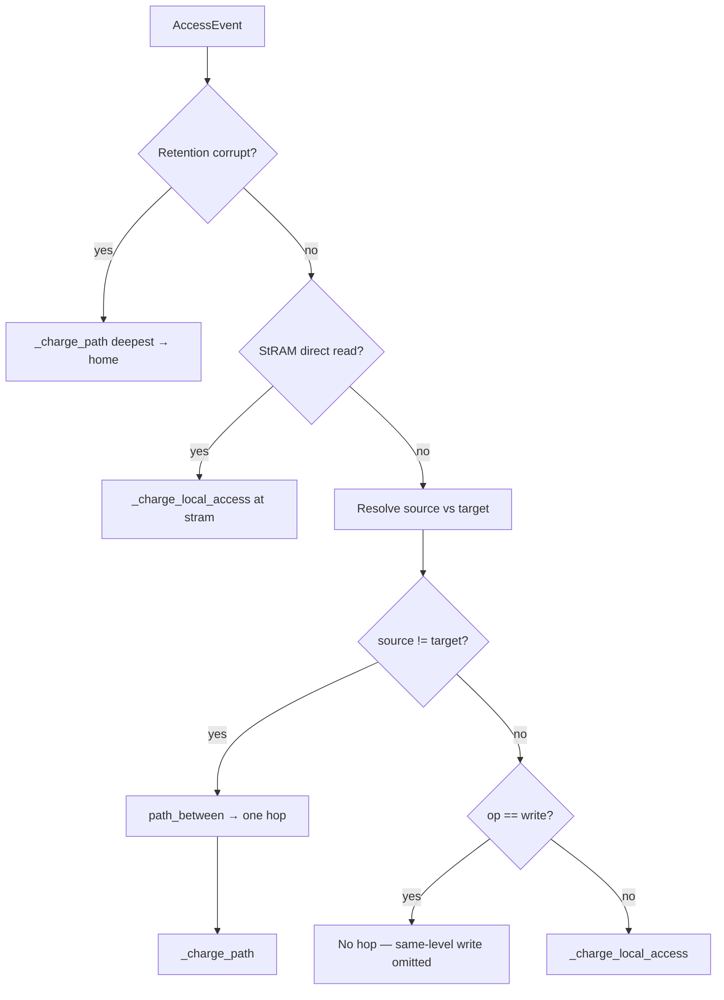

# 01 — How hops are determined

A **hop** is one charged interconnect edge between two memory levels, e.g. `("hbm", "sbuf")`. Hops are **not** inferred by walking the hierarchy YAML stack; each access produces at most **one direct** `(source, dest)` pair.

**See also:** [Latency →](02-latency.md) · [Energy →](03-energy.md) · [HBM traffic →](04-hbm-traffic.md) · [Index →](README.md)

---

## High level: two steps



1. **`_handle_access`** decides **source** and **target** from trace + residency ([`engine.py`](../../src/dmsim/sim/engine.py)).
2. Special cases run **before** the generic `source != target` check: **StRAM direct read** (local at home) and **same-level writes** (no charge).
3. Otherwise, if source and target differ, **`path_between`** returns one hop ([`transfer.py`](../../src/dmsim/sim/transfer.py)) and **`_charge_path`** charges it.

---

## Definitions

| Symbol | Meaning | Set by |
|--------|---------|--------|
| `target` | Where the access wants data | `event.target_level` or `policy.default_access_target` |
| `resident` | Current simulated location | `TensorResidency.resident_level` (fallback: `home_level`) |
| `source` | Level read from this cycle | `_source_level_for_access` |
| `home` | Persistent placement | `TensorResidency.home_level` from policy |
| `hop` | Tuple `(from_level, to_level)` | `path_between(source, target)` |

---

## Step 1 — Resolve `target`

In [`_handle_access`](../../src/dmsim/sim/engine.py):

```python
target = event.target_level or policy.default_access_target
```

Most ingest paths set `target_level` to `"sbuf"` for loads and `"hbm"` for SBUF→memory DMA writes.

**Policy default:** [`configs/policies/baseline_hbm.yaml`](../../configs/policies/baseline_hbm.yaml) sets `default_access_target: sbuf`.

---

## Step 2 — Resolve `source`

### Reads (`op == "read"`)

Source is the **resident** level:

```python
resident = state.resident_level or state.home_level
# _source_level_for_access for reads:
return resident
```

| Resident | Target | Result |
|----------|--------|--------|
| `hbm` | `sbuf` | Interconnect: **`hbm → sbuf`** |
| `sbuf` | `sbuf` | **Local** SBUF hit (scratch if `home != sbuf`) |
| `ltram` | `sbuf` | Interconnect: **`ltram → sbuf`** |
| `stram` (home) | `sbuf` | **Local** at StRAM — see [StRAM direct read](#stram-direct-read-no-stramsbuf-hop) |

### Writes to off-chip memory

Neuron DMA writebacks flush **from SBUF**, regardless of `resident_level`:

```python
# _source_level_for_access — writes to off_chip target
if target_level.interconnect == "off_chip":
    return policy.default_access_target  # typically "sbuf"
```

| Trace | Source | Target | Hop |
|-------|--------|--------|-----|
| `op: write`, `target_level: hbm` | `sbuf` | `hbm` | **`sbuf → hbm`** |

**Code:** [`_source_level_for_access`](../../src/dmsim/sim/engine.py) · tests: [`tests/test_writeback.py`](../../tests/test_writeback.py).

---

## Step 3 — Scratch hits and retention (no extra hops)

Before comparing source/target, [`_handle_access`](../../src/dmsim/sim/engine.py) computes:

```python
scratch_hit = resident_level == target and resident_level != state.home_level
```

- **Scratch hit:** tensor cached in SBUF (home is HBM/LtRAM). If `source == target`, **no hop** — local access only.
- **Retention failure** (non-scratch): may set `corrupt` and force a reload path `deepest → home` before the main access (see [04-hbm-traffic.md](04-hbm-traffic.md)).

---

## StRAM direct read (no `stram→sbuf` hop)

When a tensor is **homed and resident in StRAM** and the trace requests a **read into SBUF**, the simulator treats it as compute reading StRAM directly — not a DMA staging hop.

[`_is_direct_stram_read`](../../src/dmsim/sim/engine.py) returns true when:

- `op == "read"`
- `target == policy.default_access_target` (typically `sbuf`)
- `home_level == "stram"`
- `resident == home`

Then [`_charge_local_access`](../../src/dmsim/sim/engine.py) charges **`access_latency_ns(stram)`** / **`access_energy_pJ(stram)`** and returns — **no** `stram→sbuf` in `transfers_by_hop`.

**Test:** [`tests/test_sim.py`](../../tests/test_sim.py) `test_stram_read_to_sbuf_is_local_not_dma`.

---

## Same-level writes (no hop, no local cost)

When `source == target` and `op == "write"`, the access is an in-place SBUF touch (e.g. ingest artifact after SB→OUTPUT). The simulator **returns without charging** latency or energy:

```python
if event.op == "write":
    return
```

**Test:** [`tests/test_writeback.py`](../../tests/test_writeback.py) `test_same_level_sbuf_write_is_omitted`.

---

## Step 4 — `path_between` (direct edge)

[`path_between`](../../src/dmsim/sim/transfer.py) and [`hops_between`](../../src/dmsim/sim/transfer.py) always return **zero or one** hop:

```python
def hops_between(hierarchy, source_id, dest_id):
    if source_id == dest_id:
        return []
    hierarchy.level_by_id(source_id)  # validate
    hierarchy.level_by_id(dest_id)
    return [(source_id, dest_id)]
```

### What this means

| Move | Hops returned | NOT used |
|------|---------------|----------|
| `hbm → sbuf` | `[("hbm", "sbuf")]` | YAML level order |
| `sbuf → hbm` | `[("sbuf", "hbm")]` | Intermediate LtRAM |
| `ltram → sbuf` | `[("ltram", "sbuf")]` | StRAM staging |

**Multi-hop staging** (e.g. `hbm → ltram` then `ltram → sbuf`) must appear as **two separate trace access events**. The simulator will not insert intermediate tiers automatically.

The `home_id` parameter on `path_between` is **ignored** (kept for API compatibility).

**Tests:** [`tests/test_transfer.py`](../../tests/test_transfer.py) · [`tests/test_sim.py`](../../tests/test_sim.py) `test_ltram_homed_access_charges_direct_hop`.

---

## Step 5 — `_charge_path` records the hop

[`_charge_path`](../../src/dmsim/sim/engine.py) iterates `path_between` (typically one iteration) and increments:

```python
hop_key = f"{hop_from}->{hop_to}"
result.transfers_by_hop[hop_key] = result.transfers_by_hop.get(hop_key, 0) + 1
```

Example `SimulationResult.transfers_by_hop` after a short run:

```python
{
    "hbm->sbuf": 12933,
    "sbuf->hbm": 134396,
}
```

With LtRAM weights policy, you may also see `"ltram->sbuf"` without any `"sbuf->ltram"` on writebacks.

---

## Kernel boundaries change future hops

On `kernel_end`, only levels listed in **`kernel.wipe_levels_on_boundary`** are cleared (default **`[psum, sbuf]`**). Wipe scope is **per NeuronCore**, matching fast-buffer clears and residency reset:

| `kernel_end.core_id` | Fast buffers cleared | `resident_level` reset |
|----------------------|----------------------|----------------------|
| **Set** (e.g. `0`) | That core’s wiped tiers only | Tensors with `TensorRecord.core_id == 0` only |
| **`null`** | Every core in `fast_buffers` | Tensors on those same cores |
| **`null`**, no buffers yet | Core `0` fallback | Core `0` tensors only |

```python
cores = _kernel_wipe_cores(event, fast_buffers, wipe_ids)
for tensor_id, state in residency.items():
    if state.resident_level in wipe_ids and _tensor_core_id(tensor_id) in cores:
        state.resident_level = state.home_level
```

Merged multi-core traces (`merge_traces`) set **`core_id`** on each core’s `kernel_end`. Single-core Neuron ingest omits it → all cores that have seen traffic are wiped together.

| Home tier | After wipe (for that core) | Next read to SBUF |
|-----------|---------------------------|-------------------|
| HBM / LtRAM | SBUF scratch cleared | Fresh **`home → sbuf`** hop |
| StRAM | **StRAM copy persists** (not in wipe list) | **StRAM direct read** (local), not `stram→sbuf` |

**Config:** `kernel.wipe_levels_on_boundary: [psum, sbuf]` in hierarchy YAML.

**Tests:** [`tests/test_sim.py`](../../tests/test_sim.py) `test_kernel_wipe_scoped_to_core`, `test_stram_home_persists_across_kernel_wipe`.

---

## Worked example

**Setup:** weight homed in HBM, resident in HBM, baseline policy.

**Event:**

```json
{"type": "access", "op": "read", "bytes": 65536, "target_level": "sbuf", "tensor_id": "w", "core_id": 0}
```

**Decision path:**

1. `target = "sbuf"`
2. `source = resident = "hbm"`
3. `source != target` → interconnect
4. `path_between("hbm", "sbuf")` → `[("hbm", "sbuf")]`
5. `transfers_by_hop["hbm->sbuf"] += 1`
6. `resident_level` updated to `"sbuf"`

**Second identical event** (before `kernel_end`):

1. `resident = "sbuf"`, `target = "sbuf"`
2. `source = "sbuf"` → **local access**, **no hop**

---

## Code index

| Function | File | Role |
|----------|------|------|
| `_handle_access` | [`engine.py`](../../src/dmsim/sim/engine.py) | Source/target, scratch, corrupt reload |
| `_is_direct_stram_read` | [`engine.py`](../../src/dmsim/sim/engine.py) | StRAM home → local read, no hop |
| `_charge_local_access` | [`engine.py`](../../src/dmsim/sim/engine.py) | Line-granularity local latency/energy |
| `_source_level_for_access` | [`engine.py`](../../src/dmsim/sim/engine.py) | Writeback = SBUF source |
| `path_between` / `hops_between` | [`transfer.py`](../../src/dmsim/sim/transfer.py) | Direct hop list |
| `_charge_path` | [`engine.py`](../../src/dmsim/sim/engine.py) | Charge + count hop |
| `_handle_kernel_boundary` | [`engine.py`](../../src/dmsim/sim/engine.py) | Per-core fast-buffer + residency wipe |
| `_kernel_wipe_cores` | [`engine.py`](../../src/dmsim/sim/engine.py) | NeuronCore ids affected by `kernel_end` |
| `_tensor_core_id` | [`engine.py`](../../src/dmsim/sim/engine.py) | Tensor ownership for wipe scope |
| `TensorResidency` | [`residency.py`](../../src/dmsim/sim/residency.py) | `home_level`, `resident_level` |
| `AccessEvent` | [`schema.py`](../../src/dmsim/trace/schema.py) | Trace input |

**Next:** [02 — Latency metrics →](02-latency.md)
