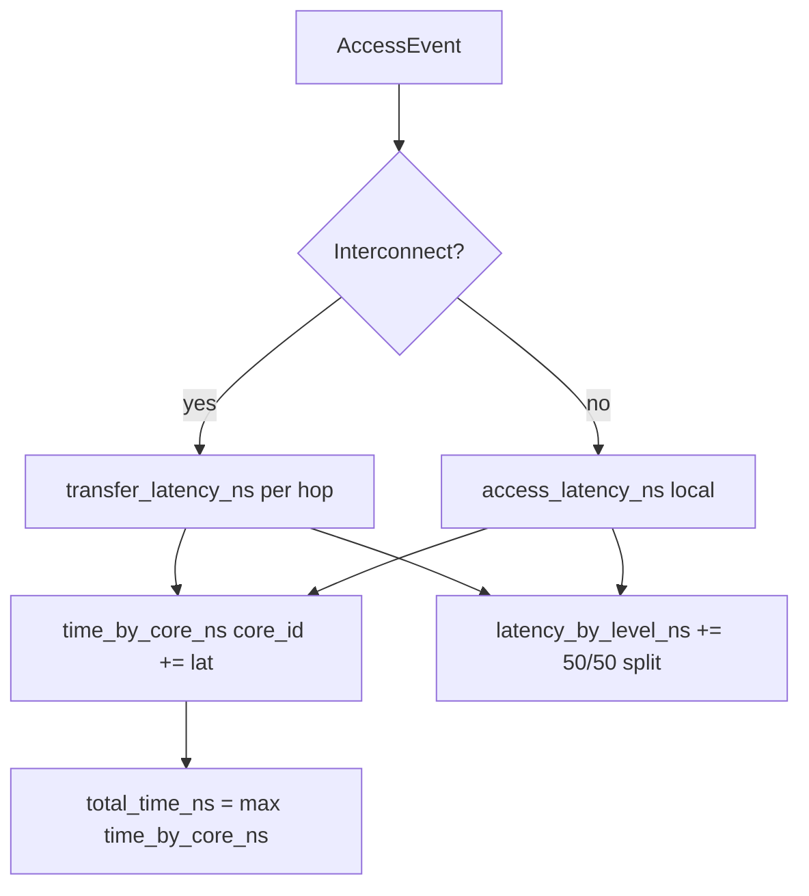

# 02 — How latency metrics are determined

Latency accounting converts each charged access (interconnect hop or local touch) into nanoseconds and aggregates them into **`SimulationResult`** time fields.

**See also:** [Hops →](01-hops.md) · [Energy →](03-energy.md) · [Index →](README.md)

---

## High level: what counts as “time”



**Important:** trace timestamp gaps (`t_ns` between events) are **not** added to `total_time_ns`. They are only used for refresh energy between events.

---

## Output metrics (definitions)

| Field | Aggregation | Meaning |
|-------|-------------|---------|
| **`time_by_core_ns[c]`** | Sum on core `c` | Total charged latency for NeuronCore `c` |
| **`total_time_ns`** | `max(time_by_core_ns)` | Wall-clock proxy assuming cores run in parallel |
| **`latency_by_level_ns[level]`** | Sum chip-wide | Accounting breakdown; **not** wall-clock per level |
| **`worst_core_id`** | property | Argmax of `time_by_core_ns` |

**Code:** [`SimulationResult`](../../src/dmsim/sim/engine.py) · final line of [`run_simulation`](../../src/dmsim/sim/engine.py):

```python
result.total_time_ns = max(result.time_by_core_ns.values()) if result.time_by_core_ns else 0.0
```

### What is *not* in `total_time_ns`

- Idle time between profile DMA timestamps
- Compute / matmul time (not in trace)
- Refresh cycles (refresh adds **energy** only; latency contribution is `0.0`)

---

## Two latency formulas

All latency math lives in [`src/dmsim/sim/transfer.py`](../../src/dmsim/sim/transfer.py).

### 1. Interconnect transfer — `transfer_latency_ns`

Used when `source != target` in [`_charge_path`](../../src/dmsim/sim/engine.py).

```python
def transfer_latency_ns(hierarchy, from_level, to_level, nbytes):
    bw_GBs = hierarchy.link_bandwidth_GBs(from_level.id, to_level.id)
    bw_bytes_per_ns = bw_GBs  # GB/s numerically equals bytes/ns here
    hop_transfer = nbytes / bw_bytes_per_ns
    read_lat = from_level.tech.access.read_latency_ns
    write_lat = to_level.tech.access.write_latency_ns
    return read_lat + hop_transfer + write_lat
```

**Formula:**

\[
T_{\text{transfer}} = T_{\text{read}}(\text{from}) + \frac{\text{nbytes}}{BW_{\text{link}}} + T_{\text{write}}(\text{to})
\]

**Bandwidth** (`BW_link`) from [`ResolvedHierarchy.link_bandwidth_GBs`](../../src/dmsim/config/models.py):

| Endpoint types | Bandwidth (per core) |
|----------------|----------------------|
| both `on_chip` | `on_chip_bandwidth_GBs` (default 10 000 GB/s) |
| any `off_chip` | `dma_bandwidth_GBs` (default 368 GB/s) |

Set in hierarchy YAML under `interconnect:` — see [`trainium2_baseline.yaml`](../../configs/hierarchy/trainium2_baseline.yaml).

**Note:** tech `interface.max_bandwidth_GBs` is **not** used for interconnect hops; those use `link_bandwidth_GBs` above.

### 2. Local / datapath read — `datapath_read_latency_ns`

Used when [`_charge_local_access`](../../src/dmsim/sim/engine.py) runs for **reads**:

- SBUF **scratch hit** (`source == target == sbuf`, home elsewhere)
- **StRAM direct read** (`_is_direct_stram_read`) — compute reads StRAM, not DMA `stram→sbuf`

**Not used for:** same-level **`write`** events — omitted (0 ns). Writes still use line-granularity in `access_latency_ns` if charged elsewhere.

```python
def datapath_read_latency_ns(level, nbytes, hierarchy):
    return level.tech.access.read_latency_ns + nbytes / hierarchy.on_chip_bandwidth_GBs
```

| Traffic | Mechanism in model | Bandwidth source |
|---------|-------------------|------------------|
| HBM/LtRAM → SBUF | `transfer_latency_ns` | `interconnect.dma_bandwidth_GBs` (~368 GB/s per core) |
| SBUF/StRAM → compute | `datapath_read_latency_ns` | `interconnect.on_chip_bandwidth_GBs` (hierarchy YAML) |

This matches Trainium2: **DMA engines** move data off-chip into SBUF; **engine datapaths** read SBUF/StRAM for execution.

---

## Numeric example: `hbm → sbuf` load

**Tech** ([`hbm_trainium2.yaml`](../../configs/tech_specs/hbm_trainium2.yaml) + [`sbuf_trainium2.yaml`](../../configs/tech_specs/sbuf_trainium2.yaml)):

- HBM read latency: **120 ns**
- SBUF write latency: **1 ns**
- DMA bandwidth: **368 GB/s**
- Transfer size: **65 536 bytes**

\[
T = 120 + \frac{65536}{368} + 1 \approx 120 + 178 + 1 = 299 \text{ ns}
\]

Compare **`ltram → sbuf`** ([`rram.yaml`](../../configs/tech_specs/rram.yaml) read 10 ns):

\[
T = 10 + \frac{65536}{368} + 1 \approx 189 \text{ ns}
\]

Fixed read latency difference (**110 ns**) matters most for **small** transfers; large transfers are bandwidth-dominated.

---

## Where latency is accumulated

### Per-core wall time — `_add_core_latency`

```python
def _add_core_latency(result, core_id, latency_ns):
    result.time_by_core_ns[core_id] = (
        result.time_by_core_ns.get(core_id, 0.0) + latency_ns
    )
```

Called from:

- [`_charge_path`](../../src/dmsim/sim/engine.py) — each hop
- [`_charge_local_access`](../../src/dmsim/sim/engine.py) — local branch (SBUF scratch, StRAM direct read)

### Per-level accounting — `_accumulate_level`

Interconnect latency is split **50/50** across the two endpoints:

```python
_accumulate_level(result, hop_from, lat * 0.5, eng * 0.5)
_accumulate_level(result, hop_to, lat * 0.5, eng * 0.5)
```

Local access attributes 100% to the one level:

```python
_accumulate_level(result, target, lat, eng)
```

**Interpretation:** `latency_by_level_ns` is a **bookkeeping** split for comparing configs, not “time spent in level X on the critical path.”

---

## Decision tree: which formula applies?

```
AccessEvent
    │
    ├─ StRAM direct read? → _charge_local_access(stram)   → access_latency_ns
    │
    ├─ source != target? → _charge_path(source → target)   → transfer_latency_ns
    │
    ├─ source == target, op == write? → (skip)             → 0 ns
    │
    └─ source == target, op == read? → _charge_local_access → access_latency_ns
```

**Source/target rules:** [01-hops.md](01-hops.md).

---

## Example `SimulationResult` (latency fields)

From a 4-core decode trace (representative):

```python
SimulationResult(
    total_time_ns=14_114_221,          # worst core
    time_by_core_ns={
        0: 14_114_221,
        1: 14_068_183,
        2: 14_089_263,
        3: 14_044_527,
    },
    latency_by_level_ns={
        "hbm": 9_021_000,              # chip-wide sum (ms scale when /1e6)
        "sbuf": 47_295_000,
    },
    transfers_by_hop={
        "hbm->sbuf": 12933,
        "sbuf->hbm": 134396,
    },
)
```

On non-aggregated traces, **local SBUF** (`latency_by_level_ns["sbuf"]`) often dominates because hundreds of thousands of scratch hits each pay `access_latency_ns`.

---

## Inputs that affect latency (checklist)

| Input | File | Affects |
|-------|------|---------|
| `read_latency_ns`, `write_latency_ns` | `configs/tech_specs/*.yaml` | Fixed component of both formulas |
| `line_size_bytes` | same | Local access line count |
| `dma_bandwidth_GBs`, `on_chip_bandwidth_GBs` | hierarchy YAML | Transfer `nbytes/BW` only |
| `level_domain` | hierarchy YAML | Which BW rule applies |
| Trace `bytes` | trace JSON | Transfer size; datapath reads use `nbytes / on_chip_bandwidth_GBs` |
| Residency / kernel wipes | simulator state | How often interconnect vs local |

---

## Code index

| Symbol | File |
|--------|------|
| `transfer_latency_ns` | [`transfer.py`](../../src/dmsim/sim/transfer.py) |
| `access_latency_ns` | [`transfer.py`](../../src/dmsim/sim/transfer.py) |
| `link_bandwidth_GBs` | [`config/models.py`](../../src/dmsim/config/models.py) |
| `_charge_path` | [`engine.py`](../../src/dmsim/sim/engine.py) |
| `_handle_access` | [`engine.py`](../../src/dmsim/sim/engine.py) |
| `_add_core_latency` | [`engine.py`](../../src/dmsim/sim/engine.py) |
| `_accumulate_level` | [`engine.py`](../../src/dmsim/sim/engine.py) |

**Next:** [03 — Energy →](03-energy.md)
