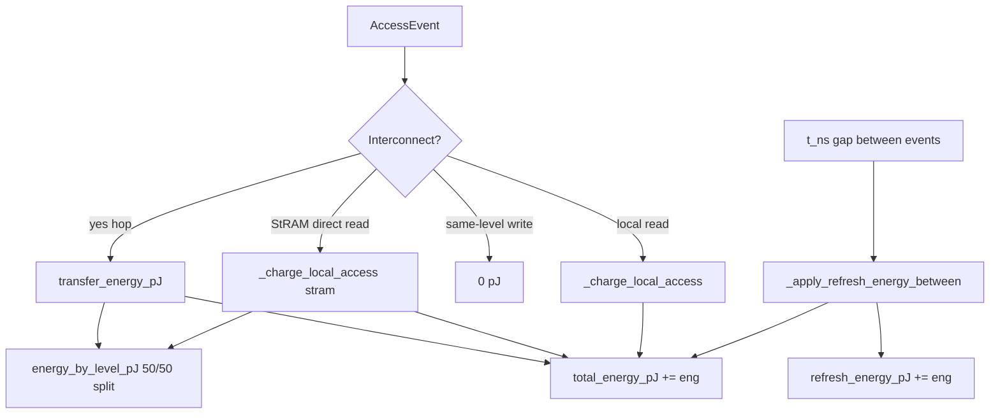

# 03 — How energy is determined

Energy accounting parallels latency: each access charges **local** or **transfer** energy, plus optional **background refresh** between trace timestamps. All energy is **summed chip-wide** into `total_energy_pJ`.

**See also:** [Hops →](01-hops.md) · [Latency →](02-latency.md) · [HBM traffic →](04-hbm-traffic.md) · [Index →](README.md)

---

## High level




**Entry point:** `[run_simulation](../../src/dmsim/sim/engine.py)` event loop.

---

## Output metrics (definitions)


| Field                           | Aggregation   | Meaning                                   |
| ------------------------------- | ------------- | ----------------------------------------- |
| `**total_energy_pJ`**           | Sum chip-wide | All access + transfer + refresh energy    |
| `**energy_by_level_pJ[level]**` | Sum chip-wide | Bookkeeping split (50/50 on hops)         |
| `**refresh_energy_pJ**`         | Sum chip-wide | Background refresh only (subset of total) |
| `**refresh_cycles_by_level**`   | Count         | Refresh intervals crossed between events  |


There is **no** `energy_by_core` — energy is not partitioned by NeuronCore in the current model.

---

## Tech spec inputs

Each memory level loads a `[TechnologySpec](../../src/dmsim/config/models.py)` from YAML:

```python
class AccessSpec(BaseModel):
    read_latency_ns: float
    write_latency_ns: float
    read_energy_pJ_per_bit: float
    write_energy_pJ_per_bit: float
```

Example HBM (`[hbm_trainium2.yaml](../../configs/tech_specs/hbm_trainium2.yaml)`):

```yaml
access:
  read_energy_pJ_per_bit: 7.0
  write_energy_pJ_per_bit: 8.0
refresh_interval_s: 0.064
refresh_energy_pJ_per_bit: 1.5
```

Example SBUF (`[sbuf_trainium2.yaml](../../configs/tech_specs/sbuf_trainium2.yaml)`): ~0.05 pJ/bit read/write.

Example RRAM / LtRAM (`[rram.yaml](../../configs/tech_specs/rram.yaml)`): 0.5 pJ/bit read, 20 pJ/bit write.

---

## Formula 1 — Local access energy

`[access_energy_pJ](../../src/dmsim/sim/transfer.py)`:

```python
def access_energy_pJ(level, op, nbytes):
    bits = nbytes * 8
    if op == "read":
        return bits * level.tech.access.read_energy_pJ_per_bit
    return bits * level.tech.access.write_energy_pJ_per_bit
```


E_{\text{local}} = \text{bits} \times \epsilon_{\text{read/write}}(\text{level})


**Used when:** `[_charge_local_access](../../src/dmsim/sim/engine.py)` runs:

- `source == target` and `op == "read"` (scratch hits, local at home)
- **StRAM direct read** — energy at `stram` home, not a transfer hop

**Not used for:** same-level `**write`** — omitted (0 pJ).

---

## Formula 2 — Transfer energy

`[transfer_energy_pJ](../../src/dmsim/sim/transfer.py)`:

```python
def transfer_energy_pJ(hierarchy, from_level, to_level, nbytes):
    return (
        access_energy_pJ(from_level, "read", nbytes)
        + access_energy_pJ(to_level, "write", nbytes)
    )
```


E_{\text{transfer}} = E_{\text{read}}(\text{from}) + E_{\text{write}}(\text{to})


**Used when:** each hop in `[_charge_path](../../src/dmsim/sim/engine.py)`.

There is **no separate “link energy”** term — interconnect cost is modeled as read energy at the source plus write energy at the destination.

---

## Formula 3 — Refresh energy (background)

Between consecutive events with increasing `t_ns`, `[_apply_refresh_energy_between](../../src/dmsim/sim/engine.py)` may charge refresh for occupied bytes:

```python
energy = refreshes * (occupied * 8) * energy_pJ_per_bit
result.refresh_energy_pJ += energy
result.total_energy_pJ += energy
```

Where:

- `refreshes` = number of refresh intervals crossed in `(start_t_ns, end_t_ns]`
- `occupied` = bytes allocated in that level (pools or per-core fast buffers)
- `energy_pJ_per_bit` from `tech.refresh_energy_pJ_per_bit`, or fallback to write energy

Refresh interval from `tech.refresh_interval_s` (defaults in `configs/tech_specs/`), optionally overridden per level with `refresh_interval_s` in hierarchy YAML. Set `refresh_interval_s: 0` on a level to disable refresh modeling. StRAM is assumed refreshed often enough that retention expiry is not simulated.

**Latency:** refresh adds **0 ns** to `total_time_ns` (`_accumulate_level(..., 0.0, energy)`).

---

## Level attribution — `_accumulate_level`

Same 50/50 split as latency for interconnect hops:

```python
_accumulate_level(result, hop_from, lat * 0.5, eng * 0.5)
_accumulate_level(result, hop_to, lat * 0.5, eng * 0.5)
```

Local access attributes all energy to the accessed level.

---

## Worked example: 64 KiB HBM → SBUF

**Transfer** (read HBM + write SBUF):

- HBM read: `65536 × 8 × 7.0 pJ/bit` ≈ **3.67 mJ** → 3.67×10⁹ pJ
- SBUF write: `65536 × 8 × 0.05 pJ/bit` ≈ **0.026 mJ**

Dominated by HBM read energy — why moving weights to LtRAM (0.5 pJ/bit read) dramatically cuts `**total_energy_pJ`** even when `**total_time_ns**` barely changes.

---

## Example `SimulationResult` (energy fields)

Baseline HBM hierarchy on a decode trace (illustrative):

```python
SimulationResult(
    total_energy_pJ=3.32e12,           # ~3.32 J
    refresh_energy_pJ=3.04e12,         # HBM refresh dominates baseline
    energy_by_level_pJ={
        "hbm": 3.18e12,
        "sbuf": 1.40e11,
    },
)
```

LtRAM candidate (weights off HBM):

```python
SimulationResult(
    total_energy_pJ=2.11e12,
    refresh_energy_pJ=1.91e12,
    energy_by_level_pJ={
        "hbm": 2.00e12,
        "ltram": 3.67e9,
        "sbuf": 1.01e11,
    },
)
```

CLI compare reports `energy_pJ` pct change from these totals.

---

## What does *not* charge energy today


| Event                                                    | Energy charged? |
| -------------------------------------------------------- | --------------- |
| Same-level **write** (`source == target`, `op == write`) | **No**          |
| SBUF eviction (drop occupant)                            | No              |
| Placement / bootstrap at t=0                             | No              |
| Kernel wipe (clear SBUF)                                 | No              |
| Implicit missing writeback                               | No              |
| Compute                                                  | Not modeled     |


---

## Code index


| Symbol                          | File                                                   |
| ------------------------------- | ------------------------------------------------------ |
| `access_energy_pJ`              | `[transfer.py](../../src/dmsim/sim/transfer.py)`       |
| `transfer_energy_pJ`            | `[transfer.py](../../src/dmsim/sim/transfer.py)`       |
| `_charge_path`                  | `[engine.py](../../src/dmsim/sim/engine.py)`           |
| `_charge_local_access`          | `[engine.py](../../src/dmsim/sim/engine.py)`           |
| `_is_direct_stram_read`         | `[engine.py](../../src/dmsim/sim/engine.py)`           |
| `_handle_access` (local branch) | `[engine.py](../../src/dmsim/sim/engine.py)`           |
| `_apply_refresh_energy_between` | `[engine.py](../../src/dmsim/sim/engine.py)`           |
| `_accumulate_level`             | `[engine.py](../../src/dmsim/sim/engine.py)`           |
| `TechnologySpec`                | `[config/models.py](../../src/dmsim/config/models.py)` |


**Next:** [04 — HBM traffic →](04-hbm-traffic.md)