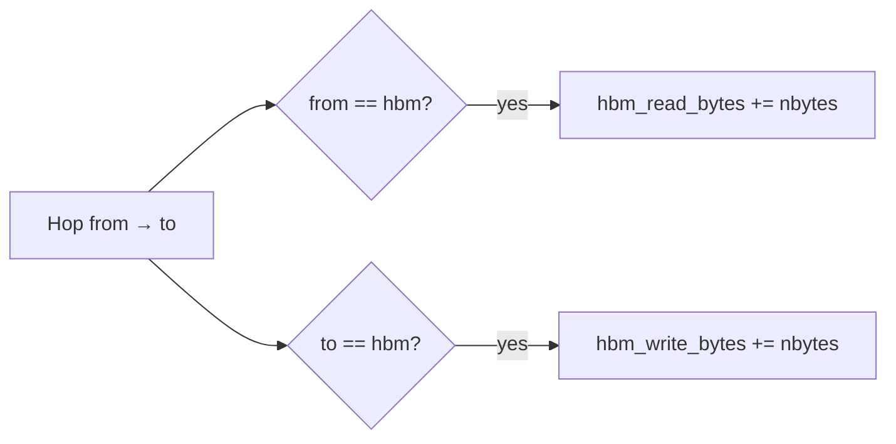

# 04 — How HBM traffic is determined

**HBM traffic** counts bytes moved across the HBM interface on charged interconnect hops. It is tracked separately from latency/energy and exposed as `hbm_read_bytes`, `hbm_write_bytes`, and the derived `hbm_traffic_bytes`.

**See also:** [Hops →](01-hops.md) · [Latency →](02-latency.md) · [Energy →](03-energy.md) · [Index →](README.md)

---

## High level

HBM bytes increment inside [`_charge_path`](../../src/dmsim/sim/engine.py) **only when a hop touches HBM**:

```python
if hop_from == "hbm":
    result.hbm_read_bytes += nbytes
if hop_to == "hbm":
    result.hbm_write_bytes += nbytes
```



There is **no separate HBM counter** for local accesses at HBM (`source == target == hbm`) — those charge latency/energy but not `hbm_*_bytes` unless routed through `_charge_path`.

---

## Output fields

| Field | Type | Meaning |
|-------|------|---------|
| `hbm_read_bytes` | `int` | Sum of `nbytes` on hops **`hbm → *`** |
| `hbm_write_bytes` | `int` | Sum of `nbytes` on hops **`* → hbm`** |
| `hbm_traffic_bytes` | property | `hbm_read_bytes + hbm_write_bytes` |

```python
@property
def hbm_traffic_bytes(self) -> int:
    return self.hbm_read_bytes + self.hbm_write_bytes
```

**Code:** [`SimulationResult`](../../src/dmsim/sim/engine.py).

---

## When HBM read bytes increment

Any charged hop with `hop_from == "hbm"`:

| Scenario | Typical hop | Counts? |
|----------|-------------|---------|
| Load KV/weight into SBUF | `hbm → sbuf` | **Yes** — full `event.bytes` |
| Corrupt reload to HBM home | `hbm → hbm` (no hop) or `hbm → ltram` etc. | Read if hop starts at HBM |
| Weight homed in LtRAM | `ltram → sbuf` | **No** HBM read |
| KV homed in StRAM (direct read) | local at `stram` | **No** — no hop at all |
| Scratch hit in SBUF | local only | **No** |
| Bootstrap at t=0 | no `_charge_path` | **No** |

### Residency reduces HBM reads on non-aggregated traces

After the first `hbm → sbuf` load, repeated reads while `resident == sbuf` are **local** — **no** additional `hbm_read_bytes` even if the trace lists many DMA records.

After `kernel_end` wipes SBUF on a **core**, that core’s tensors return `resident` to `home` for wiped tiers → next load may count again. Other cores are unaffected until their own `kernel_end`. **StRAM** is not wiped by default.

---

## StRAM direct read (no hop counters)

When `_is_direct_stram_read` applies, **neither** `transfers_by_hop` **nor** `hbm_*_bytes` increment — the access never enters `_charge_path`.

---

## When HBM write bytes increment

Any charged hop with `hop_to == "hbm"`:

| Scenario | Typical hop | Counts? |
|----------|-------------|---------|
| Trace writeback (DMA SBUF→HBM) | `sbuf → hbm` | **Yes** |
| LtRAM stack writeback (direct routing) | `sbuf → hbm` | **Yes** — **not** staged via LtRAM |
| Write to LtRAM home | `sbuf → ltram` | **No** HBM write |

Writebacks use [`_source_level_for_access`](../../src/dmsim/sim/engine.py): off-chip writes always source from **`default_access_target`** (SBUF):

```python
if target_level.interconnect == "off_chip":
    return policy.default_access_target  # "sbuf"
```

**Test:** [`tests/test_writeback.py`](../../tests/test_writeback.py).

---

## Relationship to `transfers_by_hop`

`transfers_by_hop` counts **events**; HBM byte counters sum **nbytes**:

```python
# One access, one hop
_charge_path(..., nbytes=4096, ...)
# → transfers_by_hop["sbuf->hbm"] += 1
# → hbm_write_bytes += 4096
```

Many small writebacks (few MB total, ~100k+ events) can dominate **hop count** and **fixed latency** while **`hbm_write_bytes`** stays small.

---

StRAM retention expiry is **not** modeled; refresh is assumed sufficient to keep homed data valid.

---

## Aggregated vs non-aggregated traces

| Trace style | Effect on HBM traffic |
|-------------|------------------------|
| **`aggregate_dma=True`** | Few large `hbm → sbuf` loads; may **over-count** HBM reads vs hardware reuse |
| **`--no-aggregate-dma`** | Many events; residency deduplicates → **lower** `hbm_read_bytes`, higher local latency |

Total **access bytes** in the trace are similar; **HBM traffic** depends on how residency interacts with event granularity.

---

## Worked examples

### Example A — KV read (first touch after kernel wipe)

```json
{"op": "read", "bytes": 8192, "target_level": "sbuf", "tensor_id": "cache_k_0", "core_id": 0}
```

- `source = hbm`, `target = sbuf`
- Hop: `hbm → sbuf`
- **`hbm_read_bytes += 8192`**
- `transfers_by_hop["hbm->sbuf"] += 1`

### Example B — Repeat read (scratch hit)

Same tensor, still resident in SBUF:

- `source = sbuf`, `target = sbuf`
- Local access only
- **No change** to `hbm_read_bytes`

### Example C — Writeback

```json
{"op": "write", "bytes": 4096, "target_level": "hbm", "tensor_id": "out_0", "core_id": 0}
```

- `source = sbuf`, `target = hbm`
- Hop: `sbuf → hbm`
- **`hbm_write_bytes += 4096`**
- `transfers_by_hop["sbuf->hbm"] += 1`

Even on [`trainium2_diff_mem_25hbm.yaml`](../../configs/hierarchy/trainium2_diff_mem_25hbm.yaml) with LtRAM enabled, writebacks remain **`sbuf → hbm`** (direct hop) — see [`tests/test_writeback.py`](../../tests/test_writeback.py) `test_write_to_hbm_direct_with_ltram_in_stack`.

### Example D — StRAM-homed KV read (direct)

```json
{"op": "read", "bytes": 8192, "target_level": "sbuf", "tensor_id": "cache_k_0", "core_id": 0}
```

Tensor **home = stram**, **resident = stram** (e.g. after bootstrap or prior access):

- `_is_direct_stram_read` → local charge at `stram`
- **No** `stram->sbuf` in `transfers_by_hop`
- **No** HBM read/write bytes

---

## Example result snapshot

Non-aggregated 4-core decode, baseline HBM policy:

```python
hbm_read_bytes=76_457_814      # ~76 MB (residency deduped)
hbm_write_bytes=2_763_056      # ~2.8 MB
hbm_traffic_bytes=79_220_870
transfers_by_hop={
    "hbm->sbuf": 12933,
    "sbuf->hbm": 134396,
}
```

Same trace, weights in LtRAM:

```python
hbm_read_bytes=62_742_470      # lower — weights don't pull from HBM
hbm_write_bytes=2_763_056      # writebacks unchanged
transfers_by_hop={
    "hbm->sbuf": 10122,
    "ltram->sbuf": 2811,
    "sbuf->hbm": 134396,
}
```

---

## What HBM traffic does *not* include

- Bytes logically “in HBM” at rest (pool occupancy without a hop)
- Traffic to LtRAM/StRAM (separate tiers)
- Refresh (energy only)
- Evicted SBUF lines (no writeback modeled)
- Off-chip traffic beyond what trace access events charge

---

## Code index

| Symbol | File |
|--------|------|
| `_charge_path` (HBM counters) | [`engine.py`](../../src/dmsim/sim/engine.py) |
| `_source_level_for_access` (writeback routing) | [`engine.py`](../../src/dmsim/sim/engine.py) |
| `_handle_access` | [`engine.py`](../../src/dmsim/sim/engine.py) |
| `hops_between` | [`transfer.py`](../../src/dmsim/sim/transfer.py) |
| `SimulationResult.hbm_traffic_bytes` | [`engine.py`](../../src/dmsim/sim/engine.py) |

**Back to:** [Index →](README.md)
