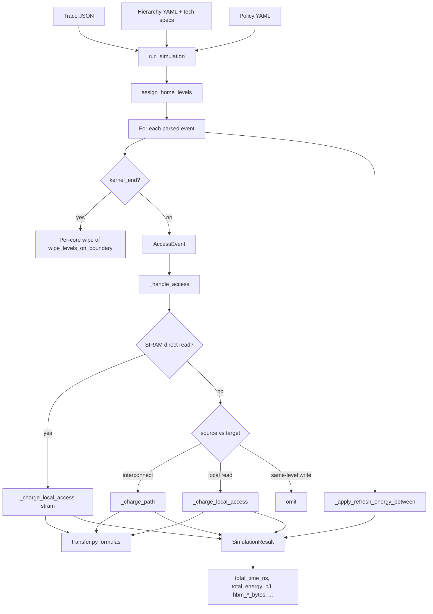

# Simulation cost model

How **dmsim** turns an ingested trace into **time**, **energy**, and **HBM traffic** metrics. This folder documents the four core accounting paths.

**Start here:** [`PLAN.md`](PLAN.md) for structure and reading order.

| Doc | Question it answers |
|-----|---------------------|
| [01 — Hops](01-hops.md) | Which memory edge is charged for each access? |
| [02 — Latency](02-latency.md) | How do hops become `total_time_ns` and related metrics? |
| [03 — Energy](03-energy.md) | How is `total_energy_pJ` computed? |
| [04 — HBM traffic](04-hbm-traffic.md) | When do `hbm_read_bytes` / `hbm_write_bytes` increment? |

**Related:**

- Full simulator guide: [`src/dmsim/sim/README.md`](../../src/dmsim/sim/README.md)
- Placement / spill: [`docs/PLACEMENT_AND_EVICTION.md`](../PLACEMENT_AND_EVICTION.md)

---

## Glossary

| Term | Definition |
|------|------------|
| **Hop** | One directed interconnect transfer between two memory levels, e.g. `hbm → sbuf`. Stored as `(from_id, to_id)`. |
| **Home** | Persistent tier for a tensor from placement policy (`home_level`). |
| **Resident** | Where the simulator believes data currently lives (`resident_level`). |
| **Target** | Level named in the trace access (`AccessEvent.target_level`, default `sbuf`). |
| **Source** | Level data is read *from* for this access (derived in `_source_level_for_access`). |
| **Interconnect move** | `source != target` → charge via `_charge_path` (transfer latency/energy). Exception: **StRAM direct read** — local at home even when target is SBUF. |
| **Local access** | [`_charge_local_access`](../../src/dmsim/sim/engine.py): scratch/read hits via `access_latency_ns` / `access_energy_pJ`. Includes **StRAM direct read**. |
| **Scratch hit** | `resident == target != home` (e.g. SBUF cache hit); local access only, no retention check. |
| **StRAM direct read** | `home == stram`, `resident == home`, read to SBUF → local at StRAM, **no** `stram→sbuf` hop. |
| **Same-level write** | `source == target`, `op == write` → **no** latency or energy (in-place SBUF touch). |
| **Writeback** | Trace `write` to an off-chip `target_level` → modeled as `sbuf → target` flush. |
| **Kernel wipe** | On traced `kernel_end`, clear wiped tiers on affected NeuronCore(s) and reset scratch `resident_level` for tensors on those cores only. |

---

## End-to-end flow (high level)



**Entry point:** [`run_simulation`](../../src/dmsim/sim/engine.py) in [`src/dmsim/sim/engine.py`](../../src/dmsim/sim/engine.py).

---

## Input data structures

### Trace access event

Defined in [`src/dmsim/trace/schema.py`](../../src/dmsim/trace/schema.py):

```python
class AccessEvent(BaseModel):
    type: Literal["access"] = "access"
    t_ns: float = 0
    tensor_id: str
    op: Literal["read", "write"] = "read"
    bytes: int
    target_level: str = "sbuf"
    core_id: int = 0
```

Example JSON in a trace file:

```json
{
  "type": "access",
  "t_ns": 1205000.0,
  "tensor_id": "linear_weight_12",
  "op": "read",
  "bytes": 65536,
  "target_level": "sbuf",
  "core_id": 0
}
```

### Per-tensor residency (simulator state)

Defined in [`src/dmsim/sim/residency.py`](../../src/dmsim/sim/residency.py):

```python
@dataclass
class TensorResidency:
    home_level: str
    resident_level: str | None = None
    last_home_touch_ns: float | None = None
    corrupt: bool = False
    initialized_at_home: bool = False
```

After placement for a weight homed in HBM on baseline policy:

```python
TensorResidency(home_level="hbm", resident_level="hbm")
```

After a successful load into SBUF:

```python
TensorResidency(home_level="hbm", resident_level="sbuf", last_home_touch_ns=1205000.0)
```

### Output: SimulationResult

Defined in [`src/dmsim/sim/engine.py`](../../src/dmsim/sim/engine.py):

```python
@dataclass
class SimulationResult:
    hierarchy_name: str
    policy_name: str
    trace_workload: str
    total_time_ns: float
    total_energy_pJ: float
    time_by_core_ns: dict[int, float]
    hbm_read_bytes: int
    hbm_write_bytes: int
    transfers_by_hop: dict[str, int]
    energy_by_level_pJ: dict[str, float]
    latency_by_level_ns: dict[str, float]
    refresh_energy_pJ: float
    # ...
```

---

## Configuration inputs (summary)

| Input | Location | Affects |
|-------|----------|---------|
| Per-level read/write latency & energy | [`configs/tech_specs/*.yaml`](../../configs/tech_specs/) | Transfer and local access formulas |
| DMA vs on-chip bandwidth | [`configs/hierarchy/*.yaml`](../../configs/hierarchy/) `interconnect:` | Transfer time only |
| Level domain (`on_chip` / `off_chip`) | same | Which bandwidth applies per hop |
| Policy `default_access_target` | [`configs/policies/*.yaml`](../../configs/policies/) | Default `target`, writeback source |

Tech spec example (HBM): [`configs/tech_specs/hbm_trainium2.yaml`](../../configs/tech_specs/hbm_trainium2.yaml).

Hierarchy interconnect example: [`configs/hierarchy/trainium2_baseline.yaml`](../../configs/hierarchy/trainium2_baseline.yaml).

---

## Where to go next

1. **Routing** → [01-hops.md](01-hops.md)
2. **Time** → [02-latency.md](02-latency.md)
3. **Energy** → [03-energy.md](03-energy.md)
4. **HBM bytes** → [04-hbm-traffic.md](04-hbm-traffic.md)
